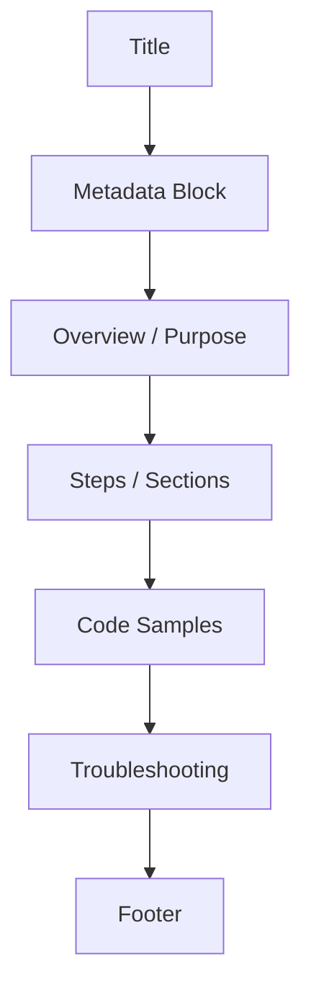

# 🧠 Dev Writing Guidelines

**Applies to:** Internal Technical Documentation | **Updated:** May 26, 2025  
**Audience:** Engineers & Technical Writers | **Difficulty:** Beginner–Intermediate  
**Support Contact:** documentation@example.com

---

## 🎯 Purpose

This article defines the documentation standards engineers and writers should follow when contributing to internal knowledge bases, developer portals, or operational runbooks. These guidelines ensure clarity, consistency, and ease of maintenance across all internal content.

---

## ✍️ Style & Voice

| Element              | Standard                                           |
|----------------------|----------------------------------------------------|
| Tone                 | Professional, concise, and neutral                 |
| Perspective          | Second person ("you") for instructions; third person for explanations |
| Jargon               | Avoid or define when first used                    |
| Emojis               | ✅ Use sparingly and only for scannability (e.g., callouts, step indicators) |
| Abbreviations        | Spell out on first use unless well-known (e.g., SSO) |
| Tense                | Present tense unless explaining a historical action |

---

## 🧱 Structure

All documents should include the following sections where applicable:

1. **Title** – Sentence case, short, descriptive  
2. **Metadata Block** – Applies to, updated date, difficulty level, contact  
3. **Overview or Purpose** – One or two sentences summarizing the document  
4. **Steps or Sections** – Clearly numbered or bullet-listed for scannability  
5. **Code Samples** – Indented with correct language syntax  
6. **Troubleshooting (if applicable)** – Use table format for clarity  
7. **Footer** – Document ID and last updated info

---

### 🧭 Visual Reference



---

## 💡 Formatting Rules

- Use Markdown with GitHub-compatible syntax  
- Use `**bold**` for UI elements and emphasis  
- Use backticks (`) for inline code or CLI flags  
- Use triple backticks for blocks of code (` ``` `)  
- Always include input/output examples for API or CLI content  
- Use tables for parameters, errors, options

**Example:**
```bash
curl -X GET https://api.example.com/users \
  -H "Authorization: Bearer $TOKEN"
```

---

## ✏️ Tone Examples

**❌ Weak or informal:**
> We'll go ahead and add the token here...

**✅ Preferred:**
> Add the token using the following syntax:

**❌ Passive / unclear:**
> The file should be uploaded before continuing.

**✅ Preferred:**
> Upload the file before continuing.

---

## ✅ Before & After Example

| Type | Sample |
|------|--------|
| ❌ Before | “Clicking on the Submit button will result in the form being sent.” |
| ✅ After | “Click **Submit** to send the form.” |

| ❌ Before | “You must ensure the environment variables are correctly configured.” |
| ✅ After | “Configure the required environment variables before running the command.” |

---

## 🔁 Reusability

- Use shared terminology from the internal style guide  
- Link to related articles when possible  
- Avoid duplicating content—create modular references or KBs  
- Store reusable examples in shared `/examples` or `/snippets` folders

---

## 📤 Submitting Documentation

Before submitting, ensure the following:

- ✅ Spellcheck completed  
- ✅ Title and metadata block added  
- ✅ All sections follow this guide  
- ✅ Code tested or validated where applicable  
- ✅ Peer-reviewed or proofread if possible

Submit content via GitHub pull request or your team’s documentation intake form.

---

## 📚 Additional Resources

- [Internal Style Guide (PDF)](https://intranet.example.com/docs/style-guide.pdf)  
- [Markdown Syntax Reference](https://www.markdownguide.org/basic-syntax/)  
- [KB Template Repo](https://github.com/yourorg/kb-templates)

---

*Article ID: KB-GUIDE-001 | Updated: May 26, 2025*
