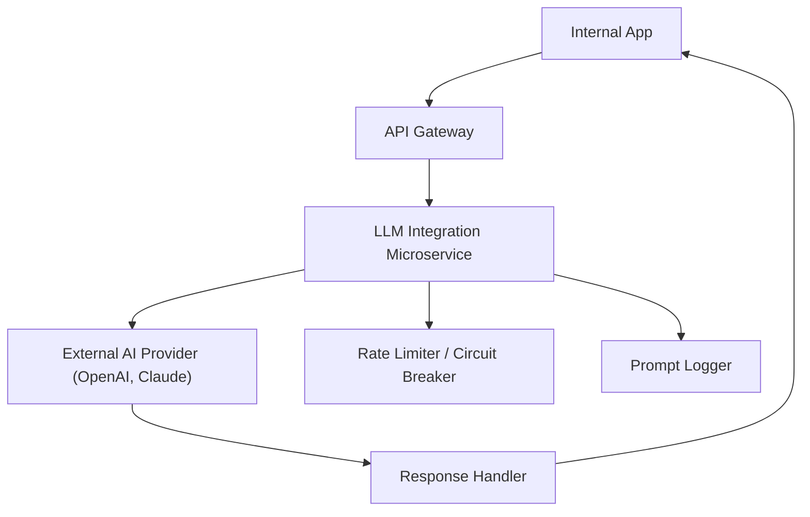

# 🔗 Integration Playbook: Connecting AI Services with Internal Platforms

**Applies to:** AI Integration, Internal Platform Engineering  
**Audience:** Backend Engineers, Infra, DevOps  
**Updated:** May 26, 2025  
**Difficulty:** Intermediate–Advanced  
**Contact:** integrations@example.com

---

## 🛠️ Problem

Your engineering team needs to securely integrate hosted AI services (e.g., OpenAI, Anthropic, Cohere) with internal tools and platforms. Common challenges include authentication, error handling, observability, and vendor flexibility.

---

## ✅ Solution

This playbook provides a standardized integration strategy, code patterns, and troubleshooting guidance for embedding LLM services into internal apps, APIs, or workflows. It is optimized for scalability, maintainability, and cost-awareness.

---

## 🧩 Integration Components

| Component         | Role                                      | Examples                             |
|------------------|-------------------------------------------|--------------------------------------|
| API Client        | Connect to external LLM services          | OpenAI SDK, Anthropic HTTP client    |
| Middleware Layer  | Rate limit, retry, route requests         | Express.js, FastAPI                  |
| Auth Handler      | Manage secure token access                | Vault, env vars, AWS Secrets Manager |
| Formatter         | Input/output shaping                      | Markdown, JSON, plain text           |

---

## 🔐 Authentication and Key Management

- Store tokens in env vars or a secret manager (e.g., AWS Secrets, Vault)  
- Avoid hardcoding secrets or exposing them in logs  
- Rotate API keys on a scheduled basis  
- Use scope-limited API keys when available

**Example:**
```bash
export OPENAI_API_KEY="sk-xxxxx"
```

---

## 🔀 Routing and Version Control

- Route traffic through internal API endpoints:
  - `/api/ai/generate`
  - `/api/ai/summarize`
- Wrap vendor logic behind internal abstractions  
- Support versioning: `/v1/ai/generate`  
- Use feature flags for provider testing (e.g., switch between Claude and GPT-4)

---

## ⚙️ Rate Limiting & Retry Logic

**Recommended pattern:**
```javascript
const rateLimit = require("express-rate-limit");

const limiter = rateLimit({
  windowMs: 60000, // 1 minute
  max: 60,
  standardHeaders: true,
});

app.use("/api/ai", limiter);
```

📌 For advanced cases, use sliding window or token bucket strategies.

---

## 🔍 Observability and Logging

Track:
- Prompt content (sanitized)
- Token usage
- Response latency
- Retry count
- Status codes

Use:
- OpenTelemetry, Prometheus, or DataDog
- Trace IDs for cross-system correlation

---

## 🧪 Prompt/Response Example

```json
{
  "prompt": "Summarize the following email.",
  "context": "Please review the attached invoice and confirm delivery times for Q3."
}
```

**Expected Output:**
```json
{
  "summary": "Customer requests invoice review and Q3 delivery confirmation."
}
```

---

## 🧯 Troubleshooting Common Failures

| Symptom                        | Likely Cause               | Recommended Action                       |
|-------------------------------|----------------------------|------------------------------------------|
| `401 Unauthorized`            | Expired or invalid key     | Regenerate or refresh API token          |
| `429 Too Many Requests`       | Rate limit breach          | Apply backoff, increase quota            |
| Null or empty response        | Formatting or prompt issue | Restructure prompt, reduce size          |
| Cost spikes in usage          | Unbounded traffic loops     | Add rate caps per user/session           |

---

## 🗺️ Integration Request Flow



---

## 📬 Support Escalation Template

```
Request ID: <trace-id>
Timestamp: <UTC datetime>
Service Name: AI Integration Gateway
Endpoint: POST /api/ai/summarize
Environment: staging | production
Payload: (Include sanitized sample)
Observed Error: e.g., 422 Unprocessable Entity
```

---

## 📚 Related Resources

- [AI Prompt Design Guidelines (KB)](https://kb.example.com/ai-prompt-basics)  
- [API Token Management SOP](https://confluence.example.com/security/api-tokens)  
- [Observability Setup Playbook](https://confluence.example.com/infra/logging-traces)

---

*Article ID: KB-AI-INTEGRATION-001 | Updated: May 26, 2025*
