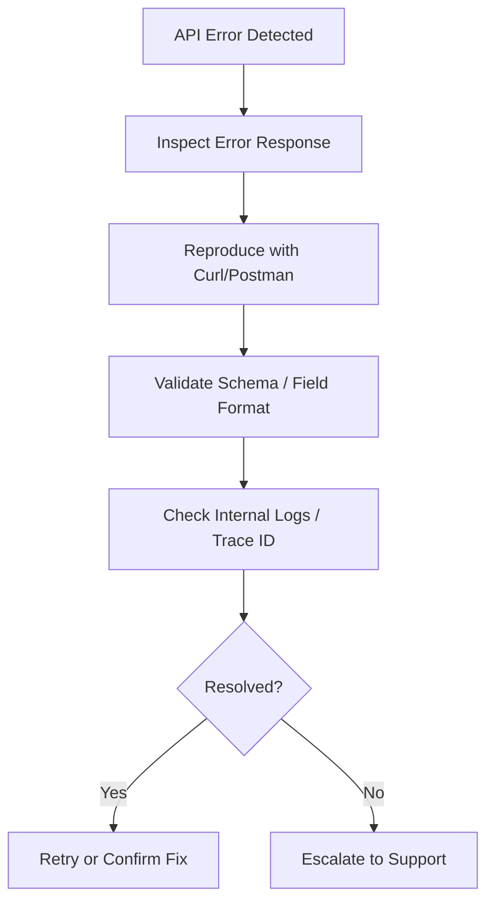

# 🧰 Troubleshooting API Errors

**Applies to:** All Internal and External APIs  
**Audience:** Developers, QA, Support Engineers  
**Updated:** May 26, 2025  
**Difficulty:** Intermediate  
**Contact:** api-support@example.com

---

## 🛠️ Problem

API calls are returning unexpected or failed responses. Errors may include status codes such as 401, 403, 404, 422, 429, or 500. This interrupts expected workflows and hinders system stability.

---

## ✅ Solution

Use this KB to identify, interpret, and resolve API errors using a repeatable process. You'll learn how to debug error responses, validate request structure, check logs, and escalate efficiently when needed.

---

## 📋 Pre-Check Before Debugging

- ✅ Confirm your API key/token is valid and active  
- ✅ Check the correct versioned endpoint is being used  
- ✅ Verify request structure (headers, body format)  
- ✅ Identify the correct environment (dev, staging, prod)  
- ✅ Review logs or trace data if available  

---

## 🔍 Common Error Codes & Fixes

| Code | Type        | Cause                                  | Resolution                            |
|------|-------------|-----------------------------------------|----------------------------------------|
| 400  | Bad Request | Malformed body or missing field         | Validate request format with docs      |
| 401  | Unauthorized| Token is missing or invalid             | Set correct Authorization header       |
| 403  | Forbidden   | Token lacks proper scope/role           | Update token permissions               |
| 404  | Not Found   | Invalid endpoint or ID                  | Recheck the path or resource           |
| 409  | Conflict    | Duplicate data or version mismatch      | Check payloads for conflicts           |
| 422  | Unprocessable| Invalid parameter structure/format     | Review constraints, data types         |
| 429  | Rate Limit  | Too many requests                       | Retry with backoff / respect limits    |
| 500+ | Server      | API-side issue or crash                 | Retry or contact API team              |

---

## 🔎 Troubleshooting Steps

### Step 1: Inspect the API Response

Look for:
- HTTP status code  
- `error.message` or `error.code`  
- Request or trace ID  
- Retry headers (`Retry-After` for 429)

---

### Step 2: Reproduce in Isolation

Use a raw HTTP tool like:
```bash
curl -X POST https://api.example.com/resource \
  -H "Authorization: Bearer sk-xxx" \
  -H "Content-Type: application/json" \
  -d '{ "name": "test" }'
```

Switch environments by updating:
- Base URLs (e.g., `api.staging.example.com`)
- Token sets or subdomain-specific keys

---

### Step 3: Validate Schema and Format

- Match your request to the OpenAPI spec or internal doc  
- Use schema validation tools or IDE linters  
- Compare failing vs successful payloads for diffs

---

### Step 4: Review Logs and Traces

If enabled, inspect:
- API gateway logs  
- Microservice trace logs  
- Observability dashboards (Grafana, DataDog)

---

## 📈 Debug Flow



---

## 🧯 Example Case: 401 Unauthorized

1. Ensure the token is present and valid:
```http
Authorization: Bearer sk-xxxxx
```

2. Confirm the key is active and hasn’t expired  
3. Recheck that you’re hitting the intended environment  
4. Check audit logs for revoked or rotated tokens  
5. Regenerate and retry with a fresh token if needed

---

## 📬 Support Escalation Template

Include this information when contacting the support team:

```
Request ID: <insert-id>
Timestamp (UTC): <YYYY-MM-DD HH:MM:SS>
Environment: dev | staging | prod
Endpoint: <POST /v1/resource>
Error Message/Code: <422 Unprocessable Entity>
Payload: (Sanitized example)
Trace ID: <optional>
```

---

## 📚 Additional Resources

- [API Authentication Best Practices](https://developer.example.com/auth)  
- [Internal API Status Page](https://status.example.internal)  
- [API Style Guide](https://confluence.example.com/display/ENG/APIGUIDE)

---

*Article ID: KB-API-ERRORS-001 | Updated: May 26, 2025*
