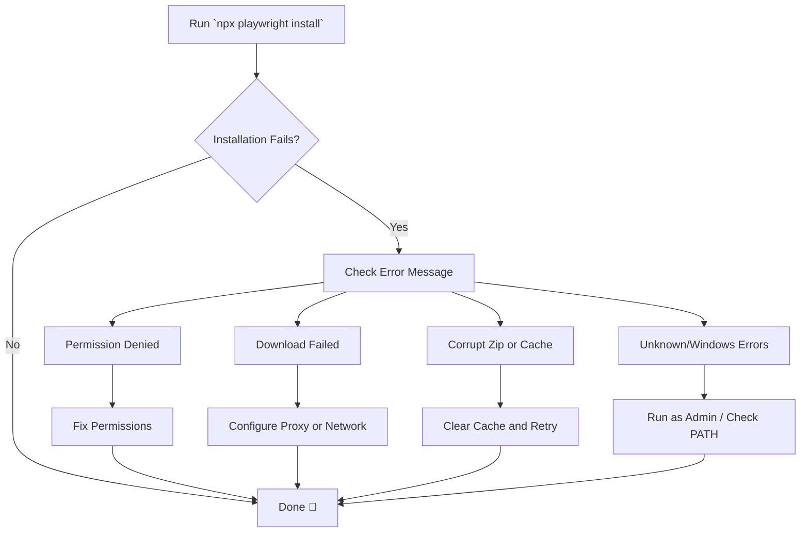

# 🛠️ Troubleshooting Playwright Install Failures  
*Diagnose and resolve common issues encountered during `playwright install`.*

| **Field**        | **Value**                                         |
|------------------|--------------------------------------------------|
| **Version**      | 1.1                                              |
| **Author**       | Corey Rollins                                    |
| **Last Updated** | May 21, 2025                                     |
| **Status**       | Draft                                            |
| **Source**       | [Playwright Docs](https://playwright.dev/docs)  |

---

## Table of Contents

1. [Overview](#1-overview)  
2. [Common Errors](#2-common-errors)  
3. [Root Causes and Fixes](#3-root-causes-and-fixes)  
4. [Advanced Debugging](#4-advanced-debugging)  
5. [See Also](#5-see-also)  

---

## 1. Overview

When running `npx playwright install`, users may encounter issues such as timeouts, corrupted downloads, or permission errors. This guide outlines steps to identify and resolve common problems across various platforms.

<details>
<summary>📊 Click to view the Playwright install troubleshooting flow</summary>



</details>

[🔝 Back to top](#table-of-contents)

---

## 2. Common Errors

| **Error Message**                              | **Likely Cause**                      |
|------------------------------------------------|----------------------------------------|
| `EACCES: permission denied`                    | Insufficient permissions               |
| `Failed to download Chromium`                  | Network timeout or proxy issues        |
| `Corrupt zip file`                             | Incomplete or interrupted download     |
| `spawn UNKNOWN` or `spawn ENOENT`              | Missing system dependencies or path    |

**Example:**
```bash
Error: EACCES: permission denied, mkdir '/usr/lib/node_modules/playwright/.local-browsers'
```

💡 **Tip:** Always confirm you're running the latest version of Node.js and Playwright.

[🔝 Back to top](#table-of-contents)

---

## 3. Root Causes and Fixes

### 3.1 Fixing Permissions (Linux/macOS)

```bash
# Reset permissions on the Playwright browser cache
sudo chown -R $USER:$GROUP ~/.cache/ms-playwright
```

### 3.2 For Corporate Proxies or Firewalls

Set your proxy in the terminal:

```bash
export HTTPS_PROXY=http://proxy.example.com:8080
```

Or use `.npmrc`:

```
https-proxy=http://proxy.example.com:8080
```

### 3.3 Fix Corrupted or Incomplete Downloads

Clear the Playwright cache and reinstall:

```bash
# Clear any incomplete binary downloads
rm -rf ~/.cache/ms-playwright

# Reinstall with fresh download
npx playwright install
```

⚠️ **Warning:** Ensure you’re not behind a VPN or captive Wi-Fi portal that could block downloads.

### 3.4 Windows-Specific Fixes

If encountering `spawn UNKNOWN`:

- Run terminal as **Administrator**
- Confirm `powershell` is in your system `PATH`
- Reinstall dependencies:

```powershell
# Clean and reinstall Playwright dependencies
npm ci
npx playwright install
```

[🔝 Back to top](#table-of-contents)

---

## 4. Advanced Debugging

Enable verbose logging to reveal internal installation steps:

```bash
DEBUG=pw:install npx playwright install
```

Check network access:

```bash
curl https://playwright.azureedge.net
```

Verify your environment:

```bash
npx envinfo --binaries --system --npmPackages playwright
```

💡 **Tip:** Use [Playwright Docker images](https://playwright.dev/docs/docker) for clean installs in CI.

[🔝 Back to top](#table-of-contents)

---

## 5. See Also

- [Playwright Installation Docs](https://playwright.dev/docs/intro)
- [GitHub Issues – Playwright](https://github.com/microsoft/playwright/issues)
- [Playwright Docker Guide](https://playwright.dev/docs/docker)
- [GitHub: Known Install Errors](https://github.com/microsoft/playwright/issues?q=label%3Ainstall)

---

✅ By following these steps, you can resolve most `playwright install` issues related to permissions, downloads, proxies, and platform-specific quirks.
