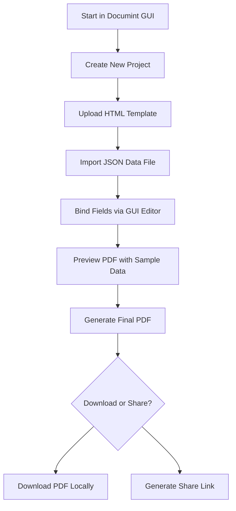

# 🖥️ Creating a PDF with the Documint GUI  
*Use the Documint web interface to design templates and generate PDFs—no coding required.*

| **Field**        | **Value**                                                                 |
|------------------|--------------------------------------------------------------------------|
| **Version**      | 1.1                                                                      |
| **Author**       | Corey Rollins                                                            |
| **Last Updated** | May 21, 2025                                                             |
| **Status**       | Draft                                                                    |
| **Source**       | [Documint GUI](https://documint.me/)                                     |

---

## Table of Contents

1. [Overview](#1-overview)  
2. [Getting Started](#2-getting-started)  
3. [Uploading a Template](#3-uploading-a-template)  
4. [Importing Sample Data](#4-importing-sample-data)  
5. [Binding Data to Fields](#5-binding-data-to-fields)  
6. [Previewing and Generating PDF](#6-previewing-and-generating-pdf)  
7. [Saving or Downloading Output](#7-saving-or-downloading-output)  
8. [See Also](#8-see-also)  

---

## 1. Overview

The Documint GUI is a web-based tool for creating branded PDFs from templates and JSON data. It allows you to upload HTML templates, visually bind them to data fields, and generate professional PDFs in seconds.

<details>
<summary>📊 Click to view the process diagram</summary>



</details>

[🔝 Back to top](#table-of-contents)

---

## 2. Getting Started

1. Visit [https://documint.me](https://documint.me)
2. Create an account or log in
3. Click **"New Project"** to begin a document setup

💡 **Tip:** Projects group templates, data, and outputs together.

[🔝 Back to top](#table-of-contents)

---

## 3. Uploading a Template

1. From your project dashboard, click **"Add Template"**
2. Upload a `.html` file or start with a blank template
3. Use the WYSIWYG editor or HTML editor to customize layout and styling

⚠️ **Note:** Use `{{handlebars}}` syntax in templates to bind dynamic fields.


[🔝 Back to top](#table-of-contents)

---

## 4. Importing Sample Data

1. Navigate to the **Data** tab
2. Upload a `.json` file with your data structure
3. Validate the structure with the built-in preview panel

Example:

```json
{
  "name": "John Doe",
  "invoice_id": "INV-1001",
  "amount_due": "499.00"
}
```

[🔝 Back to top](#table-of-contents)

---

## 5. Binding Data to Fields

1. In the template editor, click on any placeholder text
2. Choose the matching field from the sidebar
3. Use the `{ }` tag to insert fields like `{{name}}`, `{{invoice_id}}`, etc.

💡 **Tip:** Conditional fields and loops are also supported via GUI options.  
⚠️ **Note:** If a field renders as `{{field}}`, check your JSON file for typos or mismatches in key names.

[🔝 Back to top](#table-of-contents)

---

## 6. Previewing and Generating PDF

1. Click **"Preview"** to see a live rendering of the template with data
2. If everything looks correct, click **"Generate PDF"**

This creates a downloadable, styled PDF using the template and selected JSON input.


[🔝 Back to top](#table-of-contents)

---

## 7. Saving or Downloading Output

- Download directly from the preview window
- Or return to the **Documents** tab to access past exports
- PDFs can also be shared via secure link or embedded in other systems

[🔝 Back to top](#table-of-contents)

---

## 8. See Also

- [Documint CLI Usage](./automating-pdf-generation-documint.md)
- [Handlebars Documentation](https://handlebarsjs.com/)
- [Documint Template Syntax Reference](https://docs.documint.me/docs/templates/syntax)
- [Documint Support](https://documint.me/support)

---

✅ With the Documint GUI, you can generate dynamic, personalized documents without touching a terminal—perfect for business users, HR teams, and client-facing workflows.
