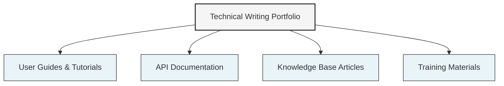
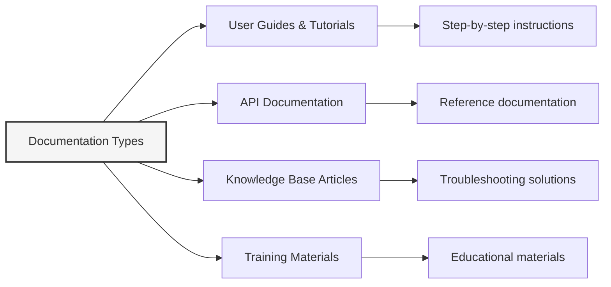
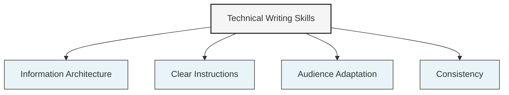

# Technical Writing Portfolio



**Hi there — and welcome.**

This is my technical documentation portfolio, a space I use to practice technical writing as I continue to self-teach and grow in the field. I've included sample docs that reflect how I approach making complex topics more clear and approachable. My background is in SaaS enablement, where I worked as a Senior Instructional Designer, with a strong passion to explore Technical Writing.

## 📂 Portfolio Contents

Here, you'll find examples of my work across several documentation types, including:



- [**User Guides & Tutorials**](./User-Guides): Step-by-step instructions for technical products  
- [**API Documentation**](./API-Documentation): Clear reference documentation for developers  
- [**Knowledge Base Articles**](./Knowledge-Base): Concise solutions to common technical problems  
- [**Training Materials**](./Training-Materials): Educational content for technical product users

Each folder includes a landing page and sample documentation to demonstrate various writing styles and use cases. These reflect my experience creating technical enablement content that supports product adoption and reduces support needs.

## 🔍 About These Samples



The documents in this portfolio demonstrate my ability to:

- Organize complex information in a user-friendly way
- Create clear, concise technical instructions
- Design documentation for different audience needs
- Apply consistent formatting and terminology

## 📫 Contact

```mermaid
flowchart LR
    A[Contact Me] --> B[Email]
    A --> C[LinkedIn]
    A --> D[Website]
    
    B --> B1[corey.p.rollins@gmail.com]
    C --> C1[linkedin.com/in/corey-p-rollins]
    D --> D1[crollins6020.github.io]
    
    style A fill:#f5f5f5,stroke:#333,stroke-width:2px
```

Interested in discussing a technical writing project? Reach out to me:

- Email: [corey.p.rollins@gmail.com](mailto:corey.p.rollins@gmail.com)
- LinkedIn: [linkedin.com/in/corey-p-rollins](https://www.linkedin.com/in/corey-p-rollins/)
- Website: [crollins6020.github.io](https://crollins6020.github.io)
