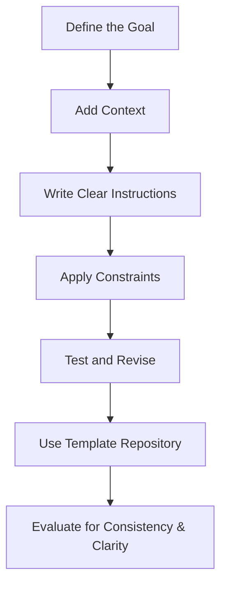

# Enterprise Prompt Engineering Handbook

*Practical instructions for writing effective AI prompts that generate consistent, accurate results—while avoiding common pitfalls that waste time and resources.*

**Version:** 1.0
**Author:** Corey Rollins
**Last Updated:** May 21, 2025
**Status:** Draft
**Source:** [GitHub Repository](#)

---

## Table of Contents

1. [Introduction](#1-introduction)
2. [Prompt Engineering Principles](#2-prompt-engineering-principles)
3. [Prompt Design Workflow](#3-prompt-design-workflow)
4. [Common Pitfalls and How to Avoid Them](#4-common-pitfalls-and-how-to-avoid-them)
5. [Evaluation and Iteration](#5-evaluation-and-iteration)
6. [Best Practices and Templates](#6-best-practices-and-templates)
7. [Troubleshooting Prompt Issues](#7-troubleshooting-prompt-issues)
8. [Visual Workflow Overview](#8-visual-workflow-overview)
9. [Next Steps and Resources](#9-next-steps-and-resources)
10. [Back to Top](#enterprise-prompt-engineering-handbook)

---

## 1. Introduction

This handbook helps technical teams, content creators, and AI stakeholders design and iterate on high-performing prompts. It follows a structured, modular approach aligned with enterprise use cases—ensuring prompts are repeatable, effective, and maintainable.

---

## 2. Prompt Engineering Principles

* **Clarity First:** Use plain, specific language. Avoid ambiguity.
* **Structure Prompts Like Code:** Think in logical blocks (input, instruction, constraints).
* **Test for Variability:** Evaluate outputs across varied inputs to check stability.
* **Design for Purpose:** Prompts should map to clear use cases (e.g., summarization, generation, Q\&A).
* **Maintain Reusability:** Use variables, comments, and formatting for shared usage.

💡 *Tip: Treat prompt engineering like UX design—optimize for predictable, user-friendly responses.*

---

## 3. Prompt Design Workflow

### 3.1 Define the Goal

* What should the AI accomplish?
* What does a successful output look like?

### 3.2 Provide Context

Include only relevant background. Avoid overloading the prompt with redundant info.

```text
You're a cybersecurity analyst. Summarize the following incident report...
```

### 3.3 Set Clear Instructions

* Be explicit about format, tone, and scope.
* Example: "Respond in bullet points, using neutral tone."

### 3.4 Apply Constraints

* Output length
* Response type (e.g., JSON, Markdown)
* Roleplay setup (e.g., "Act as a recruiter")

### 3.5 Evaluate and Revise

* Test edge cases
* Solicit SME feedback
* Track changes in performance metrics

---

## 4. Common Pitfalls and How to Avoid Them

| Pitfall                    | Solution                                         |
| -------------------------- | ------------------------------------------------ |
| Vague instructions         | Be directive: specify structure and format       |
| Overlong context blocks    | Trim to essential, current-task-relevant content |
| Misaligned tone or persona | Set expectations using "You are a..." framing    |
| No evaluation criteria     | Define success before testing                    |

⚠️ **Warning:** Avoid using live or production data in prompt testing environments.

---

## 5. Evaluation and Iteration

Use a consistent rubric when comparing outputs:

* **Accuracy:** Does the output match factual or task goals?
* **Consistency:** Are results stable across similar prompts?
* **Clarity:** Is the language clear and actionable?
* **Security:** Does the output follow data handling best practices?

Use version control to track prompt revisions. Document changes and test results.

### Example Evaluation Rubric

| Criteria    | Rating (1–5) | Notes |
| ----------- | ------------ | ----- |
| Accuracy    |              |       |
| Consistency |              |       |
| Clarity     |              |       |
| Security    |              |       |

---

## 6. Best Practices and Templates

### General Format

```markdown
You're a [role]. Based on the following [input], [do this task] using [format/tone/length constraints].
```

### Example Prompt

```text
You're a customer success manager. Based on this ticket transcript, write a three-sentence summary using plain language and positive tone.
```

### Template Block

```markdown
<!-- Prompt Template Start -->
You're a {{persona}}. Based on the following {{input}}, {{task}}. Format as {{output_format}}.
<!-- Prompt Template End -->
```

💡 *Tip: Store reusable prompt blocks in a versioned template repository.*

---

## 7. Troubleshooting Prompt Issues

| Issue                | Cause                                          | Solution                                   |
| -------------------- | ---------------------------------------------- | ------------------------------------------ |
| Hallucinated facts   | Prompt is too vague or lacks grounding context | Add constraints or provide example outputs |
| Inconsistent tone    | No tone guidance provided                      | Add role/persona and tone instructions     |
| Incomplete responses | Output length constraint too tight             | Adjust token or character limits           |
| Format errors        | Model misunderstood structure                  | Use formatting examples (JSON, Markdown)   |

💡 *Tip: Keep a troubleshooting log for recurring issues across prompt versions.*

---

## 8. Visual Workflow Overview



---

## 9. Next Steps and Resources

### Actionable Next Steps

* Review existing prompts using the rubric in Section 5.
* Create modular templates using the format in Section 6.
* Maintain a shared repository for prompt evaluation and reuse.
* Document issues encountered using the troubleshooting table.

### Resources

* [Prompt Engineering Templates (GitHub)](#)
* [LLM Behavior Evaluation Guide](#)
* [Enterprise AI Governance Policy](#)

For questions or suggestions, contact the documentation lead.

---

[Back to top](#enterprise-prompt-engineering-handbook)
