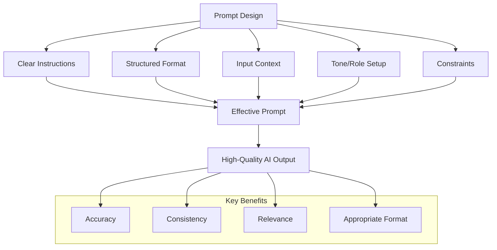
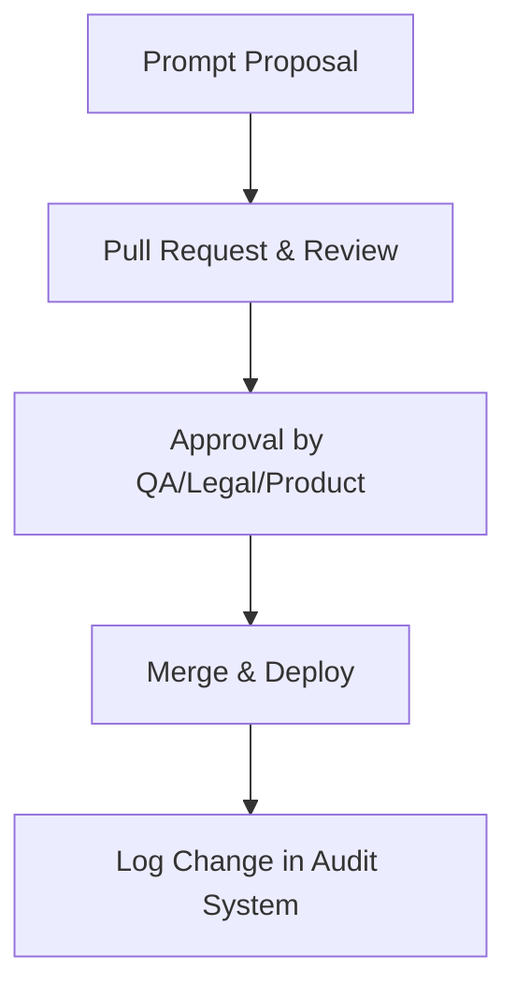
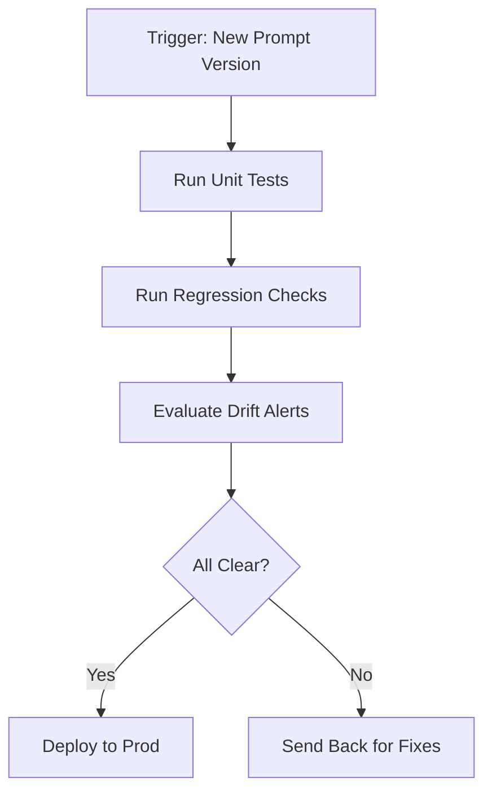
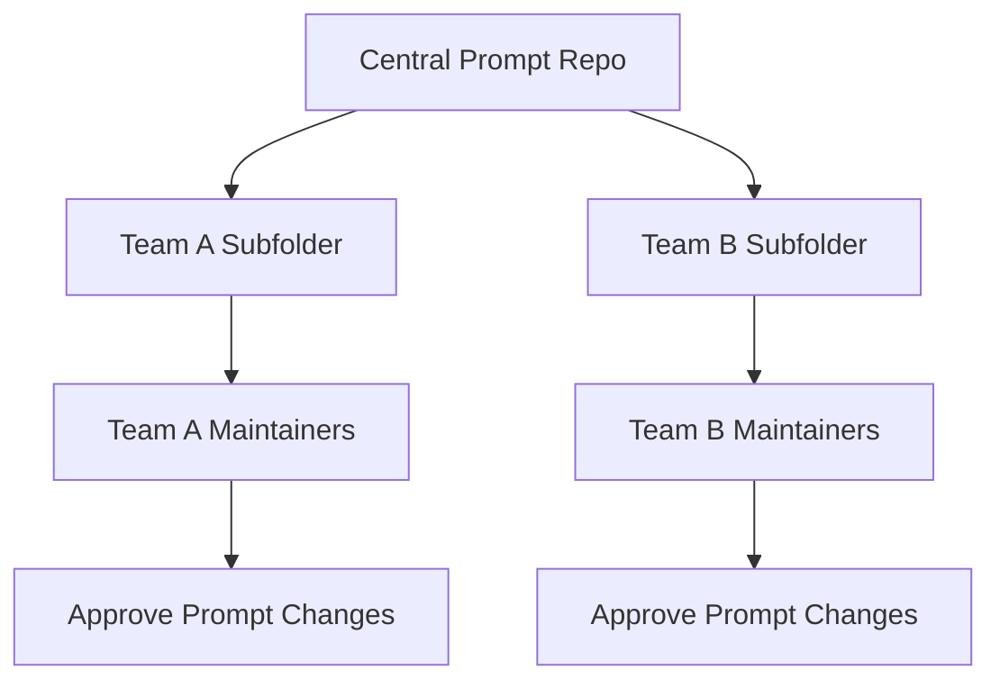
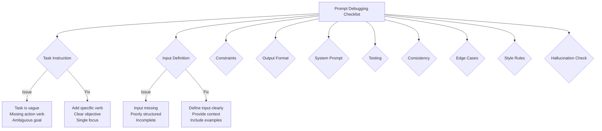
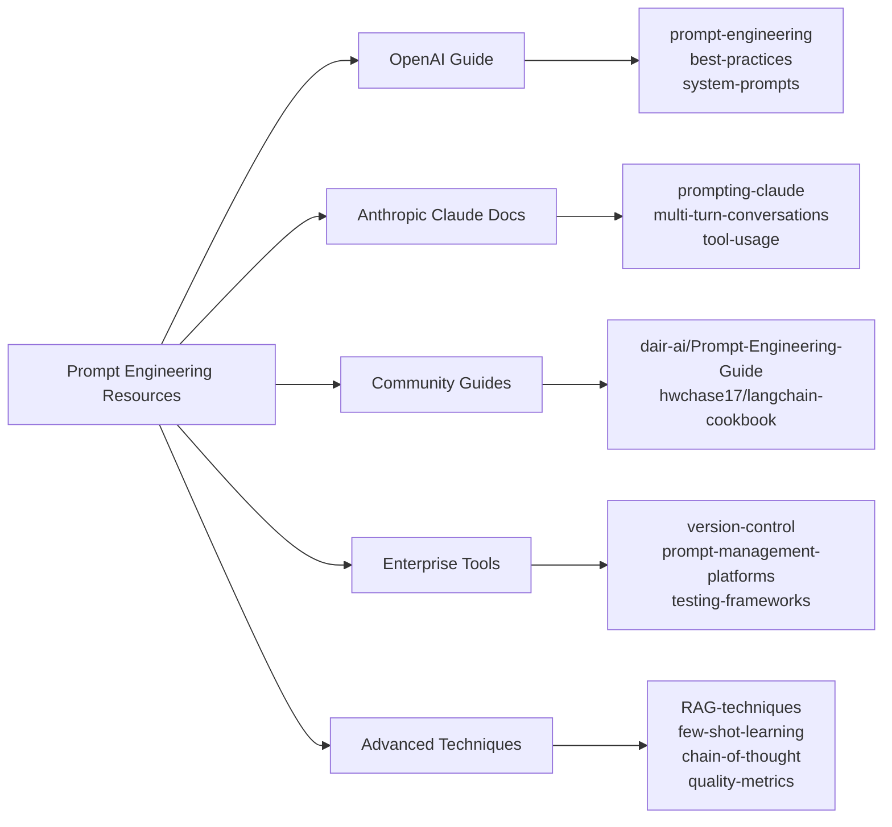

# Enterprise Prompt Engineering Handbook: Administrator's Guide

Enterprise Deployment & Management

**Version:** 1.0 | **Author:** Guide & Tutorial Builder | **Last Updated:** May 20, 2025

<hr style="border: 3px solid #333;">

## Table of Contents

1. [Executive Summary](#executive-summary)
2. [Introduction](#introduction)
3. [Environment Setup](#environment-setup)

   * 3.1 [Tools](#tools)
   * 3.2 [Team Structure](#team-structure)
4. [Prompt Design](#prompt-design)

   * 4.1 [Format Template](#format-template)
   * 4.2 [Prompt Components](#prompt-components)
   * 4.3 [Common Prompt Errors](#common-prompt-errors)
   * 4.4 [Use Case Variants](#use-case-variants)
5. [Scalable Implementation](#scalable-implementation)

   * 5.1 [Templates with Jinja2](#templates-with-jinja2)
   * 5.2 [Version Control](#version-control)
6. [Performance Evaluation](#performance-evaluation)

   * 6.1 [Metrics](#metrics)
   * 6.2 [Quality Reviews](#quality-reviews)
7. [Prompt Refinement](#prompt-refinement)

   * 7.1 [Feedback Loop](#feedback-loop)
   * 7.2 [A/B Testing](#ab-testing)
8. [Prompt Governance](#prompt-governance)
9. [Prompt Testing Strategies](#prompt-testing-strategies)
10. [Prompt Library Management](#prompt-library-management)
11. [Scaling Across Teams](#scaling-across-teams)
12. [Troubleshooting Prompt Failures](#troubleshooting-prompt-failures)

<hr style="border: 3px solid #333;">

<!-- Existing content retained -->



## Prompt Governance



Establishing governance ensures prompt updates are accountable, secure, and aligned with business objectives.

### Approval Workflows

Set up a pull request (PR) system with mandatory reviewers from QA, legal, and product teams before merging prompt changes.

> **Example:** A financial services company requires legal review of any prompt that could output investment guidance.

### Audit Logging

Track who updated what and when. Store logs in a centralized system like ELK or a GitHub audit log export.

### Permissions

Use role-based access control. Only approved engineers and designers should modify production-bound prompt templates.

<hr style="border: 3px solid #333;">

## Prompt Testing Strategies



### Unit Tests

Use fixed input/output pairs to ensure new prompts produce consistent, correct results.

```json
{
  "input": "Summarize Q1 revenue data",
  "expected_output_contains": ["increase", "$"],
  "prompt_version": "v1.2"
}
```

### Regression Tests

Automate comparisons between prompt versions. Alert on drift in word count, sentiment, or keyword presence.

### Tools

Use OpenAI evals, LangChain evals, or internal scripts to batch test prompts nightly.

<hr style="border: 3px solid #333;">

## Prompt Library Management

### Structure

Organize by domain and purpose:

```
/prompts
  /customer-support
    summarize-ticket.md
  /marketing
    generate-headlines.md
```

### Naming Conventions

Use a consistent pattern:
`[department]_[task]_[tone]-vX.Y.md`

### Metadata

Add YAML front matter or JSON blocks to store attributes:

```yaml
name: generate_headlines
category: marketing
output_format: bullet_points
```

<hr style="border: 3px solid #333;">

## Scaling Across Teams



### Central Repository

Use a Git-based monorepo to manage all prompts with folders for each team. Sync via submodules or internal registries.

### Ownership

Assign maintainers per folder. Require reviewers from that domain to approve updates.

### Templates and Tooling

Offer reusable prompt modules and macros, e.g., a common tone instruction or disclaimer.

<hr style="border: 3px solid #333;">

## Troubleshooting Prompt Failures

### Common Symptoms

* Outputs are too long or too short
* Hallucinated details
* Wrong tone or incomplete logic

### Diagnostic Checklist

* Was the prompt updated recently?
* Are inputs formatted or truncated?
* Was the model version changed?

### Recovery

* Roll back to last good version
* Run a targeted regression test
* Reintroduce examples or constraints

> **Example:** A support chatbot suddenly gives inconsistent responses. Logs show a recent prompt update removed an example. Rolling it back resolves the issue.

## Appendix A: Prompt Debugging Checklist



Use this checklist during prompt development and QA reviews:

* [ ] Is the **task instruction** specific and clear?
* [ ] Is the **input** well-scoped and available?
* [ ] Are **constraints** like tone, length, or exclusions defined?
* [ ] Is the **output format** described (e.g., bullets, JSON)?
* [ ] Does the **system prompt** define behavior or persona?
* [ ] Have you tested the prompt with **different inputs**?
* [ ] Is the output **consistent** across runs at low temperature?
* [ ] Are there **fallbacks** or clarifications for edge cases?
* [ ] Does the result follow all **style and formatting rules**?
* [ ] Are there **any hallucinations** or unsupported statements?

> ✅ Aim for clarity, consistency, and repeatability in all production prompts.

---

## Appendix B: Reference Links



* [OpenAI Prompt Engineering Guide](https://platform.openai.com/docs/guides/prompt-engineering)
* [Anthropic Claude Prompt Design](https://www.anthropic.com/index/prompting-claude)
* [Prompt Engineering Patterns](https://github.com/dair-ai/Prompt-Engineering-Guide)
* [LangChain Cookbook](https://github.com/hwchase17/langchain-cookbook)
* [RAG and LLMOps Best Practices](https://github.com/openai/openai-cookbook/tree/main/examples/RAG)

---

## Conclusion

Prompt engineering at the enterprise level demands more than intuition—it requires systems, standards, and iteration. This handbook outlined a complete lifecycle: designing effective prompts, deploying them responsibly, evaluating results with rigor, and refining based on structured feedback.

### Key Takeaways

* Use templates and modularity to promote consistency.
* Rely on tooling and metrics to scale quality control.
* Establish governance to align prompt updates with risk management.
* Build feedback loops and test environments to support continuous improvement.

### Next Steps

* Audit your current prompt inventory.
* Set up a shared library with metadata and version control.
* Train teams on prompt design principles.
* Integrate evaluation and feedback tools.

### Resources

* [OpenAI Cookbook](https://github.com/openai/openai-cookbook)
* [LangChain Documentation](https://docs.langchain.com/)
* [PromptLayer](https://www.promptlayer.com)

For feedback or contributions to this handbook, contact your PromptOps lead or open an issue in the internal prompt-repo.

<hr style="border: 3px solid #333;">
