# Enterprise Prompt Engineering Handbook

*Practical instructions for writing effective AI instructions that get consistent, accurate results and avoid common pitfalls.*

**Version**: 1.0 | **Author**: Corey Rollins | **Date**: May 20, 2025

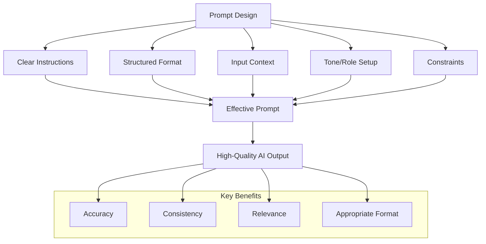

---

## Table of Contents

* [1. Introduction](#1-introduction)
* [2. Prompt Design Fundamentals](#2-prompt-design-fundamentals)
* [3. Common Pitfalls and How to Avoid Them](#3-common-pitfalls-and-how-to-avoid-them)
* [4. System Prompt Strategies](#4-system-prompt-strategies)
* [5. Role-Based Prompting Patterns](#5-role-based-prompting-patterns)
* [6. Multi-Turn Interactions](#6-multi-turn-interactions)
* [7. Evaluation and Refinement Techniques](#7-evaluation-and-refinement-techniques)
* [8. Use Case Templates](#8-use-case-templates)
* [9. Governance and Risk Considerations](#9-governance-and-risk-considerations)
* [Appendix A: Prompt Debugging Checklist](#appendix-a-prompt-debugging-checklist)
* [Appendix B: Reference Links](#appendix-b-reference-links)

---

## 1. Introduction

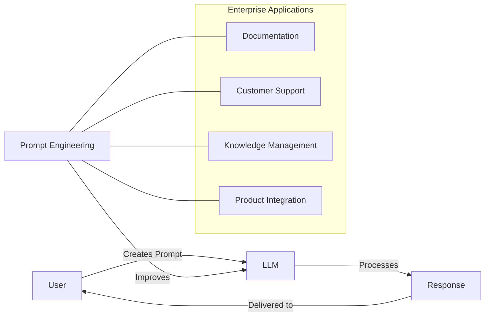

Prompt engineering is the practice of crafting clear, structured instructions to get accurate, repeatable responses from large language models (LLMs). In an enterprise context, effective prompts power documentation, enablement, customer support, and product integration workflows across technical and business domains.

This guide helps Technical Writers, Enablement teams, and SMEs write better prompts using structured frameworks, real-world examples, and best practices tailored to SaaS, cybersecurity, and high-tech use cases.

This section sets the stage for the rest of the guide, providing a clear definition of prompt engineering and its role in enterprise environments. It explains who the guide is for and why prompt quality matters.

<a href="#table-of-contents">Back to Top</a>

---

## 2. Prompt Design Fundamentals

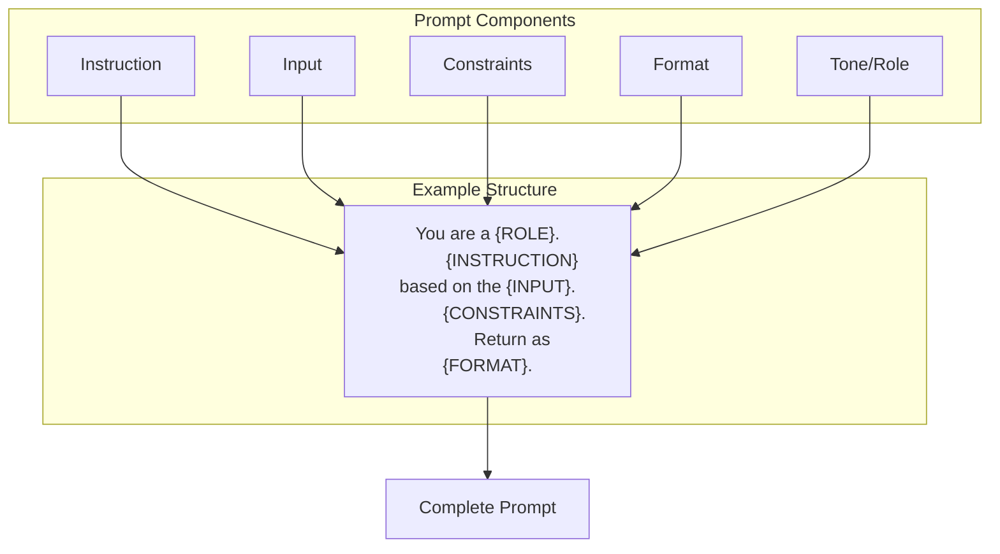

This section introduces the building blocks of well-structured prompts. The goal is to make sure every prompt has a clear purpose, expected format, and enough context to guide the model. Each component of a prompt contributes to performance—like clearly stating what the model should do, how it should respond, and what tone it should use.

### Prompt Components

| Component       | Description                      | Example                                                |
| --------------- | -------------------------------- | ------------------------------------------------------ |
| **Instruction** | What the model should do         | *"Summarize this changelog in 3 bullet points."*       |
| **Input**       | The source content               | *"Product release notes, JSON error log, user email"*  |
| **Constraints** | Limits or boundaries             | *"Keep it under 75 words. Don't include pricing."*     |
| **Format**      | Expected structure of the output | *"Return a markdown table with columns: Error, Fix"*   |
| **Tone/Role**   | The model's persona or expertise | *"You are a cybersecurity SME writing to executives."* |

> **Tip:** Start with simple single-task prompts. Gradually increase complexity as you evaluate performance.

<a href="#table-of-contents">Back to Top</a>

---

## Prompt Examples

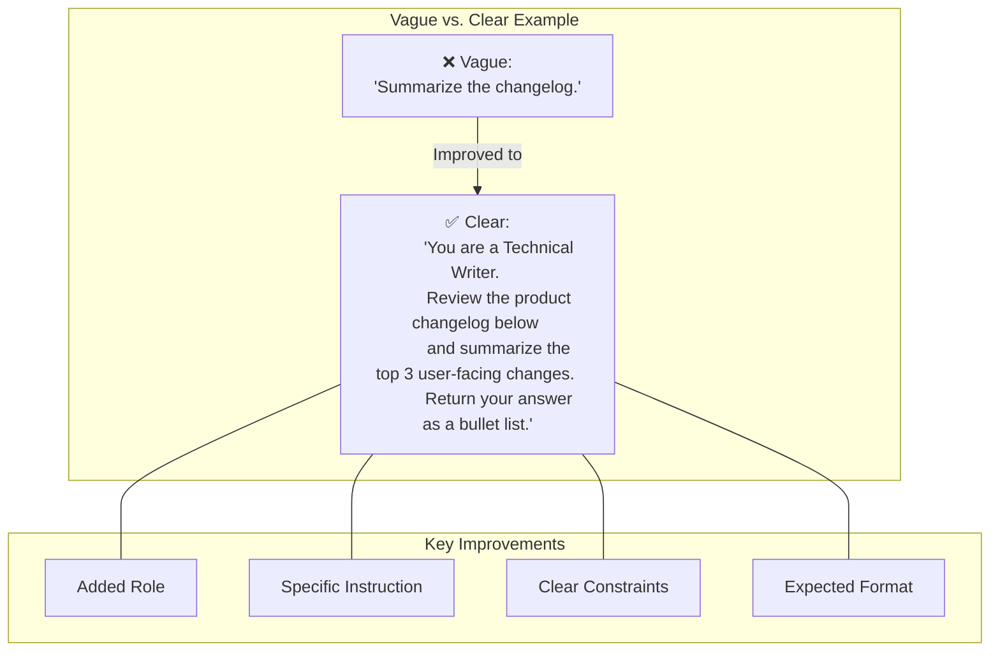

### Example 1

> #### ❌ Vague Prompt
> "Summarize the changelog."

> #### ✅ Clear Prompt
> "You are a Technical Writer. Review the product changelog below and summarize the top 3 user-facing changes. Return your answer as a bullet list."

---

### Example 2

> #### ❌ Vague Prompt
> "Make this into a short note."

> #### ✅ Clear Prompt
> "Translate the product update into a one-paragraph internal email for Customer Success. Be informal and highlight changes to billing."

---

### Example 3

> #### ❌ Vague Prompt
> "Tell me what this is."

> #### ✅ Clear Prompt
> "You are a documentation specialist. Review the following API payload and describe its structure using plain language in 3 bullet points."

---

### Example 4

> #### ❌ Vague Prompt
> "Help with this email."

> #### ✅ Clear Prompt
> "You are a SaaS onboarding writer. Create a short intro paragraph followed by a markdown checklist of setup steps from the email below."

<a href="#table-of-contents">Back to Top</a>

---

## 3. Common Pitfalls and How to Avoid Them

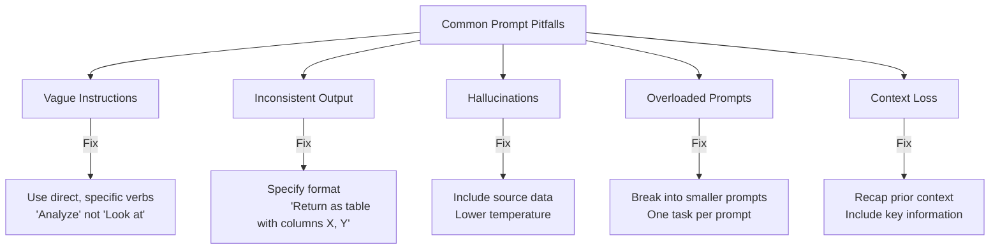

This section highlights typical mistakes in prompt construction and how to resolve them. It's especially helpful during prompt reviews and troubleshooting. Addressing these common issues can improve accuracy, reduce hallucinations, and make prompts more reusable across your organization.

| Pitfall                    | Cause                       | Fix                                       |
| -------------------------- | --------------------------- | ----------------------------------------- |
| Vague Instructions         | Ambiguous verbs or goals    | Use direct, specific tasks                |
| Inconsistent Output        | No format defined           | Specify structure and constraints         |
| Hallucinations             | Lack of context or examples | Include source data and lower temperature |
| Overloaded Prompts         | Too many requests at once   | Break into smaller, sequential prompts    |
| Loss of Multi-Turn Context | Insufficient memory cues    | Recap prior steps; restate relevant input |

> **🚫 Bad Prompt**  
> *"Tell me about this user guide."*

> **✅ Improved Prompt**  
> *"Summarize the onboarding user guide below into 3 bullet points focused on account creation, permissions, and support access."*

> **🚫 Bad Prompt**  
> *"What's wrong with this log?"*

> **✅ Improved Prompt**  
> *"You are a support engineer. Review the error log below and identify one likely root cause. Provide a short explanation and a recommended fix."*

> **🚫 Bad Prompt**  
> *"Turn this into something better."*

> **✅ Improved Prompt**  
> *"Convert this internal chat into a formal KB article with a title, short summary, and 3 key steps."*

<a href="#table-of-contents">Back to Top</a>

---

## 4. System Prompt Strategies

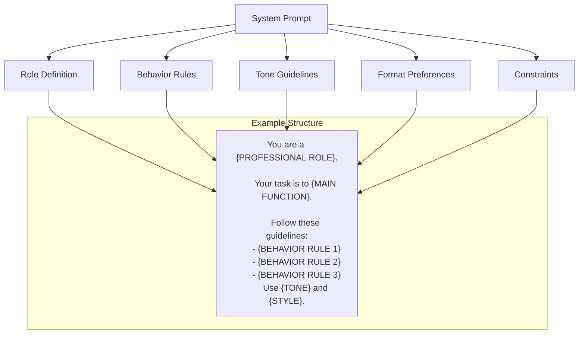

System prompts define the model's behavior, tone, and persona throughout a session. This section shows how to establish reliable defaults that improve consistency across user interactions and ensure the model acts in predictable ways.

### Example Strategies

* *"You are a professional Technical Writer working for a cybersecurity company. Be clear, concise, and use markdown formatting when appropriate."*
* *"Act as a support engineer. Be direct but friendly, avoid speculation, and cite specific logs or config settings when making recommendations."*
* *"You are a senior editor. Improve grammar and clarity while preserving meaning and tone. Do not change technical terms."*
* *"Behave as an AI assistant for developers. Return examples in JSON or code format when relevant."*
* *"You are an internal compliance specialist. Always cite the relevant policy and add a risk rating to each response."*

### Best Practices

* Keep system prompts under 1,000 characters
* Focus on behavior, tone, and constraints
* Align persona with real-world job roles
* Reinforce model limitations (e.g., avoid legal or medical advice)
* Reuse standardized system prompts across teams

<a href="#table-of-contents">Back to Top</a>

---

## 5. Role-Based Prompting Patterns

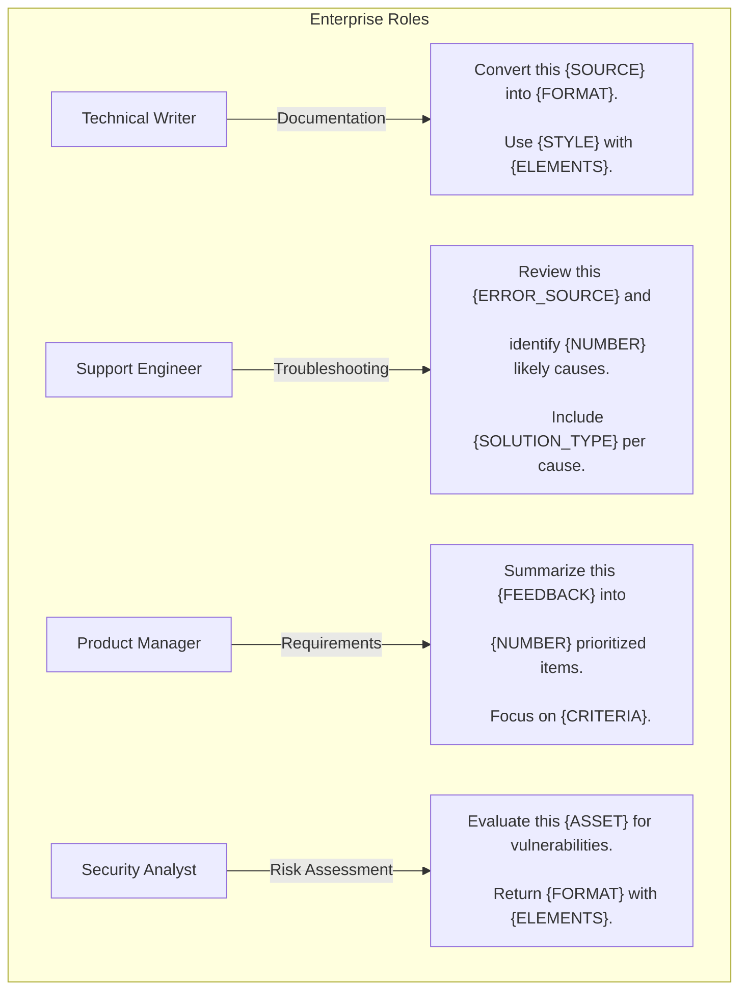

Different business roles require different prompt patterns. This section gives reusable templates aligned to job functions. These patterns ensure that prompts reflect actual workplace needs and communication styles.

| Role                      | Prompt Pattern                                                                                  |
| ------------------------- | ----------------------------------------------------------------------------------------------- |
| **Technical Writer**      | *"Convert this Slack thread into a formal internal SOP. Use headers and bullets."*              |
| **Support Engineer**      | *"Review this error trace and suggest 3 likely causes. Include one diagnostic step per cause."* |
| **Sales Enablement**      | *"Write a 1-paragraph pitch for this new feature targeting IT security leaders."*               |
| **Product Manager**       | *"Summarize this customer feedback into 3 prioritized feature requests."*                       |
| **Cybersecurity Analyst** | *"Assess this firewall rule for potential vulnerabilities. Return risk level and reasoning."*   |

<a href="#table-of-contents">Back to Top</a>

---

## 6. Multi-Turn Interactions

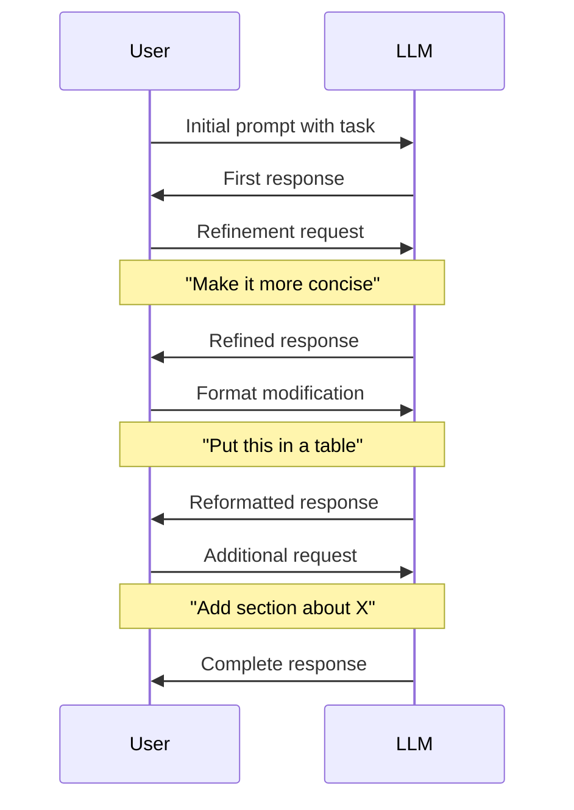

This section outlines how to structure conversations where the model and user go back and forth. Multi-turn prompts are powerful for workflows like document generation, technical troubleshooting, or iterative summaries.

### Example Workflow

**Step 1**:  
*"Summarize this SOC2 policy document in 5 bullet points."*

**Step 2**:  
*"Based on your summary, draft an FAQ for new employees about data handling."*

**Step 3**:  
*"Reformat the FAQ as a Slack message."*

### Tips

* Recap or reframe prior context
* Use follow-up instructions to refine tone or format
* Track changes explicitly (e.g., *"update last section"*)
* Acknowledge user feedback and rerun with adjustments
* Name each step for clarity in shared workflows

<a href="#table-of-contents">Back to Top</a>

---

## 7. Evaluation and Refinement Techniques

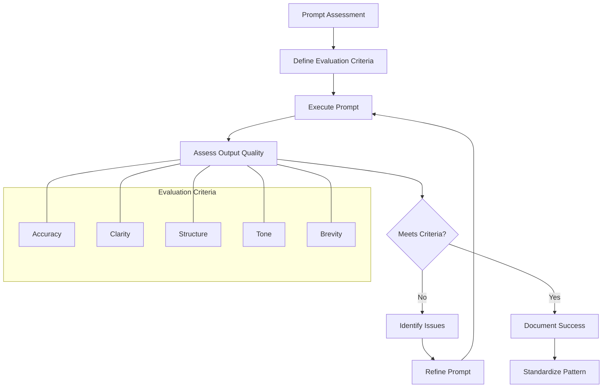

This section provides criteria and examples for reviewing prompt outputs and iteratively improving prompts based on outcomes. Evaluation helps ensure outputs are accurate, clear, and fit for purpose.

### How to Evaluate Outputs

| Criterion | Questions to Ask                         |
| --------- | ---------------------------------------- |
| Accuracy  | Are facts consistent with the input?     |
| Clarity   | Is the language clear and concise?       |
| Structure | Does it follow the requested format?     |
| Tone      | Is it appropriate for the audience/role? |
| Brevity   | Does it meet length constraints?         |

### Refinement Examples

**Original Prompt**:  
*"Write a summary of this user guide."*

**Refined Prompt**:  
*"Summarize the following onboarding guide into 3 plain-language bullet points focused on setup steps. Keep it under 100 words."*

**Original Prompt**:  
*"Explain this config."*

**Refined Prompt**:  
*"You are a DevOps specialist. Describe the function of this YAML configuration file using bullet points. Mention environment settings, ports, and volumes."*

**Original Prompt**:  
*"What do you think?"*

**Refined Prompt**:  
*"Critically evaluate the pros and cons of the password policy described below. Return a markdown table with two columns: Strengths and Weaknesses."*

<a href="#table-of-contents">Back to Top</a>

---

## 8. Use Case Templates

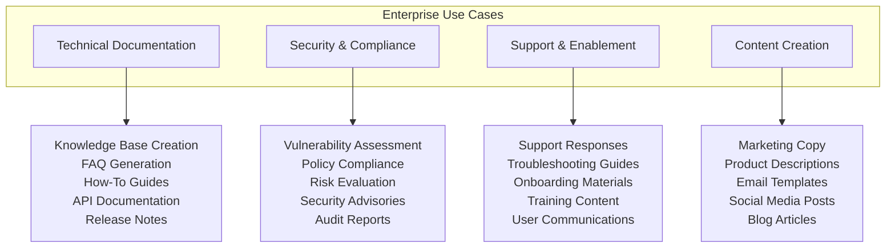

Reusable templates help teams quickly apply good prompting practices across tasks. These examples are grouped by purpose to illustrate prompt reuse at scale.

### 🔧 Technical Documentation

* *"You are a documentation specialist. Turn the notes below into a structured internal knowledge base article with headings."*
* *"Convert this Jira ticket into a how-to guide for onboarding engineers."*
* *"Generate a troubleshooting section for this guide using data from resolved support tickets."*
* *"Write a definition for this API error code. Include cause, impact, and resolution."*
* *"Turn this Slack thread into a markdown-formatted FAQ."*

### 🔐 Security & Compliance

* *"You are a compliance analyst. List 3 security gaps in this access control policy."*
* *"Summarize the relevant SOC2 requirements from this policy excerpt."*
* *"Evaluate this script for security risks. Rate each one from low to critical."*
* *"List any PII exposure risks in this dataset and recommend fixes."*
* *"Convert this policy change into a Slack update for engineering managers."*

### 💬 Support & Enablement

* *"You are a support rep. Turn this internal solution into an external-facing help article."*
* *"Summarize this customer's problem in 3 bullet points for engineering review."*
* *"Draft a one-paragraph email response to the customer's request below. Be empathetic and solution-oriented."*
* *"Write 3 troubleshooting steps based on this error trace."*
* *"Generate a 1-paragraph onboarding welcome message for new users."*

<a href="#table-of-contents">Back to Top</a>

---

## 9. Governance and Risk Considerations

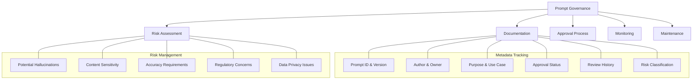

To scale prompt usage safely across teams, you need structure and oversight. This section defines how to document, review, and audit prompts so that they align with enterprise risk management.

### Metadata Tracking

Use metadata to document the who, what, why, and how of each enterprise-level prompt. Metadata enables traceability, risk monitoring, and reuse.

| Prompt Name           | Author     | Business Purpose          | Format      | Last Reviewed | Sensitivity |
| --------------------- | ---------- | ------------------------- | ----------- | ------------- | ----------- |
| onboarding\_faq\_v2   | K. Bennett | Internal training guide   | Bullet List | 2024-11-03    | Low         |
| risk\_eval\_prompt\_1 | J. Owens   | Vulnerability scoring     | JSON        | 2025-01-15    | High        |
| product\_pitch\_Q2    | M. Chang   | Sales enablement email    | Paragraph   | 2025-03-05    | Medium      |
| triage\_script\_gen   | R. Ortega  | Ticket routing in support | Table       | 2025-02-12    | Medium      |
| exec\_summary\_tool   | A. Rollins | Quarterly board summary   | Prose       | 2025-04-01    | Low         |

### Risks to Monitor

* Hallucinations in legal, compliance, or security tasks
* Overgeneralized answers without sufficient constraints
* Format drift over time in shared use prompts

> **Governance Tip**: Store reusable prompts in a version-controlled knowledge base or Git repo. Add unit tests where possible.

<a href="#table-of-contents">Back to Top</a>

---

## Appendix A: Prompt Debugging Checklist

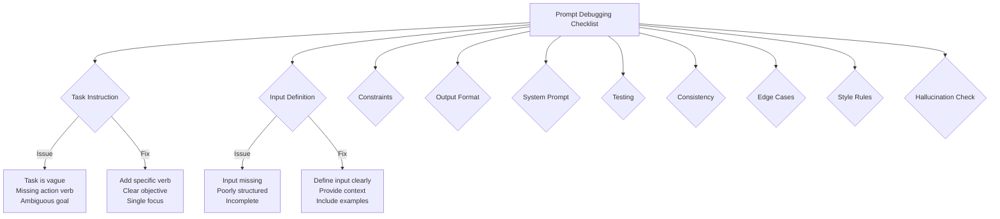

This checklist is for debugging and validating prompts before deployment or reuse. Use it during QA or prompt development sessions to ensure quality.

* [ ] Is the **task instruction** specific and clear?
* [ ] Is the **input** well-scoped and available?
* [ ] Are **constraints** like tone, length, or exclusions defined?
* [ ] Is the **output format** described (e.g., bullets, JSON)?
* [ ] Does the **system prompt** define behavior or persona?
* [ ] Have you tested the prompt with **different inputs**?
* [ ] Is the output **consistent** across runs at low temperature?
* [ ] Are there **fallbacks** or clarifications for edge cases?
* [ ] Does the result follow all **style and formatting rules**?
* [ ] Are there **any hallucinations** or unsupported statements?

> ✅ Aim for consistency, clarity, and repeatability. Prompts should perform reliably across runs and users.

<a href="#table-of-contents">Back to Top</a>

---

## Appendix B: Reference Links

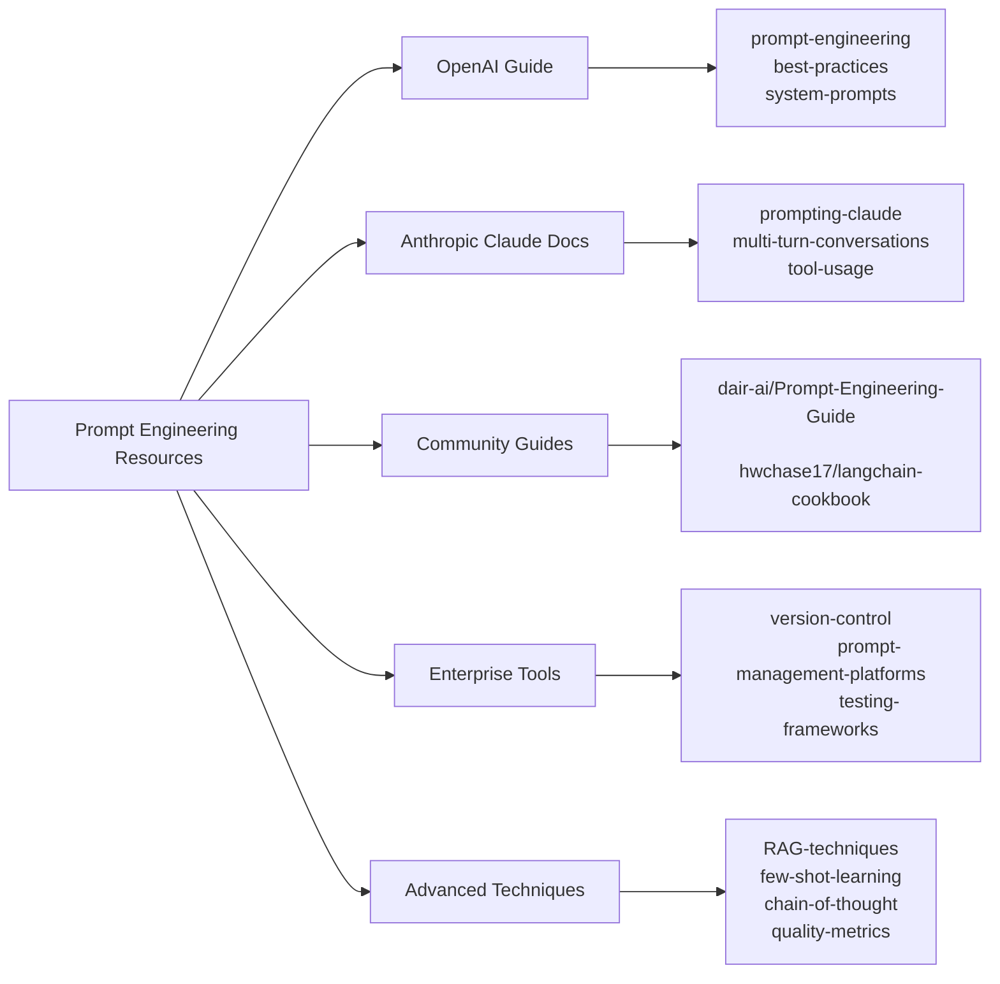

* [OpenAI Prompt Engineering Guide](https://platform.openai.com/docs/guides/prompt-engineering) - Official documentation for crafting effective prompts with OpenAI models
* [Anthropic Claude Prompt Design](https://www.anthropic.com/index/prompting-claude) - Best practices for prompting Claude models
* [Prompt Engineering Patterns](https://github.com/dair-ai/Prompt-Engineering-Guide) - Community-maintained collection of prompt engineering techniques
* [LangChain Cookbook](https://github.com/hwchase17/langchain-cookbook) - Examples and patterns for building LLM applications with LangChain
* [RAG and LLMOps Best Practices](https://github.com/openai/openai-cookbook/tree/main/examples/RAG) - Advanced techniques for retrieval augmented generation

<a href="#table-of-contents">Back to Top</a>
