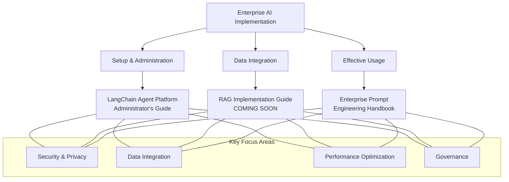
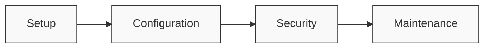
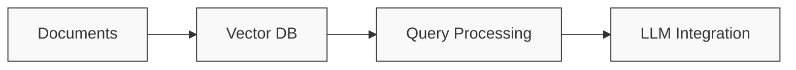
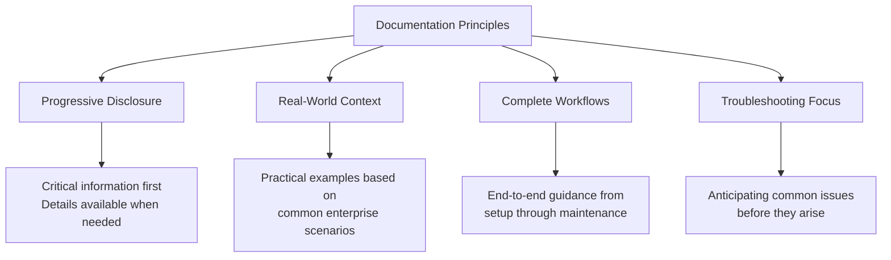

# 🧭 User Guides & Tutorials

Clear, practical documentation to help users navigate complex AI systems with confidence. These guides address the most pressing challenges businesses face when implementing AI technologies, focusing on practical implementation, security, and effective usage.

## 📂 Available Guides

### **[LangChain Agent Platform: Administrator's Guide](https://github.com/CRollins6020/CRollins6020/blob/main/User-Guides/LangChain%20Agent%20Platform%20Admin%20Guide.md)**

A complete guide for IT teams to set up and manage custom AI assistants that can securely access company information while keeping sensitive data private.

### **[COMING SOON] RAG Implementation Guide**

Learn how to connect AI chatbots to your organization's internal documents and data sources, enabling them to deliver context-aware answers based on your business content—not generic web data.

### **[Enterprise Prompt Engineering Handbook](https://github.com/CRollins6020/CRollins6020/blob/main/User-Guides/Enterprise%20Prompt%20Engineering%20Handbook.md)**

Practical instructions for writing effective AI prompts that generate consistent, accurate results—while avoiding common pitfalls that waste time and resources.

---

## Documentation Approach

My technical guides follow these principles:
- **Progressive disclosure** - Critical information first, details available when needed
- **Real-world context** - Practical examples based on common enterprise scenarios
- **Complete workflows** - End-to-end guidance from setup through maintenance
- **Troubleshooting focus** - Anticipating common issues before they arise