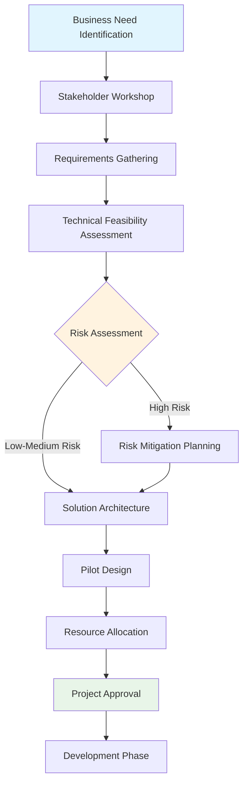

# Enterprise Prompt Engineering Handbook

| **Field** | **Value** |
|-----------|-----------|
| **Title** | Enterprise Prompt Engineering Handbook |
| **Version** | Version 1.0 |
| **Author** | Technical Writing Portfolio |
| **Last Updated** | May 23, 2025 |
| **Status** | Production |
| **Source** | [Portfolio Repository](https://github.com/portfolio/enterprise-prompt-engineering) |

---

## Executive Summary

This handbook provides enterprise organizations with a comprehensive framework for implementing, managing, and scaling prompt engineering practices across large language model (LLM) deployments. You'll learn to establish governance frameworks, design effective prompts for business applications, and build sustainable AI workflows that deliver measurable value while maintaining security and compliance standards.

Whether you're a technical leader planning AI adoption, a prompt engineer scaling best practices, or an enterprise architect ensuring secure implementation, this handbook offers both quick-reference materials and deep-dive guidance for confident enterprise AI deployment.

## Quick Start Guide

**New to Enterprise Prompt Engineering?** Start with Section 1 (Foundational Principles) and Section 3 (Implementation Framework).

**Implementing a New Use Case?** Jump to Section 4 (Enterprise Workflow) and Section 6 (Templates and Examples).

**Troubleshooting Issues?** Refer to Section 5 (Troubleshooting and Optimization) for common problems and solutions.

---

## Table of Contents

1. [Platform Overview](#1-platform-overview)
   - 1.1 [What You'll Accomplish](#what-youll-accomplish)
   - 1.2 [Platform Architecture](#platform-architecture)
   - 1.3 [Core Capabilities](#core-capabilities)
   - 1.4 [Deployment Models](#deployment-models)
   - 1.5 [Pre-deployment Planning](#pre-deployment-planning)

2. [Installation and Initial Setup](#2-installation-and-initial-setup)
   - 2.1 [Installation Prerequisites](#installation-prerequisites)
   - 2.2 [Installation Process](#installation-process)
   - 2.3 [Initial Administrator Setup](#initial-administrator-setup)
   - 2.4 [Validation and Testing](#validation-and-testing)

3. [User Management and Access Control](#3-user-management-and-access-control)
   - 3.1 [User Lifecycle Management](#user-lifecycle-management)
   - 3.2 [Role-Based Access Control](#role-based-access-control)
   - 3.3 [Identity Provider Integration](#identity-provider-integration)
   - 3.4 [Access Control Policies](#access-control-policies)

4. [Agent Configuration and Deployment](#4-agent-configuration-and-deployment)
   - 4.1 [Agent Architecture Overview](#agent-architecture-overview)
   - 4.2 [Enterprise Tool Integrations](#enterprise-tool-integrations)
   - 4.3 [Advanced Agent Configurations](#advanced-agent-configurations)
   - 4.4 [Agent Deployment Process](#agent-deployment-process)
   - 4.5 [Performance Optimization](#performance-optimization)

5. [Security and Compliance](#5-security-and-compliance)
   - 5.1 [Security Architecture Overview](#51-security-architecture-overview)
   - 5.2 [Authentication and Identity Management](#52-authentication-and-identity-management)
   - 5.3 [Data Protection and Privacy Controls](#53-data-protection-and-privacy-controls)
   - 5.4 [Compliance Framework Implementation](#54-compliance-framework-implementation)

6. [Monitoring and Performance Management](#6-monitoring-and-performance-management)
   - 6.1 [Comprehensive Monitoring Strategy](#comprehensive-monitoring-strategy)
   - 6.2 [Performance Dashboards and Alerting](#performance-dashboards-and-alerting)
   - 6.3 [Performance Optimization Strategies](#performance-optimization-strategies)

7. [Troubleshooting Common Issues](#7-troubleshooting-common-issues)
   - 7.1 [Troubleshooting Decision Tree](#troubleshooting-decision-tree)
   - 7.2 [Authentication and Access Issues](#authentication-and-access-issues)
   - 7.3 [Agent Performance Problems](#agent-performance-problems)
   - 7.4 [System Performance Issues](#system-performance-issues)

8. [Best Practices and Templates](#8-best-practices-and-templates)
   - 8.1 [Production Deployment Templates](#production-deployment-templates)
   - 8.2 [Configuration Management Best Practices](#configuration-management-best-practices)
   - 8.3 [Security Hardening Templates](#security-hardening-templates)
   - 8.4 [Implementation Case Studies](#implementation-case-studies)
   - 8.5 [Operational Excellence Templates](#operational-excellence-templates)

9. [Next Steps and Resources](#9-next-steps-and-resources)
   - 9.1 [Implementation Roadmap](#implementation-roadmap)
   - 9.2 [Resource Library](#resource-library)
   - 9.3 [Success Metrics and KPIs](#success-metrics-and-kpis)
   - 9.4 [Getting Additional Help](#getting-additional-help)

---

## 1. Foundational Principles

Enterprise prompt engineering differs fundamentally from individual or experimental AI use. While consumer applications prioritize creativity and flexibility, enterprise implementations demand consistency, auditability, and integration with existing business processes. Understanding these distinctions shapes every aspect of your prompt engineering strategy.

### 1.1 Enterprise vs. Consumer Prompt Engineering

**Consistency Over Creativity**: Enterprise prompts must produce reliable, repeatable results across different users, departments, and time periods. A customer service prompt that works differently for different agents creates inconsistent customer experiences and potential compliance issues.

**Auditability and Traceability**: Every prompt interaction in enterprise settings requires logging, version control, and the ability to trace decisions back to specific inputs and configurations. This supports regulatory compliance, quality assurance, and continuous improvement efforts.

**Integration with Business Systems**: Enterprise prompts rarely operate in isolation. They must integrate seamlessly with CRM systems, databases, workflow automation tools, and existing business processes while maintaining data security and access controls.

### 1.2 Core Enterprise Requirements

**Scalability**: Prompts must maintain performance and accuracy as usage scales from pilot programs to organization-wide deployment. This includes handling increased volume, diverse user skill levels, and varying data quality across business units.

**Security and Privacy**: Enterprise prompts often process sensitive data including customer information, proprietary business data, and confidential strategies. Security considerations include data handling, access controls, prompt injection prevention, and secure model deployment.

**Governance and Compliance**: Organizations must establish clear policies for AI use, including acceptable use guidelines, risk assessment procedures, and compliance with industry regulations such as GDPR, HIPAA, or financial services requirements.

### 1.3 Business Value Alignment

Successful enterprise prompt engineering directly supports measurable business outcomes. Rather than pursuing technical novelty, focus on prompts that reduce operational costs, improve decision-making speed, enhance customer experiences, or enable new business capabilities.

**Cost Reduction**: Automate routine tasks like document summarization, data analysis, or initial customer inquiries. Measure success through time savings, reduced manual effort, and improved resource allocation.

**Decision Support**: Enhance human decision-making with prompts that synthesize information, identify patterns, or provide structured analysis. Success metrics include decision speed, accuracy improvements, and confidence levels.

**Customer Experience**: Deploy prompts that improve response times, personalization, or service quality. Track customer satisfaction scores, resolution times, and service consistency metrics.

**[Back to top](#enterprise-prompt-engineering-handbook)**

---

## 2. Enterprise Governance Framework

Effective governance ensures AI initiatives deliver value while managing risks appropriately. This framework balances innovation speed with necessary controls, providing clear guidelines for decision-making throughout the prompt engineering lifecycle.

### 2.1 Governance Structure

**AI Steering Committee**: Executive-level group responsible for strategic AI direction, resource allocation, and risk tolerance decisions. Includes representatives from IT, legal, compliance, and key business units. Meets quarterly to review AI initiatives and approve major implementations.

**Center of Excellence (CoE)**: Cross-functional team of AI specialists, prompt engineers, data scientists, and business analysts who establish best practices, provide training, and support implementation across the organization. Acts as the bridge between technical capabilities and business requirements.

**Business Unit Champions**: Domain experts within each department who understand both business processes and AI capabilities. They identify use cases, validate prompt effectiveness, and ensure implementations align with operational needs.

### 2.2 Risk Assessment and Management

**Technical Risks**: Model hallucinations, prompt injection attacks, data leakage, and integration failures. Mitigate through robust testing procedures, security reviews, and staged deployment approaches.

**Business Risks**: Regulatory non-compliance, reputational damage from AI errors, over-dependence on AI systems, and change management challenges. Address through clear policies, comprehensive training, and fallback procedures.

**Operational Risks**: Service availability, performance degradation, and support complexity. Manage through redundant systems, performance monitoring, and clear escalation procedures.

### 2.3 Compliance and Regulatory Considerations

**Data Privacy**: Ensure prompts comply with data protection regulations by implementing data minimization principles, obtaining appropriate consents, and maintaining audit trails for data processing activities.

#### Industry-Specific Compliance Requirements

**Financial Services (Banking, Insurance, Investment)**

*Regulatory Framework*: SOX, GDPR, PCI DSS, Basel III, MiFID II, Dodd-Frank
```yaml
Compliance Requirements:
  Data Retention:
    - Transaction records: 7 years minimum
    - Customer communications: 3-7 years
    - Model documentation: Lifecycle + 5 years
  
  Model Risk Management:
    - SR 11-7 compliance for model validation
    - Independent model validation required
    - Regular back-testing and performance monitoring
    - Documentation of model limitations and assumptions
  
  Algorithmic Fairness:
    - ECOA compliance for credit decisions
    - Fair lending analysis and reporting
    - Disparate impact testing across protected classes
    - Regular bias detection and mitigation
  
  Audit Requirements:
    - Complete decision audit trails
    - Model explainability for regulatory review
    - Third-party risk assessments for AI vendors
    - Quarterly model performance reporting
```

*Implementation Example*:
```python
# Financial Services Compliance Prompt Template
FINANCIAL_COMPLIANCE_PROMPT = """
You are analyzing financial data for {institution_name} under strict regulatory compliance.

MANDATORY COMPLIANCE CHECKS:
- Verify all customer data is properly anonymized per GDPR Article 25
- Ensure credit decisions include required adverse action notices per ECOA
- Flag any potential fair lending violations for manual review
- Document confidence levels for all risk assessments per SR 11-7

INPUT DATA: {customer_data}
ANALYSIS TYPE: {analysis_type}

Provide analysis with:
1. Risk assessment with confidence intervals
2. Regulatory compliance checklist completion
3. Required disclosures for customer communications
4. Audit trail references for all data sources

COMPLIANCE VALIDATION: All outputs must be verifiable against source documents.
"""
```

**Healthcare (Hospitals, Insurance, Pharmaceuticals)**

*Regulatory Framework*: HIPAA, HITECH, FDA 21 CFR Part 11, GxP, GDPR
```yaml
Compliance Requirements:
  Patient Data Protection:
    - HIPAA minimum necessary standard
    - End-to-end encryption for PHI transmission
    - Access logging for all patient data interactions
    - Business Associate Agreements for AI vendors
  
  Clinical Decision Support:
    - FDA Software as Medical Device (SaMD) classification
    - Clinical validation studies for diagnostic tools
    - Physician oversight requirements for AI recommendations
    - Patient safety reporting for AI-related adverse events
  
  Research and Development:
    - Good Clinical Practice (GCP) compliance
    - Data integrity per FDA 21 CFR Part 11
    - Informed consent for AI-assisted research
    - Institutional Review Board (IRB) approval
  
  Quality Management:
    - ISO 13485 compliance for medical device quality
    - Risk management per ISO 14971
    - Post-market surveillance for AI performance
    - Change control procedures for model updates
```

**Manufacturing and Automotive**

*Regulatory Framework*: ISO 9001, ISO/TS 16949, ITAR, EAR, ISO 26262
```yaml
Compliance Requirements:
  Quality Management:
    - ISO 9001 quality management systems
    - Statistical process control integration
    - Supplier quality management for AI components
    - Corrective and Preventive Action (CAPA) procedures
  
  Safety Critical Systems:
    - ISO 26262 functional safety for automotive
    - Hazard analysis and risk assessment (HARA)
    - Safety integrity levels (SIL) for industrial applications
    - Fail-safe design requirements for AI systems
  
  Export Control:
    - ITAR compliance for defense-related technology
    - Export Administration Regulations (EAR) screening
    - Technology transfer restrictions for AI models
    - International traffic in arms regulations
  
  Environmental Compliance:
    - RoHS compliance for electronic components
    - REACH regulation for chemical substances
    - Environmental impact assessments
    - Sustainability reporting requirements
```

**Government and Public Sector**

*Regulatory Framework*: FedRAMP, FISMA, Section 508, NIST, OMB Guidelines
```yaml
Compliance Requirements:
  Security and Privacy:
    - FedRAMP authorization for cloud services
    - NIST Cybersecurity Framework implementation
    - Privacy Impact Assessments (PIA) for AI systems
    - System and Organization Controls (SOC) reporting
  
  Accessibility:
    - Section 508 compliance for government systems
    - WCAG 2.1 AA accessibility standards
    - Assistive technology compatibility
    - Multi-language support requirements
  
  Procurement and Ethics:
    - Federal Acquisition Regulation (FAR) compliance
    - Algorithmic accountability in government
    - Transparency and explainability requirements
    - Bias testing and mitigation procedures
  
  Data Management:
    - Federal Records Act compliance
    - Freedom of Information Act (FOIA) considerations
    - Data classification and handling procedures
    - Retention and disposal requirements
```

#### Compliance Implementation Checklist

```
┌─────────────────────────────────────────────────────────────────┐
│                    COMPLIANCE VALIDATION MATRIX                 │
├─────────────────┬───────────┬───────────┬───────────┬───────────┤
│ Requirement     │ Financial │ Healthcare│ Manufact. │ Government│
├─────────────────┼───────────┼───────────┼───────────┼───────────┤
│ Data Encryption │ ✓ AES-256 │ ✓ FIPS140 │ ✓ TLS 1.3 │ ✓ NSA Appr│
│ Access Controls │ ✓ MFA+RBAC│ ✓ RBAC+BAA│ ✓ Zero Trust│ ✓ PKI+CAC │
│ Audit Logging   │ ✓ 7yr SOX │ ✓ 6yr HIPAA│ ✓ ISO9001 │ ✓ NIST Log│
│ Model Validation│ ✓ SR 11-7 │ ✓ FDA SaMD│ ✓ ISO26262│ ✓ OMB M-21│
│ Risk Assessment │ ✓ Basel   │ ✓ ISO14971│ ✓ FMEA    │ ✓ RMF     │
│ Bias Testing    │ ✓ ECOA    │ ✓ Ethics  │ ✓ Quality │ ✓ Equity  │
│ Explainability  │ ✓ RegReq  │ ✓ Clinical│ ✓ Safety  │ ✓ Trans.  │
│ Change Control  │ ✓ Model   │ ✓ QMS     │ ✓ Config  │ ✓ ITIL    │
└─────────────────┴───────────┴───────────┴───────────┴───────────┘
```

**Industry-Specific Requirements**: Financial services must consider algorithmic fairness and explainability requirements. Healthcare organizations need HIPAA compliance for patient data. Manufacturing companies may have export control considerations for technical documentation.

**Model Transparency**: Maintain documentation explaining how AI systems make decisions, particularly for applications affecting customers, employees, or business-critical processes. This supports regulatory audits and builds stakeholder confidence.

**[Back to top](#enterprise-prompt-engineering-handbook)**

___

### 2.4 Security Framework

**Access Controls**: Implement role-based access to prompts and AI systems. Different user groups require different levels of access to sensitive prompts, model configurations, and output data.

**Prompt Security**: Establish procedures for detecting and preventing prompt injection attacks, including input validation, output filtering, and anomaly detection for unusual prompt patterns.

**Data Protection**: Ensure sensitive data used in prompts is properly encrypted, access-logged, and handled according to classification levels. Implement data loss prevention measures for AI-generated content.

---

## 3. Implementation Framework

Successful enterprise prompt engineering requires systematic approaches that balance technical excellence with business practicality. This framework guides organizations through the complete implementation lifecycle, from initial concept to scaled deployment.

### 3.1 Use Case Identification and Prioritization

**Business Impact Assessment**: Evaluate potential use cases based on their ability to reduce costs, improve quality, or enable new capabilities. High-impact use cases typically involve repetitive tasks with clear success criteria and well-defined inputs and outputs.

**Technical Feasibility Analysis**: Assess whether current AI capabilities can reliably address the use case. Consider data availability, complexity of reasoning required, and integration requirements with existing systems.

**Risk-Benefit Evaluation**: Weigh potential benefits against implementation risks, ongoing maintenance requirements, and resource commitments. Prioritize use cases with high business value and manageable risk profiles.

### 3.2 Prompt Design Methodology

**Requirements Gathering**: Work closely with business stakeholders to understand the complete workflow context, edge cases, and success criteria. Document input formats, expected outputs, and error handling requirements.

**Iterative Development**: Begin with simple prompts that address core functionality, then incrementally add complexity, edge case handling, and integration features. This approach reduces development risk and enables faster time-to-value.

**Testing and Validation**: Establish comprehensive testing procedures including functional testing with representative data, stress testing with high volumes, and adversarial testing for security vulnerabilities.

#### Code Example: Enterprise Prompt API Implementation

```python
# Enterprise Prompt Service API Example
from typing import Dict, List, Optional
import logging
from datetime import datetime

class EnterprisePromptService:
    def __init__(self, model_endpoint: str, api_key: str):
        self.model_endpoint = model_endpoint
        self.api_key = api_key
        self.audit_logger = logging.getLogger('prompt_audit')
    
    async def execute_prompt(self, 
                           prompt_template: str, 
                           variables: Dict[str, str],
                           user_id: str,
                           session_id: str) -> Dict[str, any]:
        """
        Execute enterprise prompt with full audit logging
        
        Args:
            prompt_template: Approved prompt template ID
            variables: Template variables for substitution
            user_id: Authenticated user identifier
            session_id: Session tracking identifier
        
        Returns:
            Response with result, confidence, and audit metadata
        """
        # Audit log entry
        audit_entry = {
            "timestamp": datetime.utcnow().isoformat(),
            "user_id": user_id,
            "session_id": session_id,
            "prompt_template": prompt_template,
            "input_variables": variables
        }
        
        try:
            # Input validation and sanitization
            validated_prompt = self._validate_and_sanitize(
                prompt_template, variables
            )
            
            # Execute with timeout and retry logic
            response = await self._execute_with_retry(validated_prompt)
            
            # Log successful execution
            audit_entry.update({
                "status": "success",
                "response_length": len(response.get("content", "")),
                "confidence_score": response.get("confidence", 0.0)
            })
            
            return {
                "content": response["content"],
                "confidence": response["confidence"],
                "execution_time_ms": response["execution_time"],
                "audit_id": audit_entry["session_id"]
            }
            
        except Exception as e:
            # Log and handle errors
            audit_entry.update({
                "status": "error",
                "error_message": str(e)
            })
            self.audit_logger.error(audit_entry)
            raise
        
        finally:
            self.audit_logger.info(audit_entry)
```

#### Industry-Specific Implementation Example: Healthcare

```python
# HIPAA-Compliant Medical Record Analysis
class MedicalRecordAnalyzer(EnterprisePromptService):
    
    HIPAA_PROMPT_TEMPLATE = """
    Analyze the following de-identified medical information:
    
    Patient Demographics: {demographics}
    Chief Complaint: {chief_complaint}
    Medical History: {medical_history}
    
    Provide analysis following these constraints:
    - Do not generate specific patient identifiers
    - Focus on clinical patterns and recommendations
    - Flag any potential HIPAA concerns in source data
    - Provide confidence levels for all clinical suggestions
    
    Analysis:
    """
    
    def analyze_medical_record(self, record_data: Dict) -> Dict:
        # PHI scrubbing before prompt execution
        scrubbed_data = self._remove_phi(record_data)
        
        # Execute analysis with healthcare-specific validation
        result = self.execute_prompt(
            self.HIPAA_PROMPT_TEMPLATE,
            scrubbed_data,
            user_id=record_data["attending_physician_id"],
            session_id=f"medical_analysis_{record_data['case_id']}"
        )
        
        # Additional healthcare compliance logging
        self._log_hipaa_compliance_check(result)
        
        return result
```

### 3.3 Integration Strategy

**API Design**: Develop clean, well-documented APIs that abstract prompt complexity from consuming applications. This enables easier maintenance, version management, and system integration.

**Data Pipeline Integration**: Ensure prompts integrate seamlessly with existing data workflows, including data validation, transformation, and quality assurance processes.

**User Interface Considerations**: Design user interfaces that make AI capabilities accessible to business users while maintaining appropriate controls and feedback mechanisms.

**[Back to top](#enterprise-prompt-engineering-handbook)**

___

### 3.4 Performance and Quality Assurance

**Baseline Establishment**: Measure current process performance before AI implementation to enable accurate assessment of improvement gains. Include metrics for speed, accuracy, cost, and user satisfaction.

#### Enterprise KPIs and Measurement Framework

**Technical Performance Metrics:**
- **Response Time**: Target <2 seconds for 95% of requests, <5 seconds for 99%
- **Availability**: 99.9% uptime with planned maintenance windows
- **Throughput**: Handle 10,000+ requests per hour during peak usage
- **Error Rate**: <0.1% system errors, <1% user-correctable errors

**Business Impact Metrics:**
- **Cost Reduction**: Target 30-50% reduction in manual processing time
- **Accuracy Improvement**: Achieve 95%+ accuracy compared to human baseline
- **User Adoption**: 80%+ of target users actively using system within 90 days
- **Customer Satisfaction**: Maintain or improve Net Promoter Score (NPS)

**Compliance and Risk Metrics:**
- **Audit Trail Completeness**: 100% of interactions logged with full context
- **Security Incidents**: Zero data breaches or unauthorized access events
- **Regulatory Compliance**: Pass 100% of required compliance audits
- **Model Drift Detection**: Monthly accuracy variance <5% from baseline

#### Industry-Specific KPI Examples

**Financial Services:**
```yaml
Risk Management Metrics:
  - False Positive Rate: <2% for fraud detection
  - Model Fairness Score: >0.95 across demographic groups
  - Regulatory Report Accuracy: 99.99% for compliance submissions
  - Audit Trail Retention: 7 years minimum as per SOX requirements

Customer Service Metrics:
  - First Call Resolution: Improve by 25%
  - Average Handle Time: Reduce by 40%
  - Customer Effort Score: Target <2.0 (scale 1-5)
  - Escalation Rate: <10% of AI-handled interactions
```

**Healthcare:**
```yaml
Clinical Decision Support:
  - Diagnostic Accuracy: >95% agreement with specialist review
  - Time to Treatment Recommendation: <30 minutes
  - Clinical Guidelines Adherence: 98%+ compliance rate
  - Patient Safety Events: Zero AI-related adverse events

Documentation Efficiency:
  - Chart Completion Time: Reduce by 60%
  - Clinical Coding Accuracy: 97%+ for billing compliance
  - Physician Satisfaction: >4.5/5.0 rating
  - Documentation Quality Score: 90%+ complete records
```

**Manufacturing:**
```yaml
Quality Control:
  - Defect Detection Rate: 99.5% accuracy vs manual inspection
  - Process Downtime Reduction: 25% improvement
  - Predictive Maintenance Accuracy: 90%+ for failure prediction
  - Safety Incident Prevention: Zero AI-related safety events

Supply Chain Optimization:
  - Demand Forecast Accuracy: Within 5% variance
  - Inventory Turnover: Improve by 15%
  - Supplier Risk Assessment: 95%+ accuracy
  - Cost Savings: $2M+ annually from optimization
```

**Continuous Monitoring**: Implement real-time monitoring for prompt performance, including response times, accuracy rates, and error frequencies. Set up automated alerts for performance degradation.

**Quality Gates**: Establish checkpoints throughout the development process where prompts must meet specific quality, security, and performance criteria before proceeding to the next phase.

---

## 4. Enterprise Workflow

This section outlines the complete workflow for enterprise prompt engineering, from initial concept through scaled deployment. Following this structured approach ensures consistent, high-quality implementations that deliver sustainable business value.

### 4.1 Discovery and Planning Phase

**Stakeholder Alignment**: Conduct workshops with business stakeholders, technical teams, and compliance representatives to ensure shared understanding of objectives, constraints, and success criteria. Document all requirements and obtain formal approval before proceeding.

#### Enterprise AI Implementation Workflow



#### Stakeholder Engagement Matrix

```
┌─────────────────┬─────────────┬─────────────┬─────────────┬─────────────┐
│ Stakeholder     │ Discovery   │ Design      │ Testing     │ Deployment  │
├─────────────────┼─────────────┼─────────────┼─────────────┼─────────────┤
│ Business Users  │ Lead        │ Validate    │ Accept      │ Train       │
│ IT Leadership   │ Approve     │ Review      │ Oversee     │ Support     │
│ Compliance      │ Guide       │ Audit       │ Certify     │ Monitor     │
│ Security Team   │ Assess      │ Review      │ Penetrate   │ Monitor     │
│ Data Scientists │ Advise      │ Lead        │ Optimize    │ Maintain    │
│ End Users       │ Input       │ Feedback    │ UAT         │ Adopt       │
└─────────────────┴─────────────┴─────────────┴─────────────┴─────────────┘
```

**Current State Analysis**: Map existing processes that the AI solution will enhance or replace. Identify pain points, inefficiencies, and opportunities for improvement. Document current performance metrics to establish baseline measurements.

#### Process Mapping Template

```
Current State Process Flow:
┌───────────────┐    ┌───────────────┐    ┌───────────────┐
│   Manual      │───▶│   Review &    │───▶│   Decision    │
│   Data Entry  │    │   Analysis    │    │   Making      │
│   (45 min)    │    │   (120 min)   │    │   (30 min)    │
└───────────────┘    └───────────────┘    └───────────────┘
        │                     │                     │
        ▼                     ▼                     ▼
   Error Rate: 5%        Inconsistent           Delayed
   Cost: $50/hour        Analysis Quality       Response

Target State with AI:
┌───────────────┐    ┌───────────────┐    ┌───────────────┐
│   Automated   │───▶│   AI-Enhanced │───▶│   Accelerated │
│   Ingestion   │    │   Analysis    │    │   Decision    │
│   (5 min)     │    │   (15 min)    │    │   (10 min)    │
└───────────────┘    └───────────────┘    └───────────────┘
        │                     │                     │
        ▼                     ▼                     ▼
   Error Rate: <1%       Standardized           Real-time
   Cost: $5/hour         High Quality          Response
```

**Solution Architecture**: Design the technical architecture including model selection, integration points, data flows, and security controls. Consider scalability requirements, disaster recovery needs, and maintenance procedures.

#### Enterprise AI Architecture Diagram

```
┌─────────────────────────────────────────────────────────────────┐
│                     ENTERPRISE AI PLATFORM                      │
├─────────────────────────────────────────────────────────────────┤
│  ┌─────────────┐  ┌─────────────┐  ┌─────────────┐  ┌─────────┐ │
│  │ Web Portal  │  │ Mobile App  │  │   API       │  │   CLI   │ │
│  │             │  │             │  │ Gateway     │  │  Tools  │ │
│  └─────────────┘  └─────────────┘  └─────────────┘  └─────────┘ │
├─────────────────────────────────────────────────────────────────┤
│  ┌─────────────┐  ┌─────────────┐  ┌─────────────┐  ┌─────────┐ │
│  │ Auth &      │  │ Rate        │  │ Input       │  │ Output  │ │
│  │ Access      │  │ Limiting    │  │ Validation  │  │ Filter  │ │
│  └─────────────┘  └─────────────┘  └─────────────┘  └─────────┘ │
├─────────────────────────────────────────────────────────────────┤
│  ┌─────────────┐  ┌─────────────┐  ┌─────────────┐  ┌─────────┐ │
│  │ Prompt      │  │ Model       │  │ Response    │  │ Quality │ │
│  │ Templates   │  │ Execution   │  │ Processing  │  │ Control │ │
│  └─────────────┘  └─────────────┘  └─────────────┘  └─────────┘ │
├─────────────────────────────────────────────────────────────────┤
│  ┌─────────────┐  ┌─────────────┐  ┌─────────────┐  ┌─────────┐ │
│  │ Audit       │  │ Performance │  │ Security    │  │ Backup  │ │
│  │ Logging     │  │ Monitoring  │  │ Scanning    │  │ & DR    │ │
│  └─────────────┘  └─────────────┘  └─────────────┘  └─────────┘ │
├─────────────────────────────────────────────────────────────────┤
│  ┌─────────────────────────────────────────────────────────────┐ │
│  │              DATA INTEGRATION LAYER                         │ │
│  │  CRM │ ERP │ Database │ File Systems │ External APIs       │ │
│  └─────────────────────────────────────────────────────────────┘ │
└─────────────────────────────────────────────────────────────────┘
```

### 4.2 Development and Testing Workflow

**Environment Setup**: Establish separate development, testing, and production environments with appropriate data sets, security controls, and monitoring capabilities. Ensure development environments have sufficient resources for iterative testing.

**Prompt Development Process**:

1. **Initial Prompt Creation**: Draft prompts based on requirements analysis and stakeholder input
2. **Unit Testing**: Test individual prompt components with controlled inputs
3. **Integration Testing**: Validate prompt behavior within complete system workflows
4. **User Acceptance Testing**: Engage business users in real-world scenario testing
5. **Security Testing**: Conduct penetration testing and vulnerability assessments
6. **Performance Testing**: Validate system behavior under expected production loads

**Version Control and Documentation**: Maintain detailed version history for all prompts, including rationale for changes, performance impact, and approval records. Use semantic versioning to track major and minor updates.

### 4.3 Deployment and Operations

**Staged Deployment**: Roll out new prompts gradually, starting with limited user groups or specific use cases. Monitor performance closely and address issues before broader deployment.

**Change Management**: Provide comprehensive training for end users, establish support procedures, and communicate changes clearly throughout the organization. Prepare fallback procedures for system issues.

**Operational Monitoring**: Implement comprehensive monitoring including technical performance metrics, business outcome measurements, and user feedback collection. Establish regular review cycles to assess ongoing effectiveness.

**[Back to top](#enterprise-prompt-engineering-handbook)**

___

### 4.4 Maintenance and Optimization

**Regular Performance Reviews**: Conduct monthly reviews of prompt performance, user feedback, and business impact metrics. Identify opportunities for optimization and plan improvement initiatives.

**Model Updates and Migration**: Establish procedures for updating underlying AI models, including testing protocols, rollback procedures, and communication plans for stakeholders.

**Scaling Considerations**: Plan for increased usage, additional use cases, and integration with new systems. Ensure infrastructure can handle growth while maintaining performance standards.

**[Back to top](#enterprise-prompt-engineering-handbook)**

---

## 5. Troubleshooting and Optimization

Even well-designed enterprise prompts encounter issues in production environments. This section provides systematic approaches to diagnosing problems, implementing solutions, and optimizing performance over time.

### 5.1 Common Enterprise Issues

**Inconsistent Outputs**: When prompts produce varying results for similar inputs, investigate prompt ambiguity, insufficient context, or model temperature settings. Solution: Increase prompt specificity, provide more examples, or adjust model parameters for consistency.

**Performance Degradation**: Gradual decline in response quality or speed often indicates model drift, data quality issues, or increased system load. Solution: Implement regular retraining schedules, monitor data quality metrics, and review infrastructure capacity.

**Integration Failures**: API timeouts, data format mismatches, or authentication issues disrupt business processes. Solution: Implement robust error handling, establish service-level agreements, and maintain fallback procedures.

### 5.2 Diagnostic Methodology

**Issue Classification**: Categorize problems as technical (system performance), functional (prompt behavior), or operational (user experience). This classification guides the appropriate diagnostic approach and resolution team.

**Data Collection**: Gather comprehensive information including error logs, input/output samples, system performance metrics, and user feedback. Ensure data collection maintains privacy and security standards.

**Root Cause Analysis**: Use systematic approaches like the "5 Whys" methodology or fishbone diagrams to identify underlying causes rather than addressing symptoms. Document findings to prevent recurrence.

### 5.3 Performance Optimization Strategies

**Prompt Efficiency**: Optimize prompts for clarity and conciseness without sacrificing accuracy. Remove unnecessary instructions, consolidate related requirements, and use clear, specific language.

**Caching and Preprocessing**: Implement intelligent caching for frequently requested analyses and preprocess common input formats to reduce response times and computational costs.

**Load Balancing**: Distribute prompt processing across multiple model instances or providers to maintain consistent performance during peak usage periods.

**[Back to top](#enterprise-prompt-engineering-handbook)**

___

### 5.4 Quality Assurance Procedures

**Continuous Testing**: Implement automated testing suites that regularly validate prompt performance with representative data sets. Include regression testing to ensure updates don't degrade existing functionality.

**User Feedback Integration**: Establish systematic processes for collecting, analyzing, and acting on user feedback. Create feedback loops that enable rapid identification and resolution of quality issues.

**Benchmarking and Comparison**: Regularly compare prompt performance against baseline metrics and industry standards. Use A/B testing to evaluate potential improvements before full deployment.

⚠️ **Warning**: Performance optimization changes should always be tested in staging environments before production deployment to avoid service disruptions.

---

## 6. Templates and Examples

This section provides practical templates and examples for common enterprise prompt engineering scenarios. Use these as starting points for your implementations, adapting them to your specific business requirements and technical environment.

### 6.1 Document Analysis Template

**Use Case**: Automated analysis of contracts, reports, or policy documents for key information extraction and risk assessment.

```markdown
# Document Analysis Prompt Template

## System Context
You are an expert document analyst for [COMPANY_NAME] with deep expertise in [DOMAIN_AREA]. Your role is to analyze documents and extract key information according to established business criteria.

## Input Format
- Document Type: [CONTRACT/REPORT/POLICY/OTHER]
- Analysis Focus: [RISK_ASSESSMENT/KEY_TERMS/COMPLIANCE/OTHER]
- Output Requirements: [STRUCTURED_DATA/SUMMARY/RECOMMENDATIONS]

## Analysis Framework
1. **Document Overview**: Provide a 2-3 sentence summary of the document's purpose and scope
2. **Key Findings**: Identify and extract the most important information based on analysis focus
3. **Risk Assessment**: Evaluate potential risks or compliance issues (if applicable)
4. **Recommendations**: Suggest next steps or actions based on analysis

## Output Format
**Document Summary**: [Brief overview]
**Key Information**: [Structured list of findings]
**Risk Level**: [HIGH/MEDIUM/LOW] with justification
**Recommended Actions**: [Specific next steps]
**Confidence Level**: [HIGH/MEDIUM/LOW] based on document clarity and completeness

## Quality Controls
- Flag any ambiguous or unclear sections for human review
- Indicate when information is insufficient for complete analysis
- Provide source references for all extracted information
```

### 6.2 Customer Service Escalation Template

**Use Case**: Intelligent routing and initial response for customer service inquiries with appropriate escalation triggers.

```markdown
# Customer Service Analysis Prompt Template

## Role Definition
You are a senior customer service analyst for [COMPANY_NAME] specializing in [PRODUCT/SERVICE_AREA]. Analyze customer inquiries and provide structured responses that support service representatives.

## Analysis Criteria
- **Urgency Level**: Assess time sensitivity and business impact
- **Complexity Level**: Determine technical expertise required
- **Customer Sentiment**: Evaluate emotional tone and satisfaction risk
- **Issue Category**: Classify according to standard service categories

## Response Structure
**Issue Classification**: [TECHNICAL/BILLING/ACCOUNT/PRODUCT/OTHER]
**Urgency Level**: [CRITICAL/HIGH/MEDIUM/LOW]
**Recommended Response Time**: [IMMEDIATE/4_HOURS/24_HOURS/STANDARD]
**Escalation Required**: [YES/NO] with explanation
**Suggested Resolution**: [Initial response recommendations]
**Follow-up Actions**: [Required next steps]

## Escalation Triggers
- Legal or compliance issues
- Requests for refunds over [AMOUNT]
- Technical issues affecting multiple customers
- Threats to cancel or negative social media mentions
- Requests outside standard policy parameters

## Compliance Notes
- Maintain customer privacy and data protection
- Follow industry-specific regulations [GDPR/CCPA/OTHER]
- Document all interactions for audit purposes
```

### 6.3 Financial Analysis Template

**Use Case**: Automated analysis of financial reports, budget proposals, or investment recommendations with risk assessment.

```markdown
# Financial Analysis Prompt Template

## Analytical Framework
You are a senior financial analyst for [COMPANY_NAME] with expertise in [FINANCIAL_DOMAIN]. Analyze financial data and provide structured insights that support business decision-making.

## Input Requirements
- **Data Source**: [FINANCIAL_STATEMENTS/BUDGET/FORECAST/OTHER]
- **Analysis Period**: [QUARTERLY/ANNUAL/MULTI-YEAR]
- **Comparison Baseline**: [PRIOR_PERIOD/BUDGET/INDUSTRY_BENCHMARK]
- **Focus Areas**: [PROFITABILITY/LIQUIDITY/EFFICIENCY/GROWTH]

## Analysis Structure
**Executive Summary**: [2-3 sentences highlighting key findings]
**Financial Health Assessment**: [Overall financial position evaluation]
**Key Performance Indicators**: [Relevant metrics with trend analysis]
**Risk Factors**: [Identified financial risks and concerns]
**Opportunities**: [Areas for improvement or growth]
**Recommendations**: [Specific, actionable suggestions]

## Risk Assessment Framework
- **Liquidity Risk**: Cash flow and working capital analysis
- **Operational Risk**: Revenue stability and cost structure
- **Market Risk**: External factors affecting performance
- **Compliance Risk**: Regulatory or audit concerns

## Output Specifications
- Use standardized financial terminology
- Include confidence intervals for forecasts
- Provide source data references
- Flag unusual patterns for further investigation
- Ensure all calculations are verifiable
```

**[Back to top](#enterprise-prompt-engineering-handbook)**

___

### 6.4 Technical Documentation Template

**Use Case**: Automated generation of technical documentation, API references, or system architecture descriptions.

```markdown
# Technical Documentation Prompt Template

## Documentation Standards
You are a senior technical writer for [COMPANY_NAME] creating documentation that meets enterprise standards for clarity, completeness, and maintainability.

## Content Requirements
- **Audience**: [DEVELOPERS/ADMINISTRATORS/END_USERS/MIXED]
- **Technical Level**: [BEGINNER/INTERMEDIATE/ADVANCED]
- **Document Type**: [API_REFERENCE/USER_GUIDE/ARCHITECTURE/TROUBLESHOOTING]
- **Integration Context**: [SYSTEM_OVERVIEW/SPECIFIC_COMPONENT]

## Structure Template
**Overview**: Clear description of purpose and scope
**Prerequisites**: Required knowledge, tools, or permissions
**Step-by-Step Instructions**: Numbered procedures with verification steps
**Code Examples**: Copy-pasteable examples with explanations
**Troubleshooting**: Common issues and solutions
**Additional Resources**: Links to related documentation

## Quality Standards
- Use clear, concise language appropriate for target audience
- Include practical examples with realistic data
- Provide verification steps for each major procedure
- Follow company style guide and terminology standards
- Include accessibility considerations for all users

## Code Documentation Format
```[LANGUAGE]
// Context: [Explanation of what this code accomplishes]
// Input: [Description of expected inputs]
// Output: [Description of expected outputs]
// Example usage provided below

[CODE_BLOCK]
```

## Validation Checklist
- [ ] All procedures tested with sample data
- [ ] Code examples execute successfully
- [ ] Links and references verified
- [ ] Technical accuracy reviewed by subject matter expert
- [ ] Accessibility requirements met
```

💡 **Tip**: Customize these templates based on your organization's specific requirements, terminology, and approval processes. Regular updates ensure templates remain relevant and effective.

### 6.5 Prompt Testing and Validation Template

**Use Case**: Standardized testing procedures for validating prompt performance before production deployment.

```markdown
# Prompt Testing and Validation Template

## Test Configuration
- **Prompt Version**: [VERSION_NUMBER]
- **Test Environment**: [DEVELOPMENT/STAGING/PRODUCTION]
- **Test Data Set**: [SAMPLE_SIZE and SOURCE]
- **Success Criteria**: [SPECIFIC_METRICS and THRESHOLDS]

## Functional Testing
**Input Validation**: Test with various input formats, edge cases, and invalid data
**Output Quality**: Evaluate accuracy, completeness, and consistency of responses
**Response Time**: Measure average and maximum response times under normal load
**Error Handling**: Verify appropriate responses to invalid inputs or system errors

## Security Testing
**Prompt Injection**: Attempt to manipulate prompt behavior with malicious inputs
**Data Leakage**: Verify that sensitive information is not inadvertently exposed
**Access Controls**: Confirm that authorization and authentication work correctly
**Audit Logging**: Ensure all interactions are properly logged for compliance

## Performance Testing
**Load Testing**: Validate performance under expected production volumes
**Stress Testing**: Identify breaking points and failure modes
**Scalability Testing**: Confirm system behavior as load increases
**Resource Utilization**: Monitor CPU, memory, and network usage patterns

## Business Validation
**Stakeholder Review**: Obtain approval from business users and subject matter experts
**Accuracy Assessment**: Compare outputs against known correct results
**Usability Testing**: Evaluate user experience and workflow integration
**Compliance Check**: Verify adherence to regulatory and policy requirements

## Test Results Documentation
**Pass/Fail Status**: Clear indication of test outcomes
**Performance Metrics**: Quantitative results for all measured criteria
**Issue Log**: Detailed description of any problems identified
**Recommendations**: Suggestions for improvement or additional testing
**Approval Status**: Sign-off from appropriate stakeholders
```

---

## Next Steps and Resources

Congratulations on completing the Enterprise Prompt Engineering Handbook. You now have a comprehensive framework for implementing AI-powered solutions that deliver measurable business value while maintaining security and compliance standards.

### Immediate Next Steps

**Assessment and Planning**: Use the frameworks in this handbook to assess your organization's current AI maturity and identify high-value use cases for prompt engineering implementation.

**Pilot Project Selection**: Choose a well-defined use case with clear success criteria and manageable scope for your first enterprise prompt engineering project.

**Team Development**: Establish your Center of Excellence and begin training key personnel in enterprise prompt engineering best practices.

### Additional Resources

**Advanced Training**: Consider specialized training in AI governance, prompt security, and industry-specific compliance requirements.

**Community Engagement**: Join enterprise AI communities and professional associations to stay current with evolving best practices and regulatory requirements.

**Vendor Evaluation**: Research AI platform providers and tools that support enterprise-grade prompt engineering and deployment.

### Contact Information

For questions about implementing these frameworks or accessing additional resources, contact:

- **Technical Support**: [support@company.com](mailto:support@company.com)
- **Training Resources**: [training@company.com](mailto:training@company.com)
- **Enterprise AI Center of Excellence**: [ai-coe@company.com](mailto:ai-coe@company.com)

### Revision Schedule

This handbook undergoes quarterly reviews to incorporate new best practices, regulatory changes, and technological developments. Version updates are distributed through standard enterprise communication channels.

❓ **Note**: Enterprise prompt engineering is a rapidly evolving field. Stay current with industry developments and regularly reassess your implementations to ensure continued effectiveness and compliance.

---

**Document Status**: Production Ready | **Next Review**: August 2025 | **Distribution**: Enterprise AI Team, Technical Leadership, Compliance Team