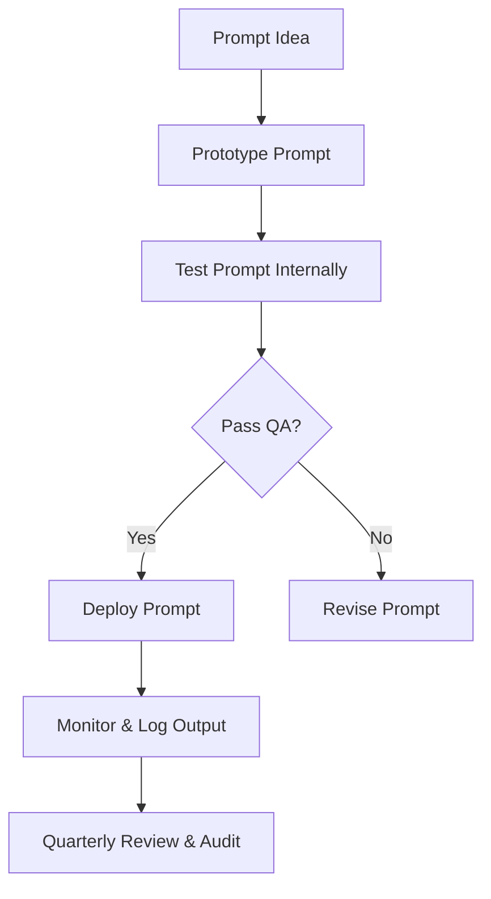

# Prompt Engineering Handbook

**Version:** 1.0 | **Audience:** Enterprise AI Teams | **Updated:** May 26, 2025  
**Status:** Stable | **Support Contact:** ai-team@example.com

---

## Table of contents

1. [Overview](#1-overview)  
2. [Prompt Design Principles](#2-prompt-design-principles)  
3. [Prompt Patterns](#3-prompt-patterns)  
4. [Prompt Types](#4-prompt-types)  
5. [Testing and Evaluation](#5-testing-and-evaluation)  
6. [Governance and Compliance](#6-governance-and-compliance)  
7. [Failure Case Scenarios](#7-failure-case-scenarios)  
8. [Prompt Lifecycle Diagram](#8-prompt-lifecycle-diagram)  
9. [Examples](#9-examples)  
10. [Resources](#10-resources)

---

## 1. Overview

This handbook provides guidance for designing, evaluating, and managing prompts used in large language model (LLM) systems across enterprise environments. It supports scalable and governed prompt development for tasks ranging from chat automation to internal tools.

---

## 2. Prompt Design Principles

- **Clarity over cleverness**: Prompts should prioritize precision over prose.  
- **Reproducibility**: Prompts should yield consistent results across time and agents.  
- **Contextual grounding**: Embed relevant facts and constraints into the prompt.  
- **Format control**: Request outputs in clearly defined structures (e.g., JSON, tables).  
- **Explicit role framing**: Define the assistant’s behavior ("You are a customer support agent...").

💡 **Tip:** Use delimiters like triple quotes (\"\"\") or code fences (\`\`\`) to isolate user inputs, documents, or variables in the prompt.

---

## 3. Prompt Patterns

| Pattern            | Description                                | Example Use Case                 |
|--------------------|--------------------------------------------|----------------------------------|
| Instructional       | Directs the model to complete a task       | "Summarize this report:"         |
| Chain-of-thought    | Encourages reasoning steps                 | "Explain your reasoning step-by-step:" |
| Few-shot examples   | Provides sample inputs/outputs             | Classification, data extraction  |
| Role-based          | Defines behavior/persona                  | "You are a helpful assistant..." |
| Constraint-based    | Enforces structure or tone                 | "Answer in JSON format only"     |

---

## 4. Prompt Types

### 4.1 Task-based Prompts

Used for answering questions, summarization, rewriting, etc.

**Example:**
```text
Summarize the following article in 3 bullet points.
```

---

### 4.2 Data Extraction Prompts

Used for pulling structured data from unstructured input.

**Example:**
```text
Extract the following from the email: sender name, company, date, and topic.
```

💡 **Structured Output Format:**
```json
{
  "sender": "Anna Rivera",
  "company": "GlowTech",
  "date": "2025-05-15",
  "topic": "Product Feedback"
}
```

---

### 4.3 Classification Prompts

Used for categorizing input into pre-defined labels.

**Example:**
```text
Classify the following feedback as Positive, Neutral, or Negative:
"The interface is slick, but I wish it loaded faster."
```

---

### 4.4 Generative Prompts

Used for content creation, dialog generation, or storytelling.

**Example:**
```text
Write a professional email response declining a meeting due to scheduling conflicts.
```

---

## 5. Testing and Evaluation

### 5.1 Metrics

| Metric       | Description                                |
|--------------|--------------------------------------------|
| Accuracy     | Correctness of output                      |
| Consistency  | Reproducibility of behavior                |
| Format       | Adherence to requested structure           |
| Safety       | Avoidance of toxic, biased, or off-topic responses |
| Latency      | Time-to-response for critical operations   |

---

### 5.2 Evaluation Methods

- **Manual review**: Spot check results for quality  
- **Golden sets**: Compare output against known good answers  
- **Automated scoring**: Use LLM-based or regex validation on format  

🎯 **Success Check:** Prompts pass a defined acceptance threshold in staging before production deployment.

---

## 6. Governance and Compliance

- Maintain a **Prompt Registry** with version control and owner tags  
- Track **input/output logs** for all production prompts  
- Use **tags or classifiers** for sensitive use cases (e.g., medical, legal)  
- Conduct **quarterly audits** of top-used prompts  
- Apply **review checkpoints** for prompts that impact regulated workflows

🚨 **Important:** Always vet prompts that influence financial, HR, or compliance outcomes.

---

## 7. Failure Case Scenarios

> **🚨 Hallucinated Outputs:**  
> "The answer contains fabricated data not grounded in the input."  
> ✅ **Fix:** Add grounding context and reduce temperature.

> **🚨 Format Violations:**  
> "Response expected in JSON returned as plain text."  
> ✅ **Fix:** Reinforce output constraints and use structured format examples.

> **🚨 Off-topic Drift:**  
> "The model answers a different or unrelated question."  
> ✅ **Fix:** Clarify task, scope, and desired tone in the prompt.

---

## 8. Prompt Lifecycle Diagram



---

## 9. Examples

### 🎯 Quick Reference: Prompt Structures

| Prompt Goal         | Format Example                                 |
|---------------------|-------------------------------------------------|
| Summarize content   | "Summarize this in 3 sentences:"                |
| Generate headline   | "Create a headline for this article:"           |
| Extract data        | "Return JSON with name, title, date:"           |
| Reformat response   | "Convert this text to a Markdown checklist:"    |

---

## 10. Resources

- [OpenAI Cookbook](https://github.com/openai/openai-cookbook)
- [Best Practices for Prompt Engineering](https://platform.openai.com/docs/guides/prompt-engineering)
- [LLM Evaluation Toolkit](https://github.com/LLM-Eval)

---

*Last updated: May 26, 2025 | Document ID: AI-PEH-001*
