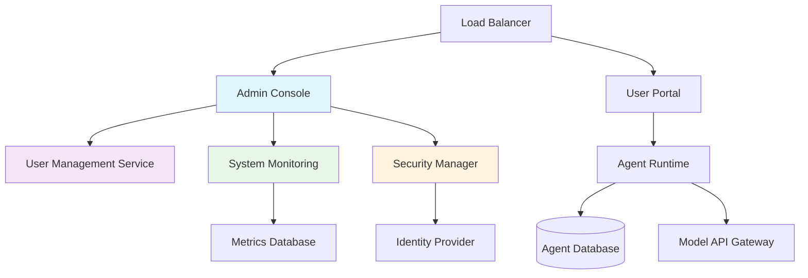
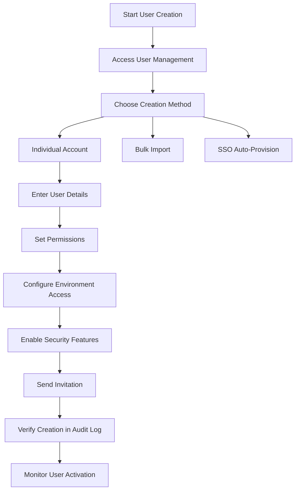
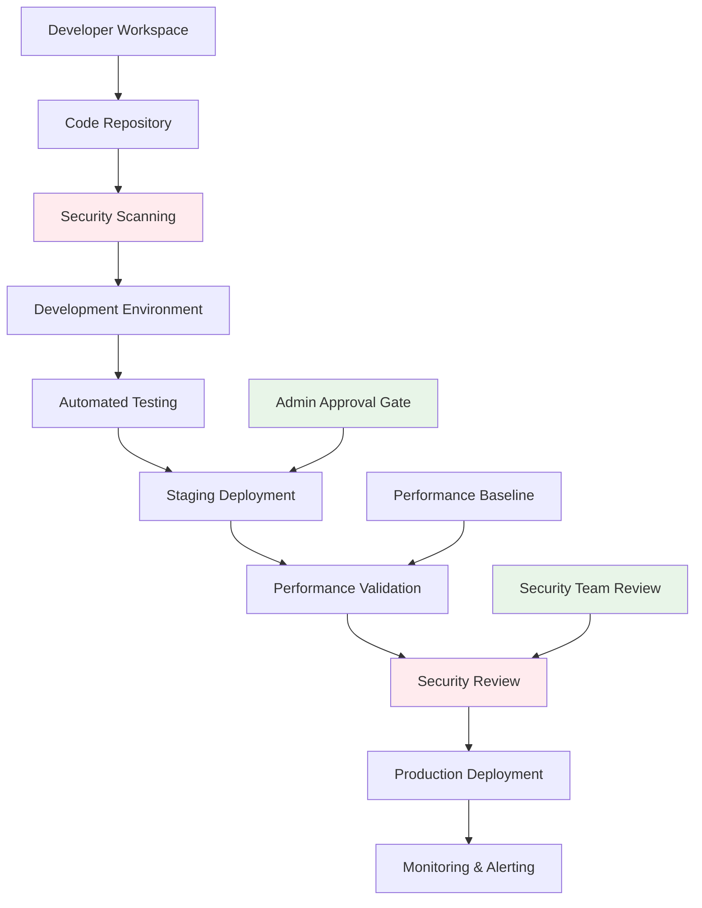
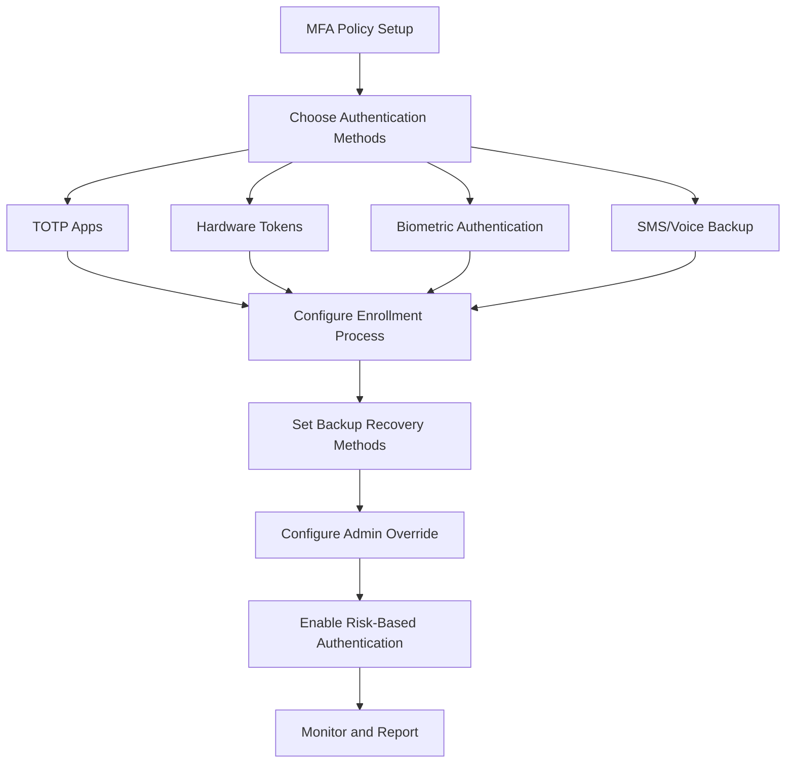
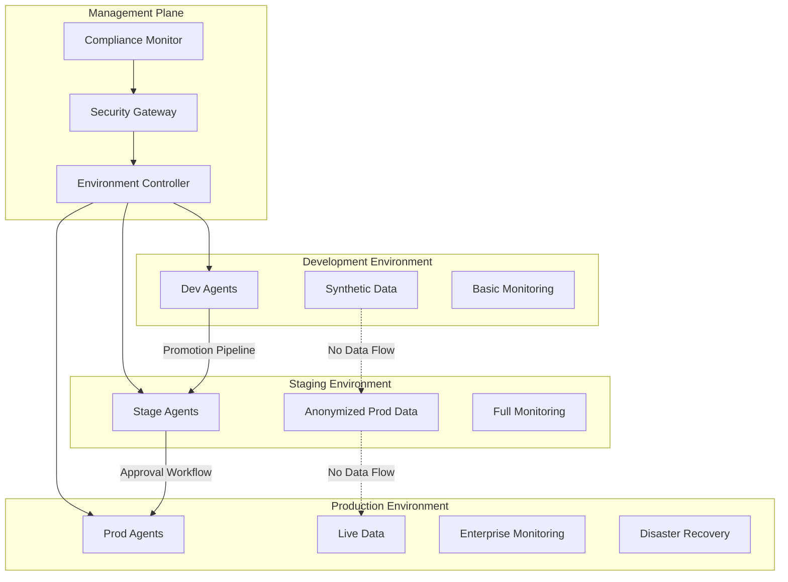
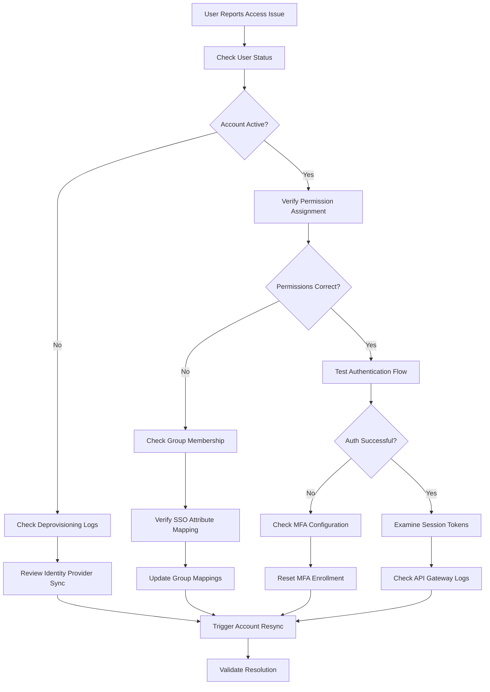
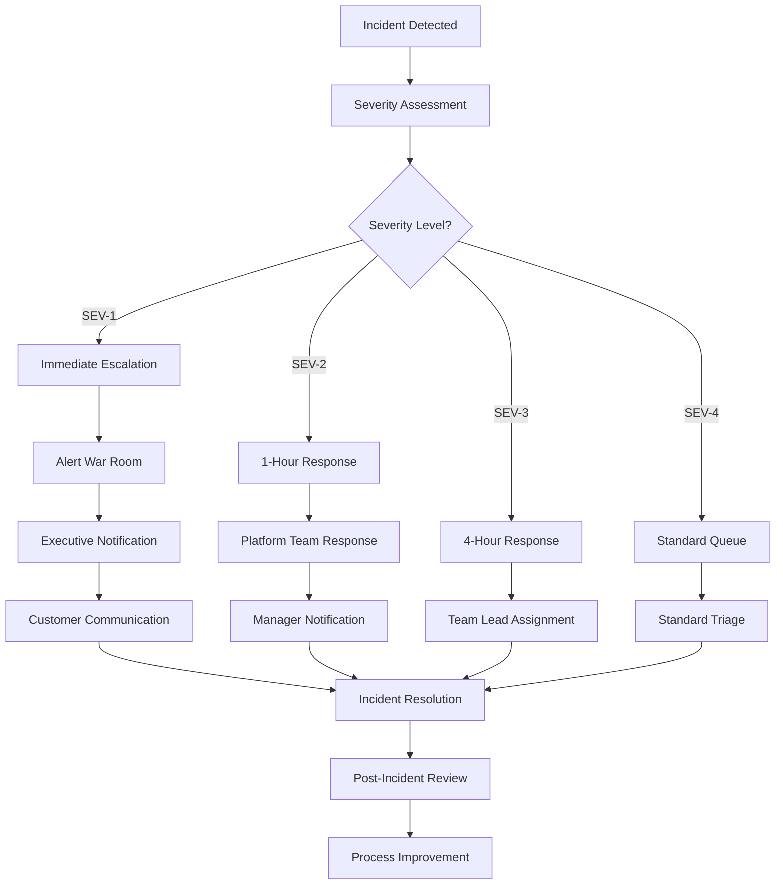

# LangChain Agent Platform: Administrator's Guide

**Document Information**

| Field | Value |
|-------|-------|
| **Version** | v1.0 |
| **Author** | Technical Writing Team |
| **Last Updated** | May 24, 2025 |
| **Document Type** | Administration Guide |
| **Target Audience** | System Administrators |
| **Complexity Level** | Intermediate to Advanced |
| **Estimated Time** | 2-3 hours initial setup, 30 minutes ongoing maintenance |
| **Accessibility Level** | WCAG AA Compliant |

---

## Table of Contents

1. [Getting started](#1-getting-started)
   - 1.1 [Platform overview and administrator role](#11-platform-overview-and-administrator-role)
   - 1.2 [Initial system access and verification](#12-initial-system-access-and-verification)
   - 1.3 [First administrative success](#13-first-administrative-success)

2. [Core administrative features](#2-core-administrative-features)
   - 2.1 [User management and permissions](#21-user-management-and-permissions)
   - 2.2 [Agent configuration and deployment](#22-agent-configuration-and-deployment)
   - 2.3 [Resource monitoring and optimization](#23-resource-monitoring-and-optimization)

3. [Advanced capabilities](#3-advanced-capabilities)
   - 3.1 [Enterprise security configuration](#31-enterprise-security-configuration)
   - 3.2 [Multi-environment management](#32-multi-environment-management)
   - 3.3 [Custom integration setup](#33-custom-integration-setup)

4. [Troubleshooting and support](#4-troubleshooting-and-support)
   - 4.1 [Common administrative issues](#41-common-administrative-issues)
   - 4.2 [Performance diagnostics](#42-performance-diagnostics)
   - 4.3 [Escalation procedures](#43-escalation-procedures)

5. [Reference and resources](#5-reference-and-resources)
   - 5.1 [Quick reference tables](#51-quick-reference-tables)
   - 5.2 [Security and compliance checklists](#52-security-and-compliance-checklists)
   - 5.3 [Additional learning resources](#53-additional-learning-resources)

---

## 1. Getting started

This section establishes your foundation as a LangChain Agent Platform administrator, covering essential setup verification and your first successful administrative action.

### 1.1 Platform overview and administrator role

The LangChain Agent Platform enables organizations to deploy, manage, and scale AI agents across multiple environments. As an administrator, you control user access, system security, resource allocation, and operational monitoring.

**Platform Architecture Overview:**



**Your administrative responsibilities include:**

- Managing user accounts and permission levels across development, staging, and production environments with role-based access control and automated compliance reporting
- Configuring agent deployment policies and resource limits to ensure optimal performance while maintaining cost efficiency and security standards
- Monitoring system health and implementing security best practices to protect sensitive data, including SOC 2 compliance and GDPR data protection requirements
- Troubleshooting platform issues and coordinating with technical support when escalation is needed, following established incident response procedures

**Prerequisites for administrative access:**

- Active organization account with administrator privileges granted by your organization owner through the platform's role-based access control system
- Understanding of basic cloud infrastructure concepts including container orchestration (Kubernetes), API gateway management, and distributed system monitoring
- Familiarity with enterprise authentication patterns including SAML 2.0, OAuth 2.0, OpenID Connect, and multi-factor authentication implementation
- Access to your organization's identity provider (Active Directory, Okta, Auth0, or Azure AD) with appropriate permissions to configure user provisioning and SSO integration

### 1.2 Initial system access and verification

**Estimated Time:** 15-20 minutes

Before beginning administrative tasks, verify your access level and confirm system connectivity through a systematic validation process.

**Administrative Console Interface Overview:**

*[Screenshot Description: Administrative dashboard showing main navigation panel on left with sections for User Management, System Monitoring, Security Settings, Agent Management, and Environment Configuration. Main content area displays system status cards showing green health indicators for Core Services (98.7% uptime), Active Users (247 current), Agent Executions (1,234 today), and Resource Utilization (67% average). Top navigation bar includes organization name, current user profile, and quick access to emergency procedures.]*

**Step 1: Access the administrative console**

1. Navigate to your organization's LangChain Agent Platform URL: `https://[your-org].langchain-platform.com/admin`
2. Sign in using your administrator credentials (supports SSO, MFA, and certificate-based authentication)
3. Verify you see the "Administration Dashboard" with full navigation menu including restricted administrative functions

**✅ Success Indicator:** You should see administrative menu options including "User Management," "System Monitoring," "Security Settings," "Environment Configuration," and "Compliance Reporting"

**🚨 Troubleshooting:** If you don't see administrative options, verify your account permissions by checking:
- Your user account appears in the "Administrators" group in your organization's identity provider
- No temporary access restrictions are applied to your account
- Your browser has not cached an older version of the interface (clear browser cache and cookies)
- Contact your organization owner to verify your account has been assigned the correct administrative role

**Step 2: Validate system connectivity and health**

1. Click **"System Status"** in the left navigation panel
2. Verify all core services show "Healthy" status with green indicators and uptime percentages above 99%
3. Check the "Recent Activity" panel shows current user sessions, agent executions, and system events from the last 24 hours
4. Review the "Infrastructure Health" section for cloud service connectivity, database performance, and external API status

**Expected Result:** All system components display green status indicators with specific uptime percentages, response times under 200ms for core services, and activity logs showing continuous platform usage

**System Health Dashboard Reference:**

| Service Component | Health Threshold | Action Required If Below |
|-------------------|------------------|-------------------------|
| User Authentication | >99.5% uptime | Check identity provider connection |
| Agent Runtime | >99% uptime | Review compute resource allocation |
| Database Performance | <100ms response | Scale database resources or optimize queries |
| External API Gateway | >98% success rate | Verify API key rotation and rate limits |
| File Storage | >99.9% availability | Check cloud storage service status |

**Step 3: Confirm permission levels and audit access**

1. Navigate to **"User Management"** → **"Permissions Overview"**
2. Locate your account in the administrator list and verify permission scope
3. Check your "Access History" for previous login sessions and verify no unauthorized access
4. Review the "Delegated Permissions" section if you manage permissions on behalf of other administrators

**✅ Success Indicator:** Your account appears in the administrators section with "Full Administrative Access" or "Super Admin" designation, recent access history matches your expected login pattern, and no security alerts appear for your account

### 1.3 First administrative success

Complete this foundational task to confirm your administrative capabilities and establish confidence with the platform's user management system.

**Create your first user account with enterprise-grade security**

**Estimated Time:** 15-20 minutes

**User Creation Workflow Diagram:**



**Step 1: Access enterprise user creation interface**

1. From the Administration Dashboard, click **"User Management"** → **"Add New User"**
2. Select **"Create Individual Account"** for detailed permission configuration
3. Choose **"Enterprise User"** to enable full security features and compliance tracking

**User Creation Interface Reference:**

*[Screenshot Description: User creation form with sections for Basic Information (email, display name, department), Security Settings (MFA requirement, password policy, account expiration), Permissions (role selection dropdown, environment access checkboxes), and Integration Settings (SSO mapping, external system access). Form includes real-time validation messages and helpful tooltips for each field.]*

**Step 2: Configure comprehensive user details with security compliance**

1. Enter a test user email address from your organization's domain (external domains trigger additional approval workflows)
2. Set **"Display Name"** as "Test User - Admin Validation - [Your Initials]"
3. Configure **"Department"** and **"Cost Center"** for accurate compliance reporting
4. Set **"Account Expiration Date"** 90 days from creation for security best practices
5. Enable **"Require MFA on First Login"** to enforce security policies immediately

**Step 3: Implement role-based access control with environment restrictions**

1. Select **"Standard User"** role from the permission dropdown
2. Grant **"Development Environment"** access only for initial testing
3. Leave **"Agent Creation Permissions"** unchecked initially (can be enabled after user training completion)
4. Configure **"Resource Quotas"** with development-tier limits: 2 vCPU, 4GB memory, 10GB storage
5. Enable **"Audit Logging"** for this user to track all actions for compliance purposes

**Enterprise Permission Configuration:**

| Permission Category | Initial Setting | Rationale | Expansion Pathway |
|---------------------|-----------------|-----------|-------------------|
| Environment Access | Development Only | Minimize risk during user onboarding | Add Staging after training completion |
| Agent Creation | Disabled | Prevent unauthorized resource usage | Enable after security training |
| Resource Limits | Development Tier | Control costs and resource consumption | Increase based on demonstrated need |
| Data Access | Team Scope Only | Implement principle of least privilege | Expand based on role requirements |
| API Access | Read-Only Initially | Reduce security exposure | Grant write access after API training |

**Step 4: Configure enterprise security features**

1. Enable **"SOC 2 Compliance Tracking"** to automatically log user actions for audit purposes
2. Set **"Data Classification Access"** to "Internal Use Only" to restrict access to sensitive data categories
3. Configure **"Geographic Access Restrictions"** if your organization requires location-based controls
4. Enable **"Automated Security Alerts"** for unusual login patterns or suspicious activity

**Step 5: Send invitation with onboarding automation**

1. Review all settings in the **"Configuration Summary"** panel before proceeding
2. Click **"Send Invitation Email"** and select **"Include Onboarding Checklist"**
3. Enable **"Automated Follow-up"** to send reminder emails if the user doesn't activate within 48 hours
4. Configure **"Manager Notification"** to alert the user's supervisor when account activation is complete

**✅ Success Indicator:** The system displays "User invitation sent successfully" with a unique invitation ID, and the user appears in **"User Management"** → **"Pending Invitations"** with "Invitation Sent" status and all configured security features listed

**Step 6: Verify creation through comprehensive audit trail**

1. Navigate to **"System Monitoring"** → **"Audit Logs"**
2. Filter by **"User Management Actions"** for the last hour and locate your user creation event
3. Confirm the audit entry includes all configuration details: permissions, security settings, resource quotas
4. Check **"Compliance Reports"** → **"User Provisioning"** to verify the new user appears in SOC 2 audit trail
5. Verify **"Security Events"** → **"Access Control Changes"** logs the permission assignment

**Expected Result:** You see a comprehensive audit entry showing "User invitation created by [your username]" with detailed security configuration, compliance tracking enabled, and all enterprise features properly configured

This successful user creation with enterprise security features demonstrates your administrative access is properly configured for production-level user management with full compliance and security controls.

---

## 2. Core administrative features

This section covers essential day-to-day administrative functions including enterprise user management, agent lifecycle control, and comprehensive system monitoring.

### 2.1 User management and permissions

Effective user management ensures appropriate access controls while enabling team productivity across different environments and compliance requirements.

**Enterprise permission matrix and role hierarchy**

The LangChain Agent Platform implements role-based access control (RBAC) with five primary permission levels designed for enterprise compliance and security:

| Permission Level | Environment Access | Agent Permissions | Administrative Capabilities | Compliance Features |
|------------------|-------------------|-------------------|----------------------------|-------------------|
| **Viewer** | Development only | View agents and executions | None | Basic audit logging |
| **Standard User** | Development, Staging | Create and modify own agents | View team activity | Enhanced audit logging |
| **Power User** | All environments | Full agent lifecycle management | Limited user management | Data classification access |
| **Team Lead** | All environments | Manage team agents and deployments | Team user management | Compliance reporting access |
| **Administrator** | All environments | Complete platform access | Full system management | Complete compliance suite |

**Advanced permission features for enterprise environments:**

**Data Classification Access Control:** Users can be restricted to specific data classification levels (Public, Internal, Confidential, Restricted) with automatic content filtering and access logging.

**Time-Based Access Control:** Permissions can be automatically granted or revoked based on schedules, supporting temporary contractor access and compliance with least-privilege principles.

**Geographic Access Restrictions:** IP-based access controls can restrict user access to specific geographic regions to comply with data sovereignty requirements.

**Project-Based Permissions:** Users can be granted permissions scoped to specific projects or business units, enabling fine-grained access control in large organizations.

**Managing user accounts with enterprise integration**

**Single Sign-On (SSO) User Provisioning:**

For organizations using enterprise identity providers, implement automated user provisioning to ensure consistent access control and reduce administrative overhead:

1. Navigate to **"Security Settings"** → **"SSO Configuration"** → **"User Provisioning"**
2. Configure **"Automatic User Creation"** to create accounts when users first authenticate through SSO
3. Set up **"Attribute Mapping"** to automatically assign roles based on Active Directory groups or Okta groups
4. Enable **"Just-in-Time Provisioning"** to create accounts with appropriate permissions during first login
5. Configure **"Deprovisioning Policies"** to automatically disable accounts when users are removed from your identity provider

**Enterprise SSO Configuration Example (Okta):**

```json
{
  "sso_provider": "okta",
  "domain": "your-company.okta.com",
  "client_id": "0oa1234567890abcdef",
  "attribute_mapping": {
    "email": "user.email",
    "display_name": "user.displayName",
    "department": "user.department",
    "manager": "user.manager",
    "groups": "user.groups"
  },
  "role_mapping": {
    "LangChain_Administrators": "Administrator",
    "LangChain_Team_Leads": "Team Lead",
    "LangChain_Power_Users": "Power User",
    "LangChain_Standard_Users": "Standard User",
    "LangChain_Viewers": "Viewer"
  },
  "auto_provisioning": true,
  "deprovisioning_enabled": true
}
```

**Bulk user management for large organizations:**

For enterprise deployments with hundreds or thousands of users, implement efficient bulk management procedures:

1. Use **"User Management"** → **"Bulk Operations"** → **"Advanced Import"** for CSV-based user creation
2. Configure **"Template Validation"** to ensure data quality before import
3. Enable **"Batch Processing"** to handle large user imports without system performance impact
4. Set up **"Import Monitoring"** to track progress and identify any failed user creations
5. Configure **"Automatic Notifications"** to inform users and managers when accounts are created

**Enterprise Bulk Import Template (Enhanced):**

| Required Fields | Optional Fields | Security Fields | Compliance Fields |
|----------------|-----------------|-----------------|-------------------|
| email | display_name | mfa_required | data_classification_level |
| role | department | password_policy | geographic_restrictions |
| environment_access | cost_center | account_expiration | manager_email |
| | phone_number | access_schedule | business_justification |

**Advanced user lifecycle management:**

**Automated Account Reviews:** Configure quarterly access reviews where managers must confirm their team members still require current access levels, with automatic notifications and escalation procedures.

**Onboarding Automation:** Set up automated onboarding workflows that include security training requirements, platform orientation, and gradual permission escalation based on training completion.

**Offboarding Procedures:** Implement automated account disabling when users are removed from your identity provider, with optional data retention periods for compliance requirements.

### 2.2 Agent configuration and deployment

Administrative oversight of agent lifecycle ensures optimal performance, security compliance, and resource utilization across your organization's AI initiatives.

**Enterprise agent deployment architecture**

The platform supports a comprehensive deployment architecture designed for enterprise scale and security requirements:

**Agent Deployment Pipeline Diagram:**



**Environment tiers with enterprise features:**

| Environment | Resource Allocation | Security Features | Monitoring Level | Data Access |
|-------------|-------------------|------------------|------------------|-------------|
| **Development** | 2 vCPU, 4GB RAM, 10GB storage | Basic security scanning | Standard logging | Synthetic data only |
| **Staging** | 4 vCPU, 8GB RAM, 50GB storage | Full security suite, vulnerability scanning | Enhanced monitoring | Production-like data (anonymized) |
| **Production** | 8-32 vCPU, 16-128GB RAM, 100GB-1TB storage | Enterprise security, compliance logging | Real-time monitoring, alerting | Live production data |

**Enterprise agent deployment policies**

Establish organization-wide standards that ensure consistency, security, and resource efficiency:

1. Navigate to **"Agent Management"** → **"Enterprise Policies"**
2. Configure **"Deployment Approval Workflows"** requiring security team review for production deployments
3. Set up **"Resource Governance"** with automatic scaling policies and cost controls
4. Enable **"Compliance Scanning"** to automatically check agent code for security vulnerabilities and data privacy compliance
5. Configure **"Performance SLAs"** with automatic rollback procedures if agents don't meet performance benchmarks

**Advanced deployment policy configuration:**

```yaml
deployment_policies:
  security_requirements:
    vulnerability_scanning: required
    secrets_detection: required
    dependency_analysis: required
    compliance_check: [SOC2, GDPR, PCI]
  
  approval_workflows:
    development_to_staging:
      required_approvers: ["team_lead"]
      automated_checks: ["security_scan", "unit_tests"]
    staging_to_production:
      required_approvers: ["security_team", "platform_admin"]
      automated_checks: ["security_scan", "integration_tests", "performance_baseline"]
  
  resource_governance:
    cost_limits:
      development: "$100/month"
      staging: "$500/month"
      production: "$5000/month"
    auto_scaling:
      enabled: true
      max_instances: 10
      scale_up_threshold: "80% CPU for 5 minutes"
      scale_down_threshold: "30% CPU for 10 minutes"
```

**Comprehensive resource monitoring and optimization**

Implement enterprise-grade monitoring that provides visibility into performance, costs, and security across all agent deployments:

**Real-time monitoring dashboard:**

*[Screenshot Description: Comprehensive monitoring dashboard showing multiple panels - Resource Utilization graph with CPU, memory, and storage metrics over time; Active Agents table with status, environment, and resource consumption; Cost Analytics showing spending trends by department and environment; Security Events panel highlighting recent security scans and compliance status; Performance Metrics comparing response times and success rates across environments.]*

**Advanced performance monitoring setup:**

1. Configure **"Application Performance Monitoring (APM)"** integration with tools like Datadog, New Relic, or AWS CloudWatch
2. Set up **"Custom Metrics Collection"** for business-specific KPIs and agent performance indicators
3. Enable **"Distributed Tracing"** to track request flows across multiple agents and external services
4. Configure **"Anomaly Detection"** using machine learning to identify unusual performance patterns
5. Set up **"Predictive Scaling"** based on historical usage patterns and business forecasts

**Enterprise monitoring configuration example:**

```json
{
  "monitoring_config": {
    "apm_provider": "datadog",
    "custom_metrics": [
      "agent_response_time",
      "business_value_generated",
      "user_satisfaction_score",
      "data_processing_volume"
    ],
    "alerting_rules": {
      "high_cpu_usage": {
        "threshold": "80%",
        "duration": "5 minutes",
        "notification_channels": ["slack", "email", "pagerduty"]
      },
      "memory_leak_detection": {
        "threshold": "memory_growth > 10% over 1 hour",
        "notification_channels": ["email", "ticket_system"]
      },
      "security_event": {
        "conditions": ["failed_authentication", "unauthorized_access"],
        "notification_channels": ["security_team", "pagerduty"]
      }
    }
  }
}
```

### 2.3 Resource monitoring and optimization

Proactive monitoring prevents performance issues and ensures efficient resource utilization while maintaining security and compliance requirements.

**Enterprise system health monitoring**

Establish comprehensive monitoring that identifies issues before they impact users and provides detailed insights for capacity planning:

**Comprehensive Health Dashboard:**

*[Screenshot Description: Executive-level system health dashboard with status cards showing Overall System Health (99.7% uptime), Active Users (1,247), Agent Executions (45,678 today), Security Score (95/100), and Compliance Status (Fully Compliant). Below are detailed charts showing Response Time Trends, Resource Utilization by Environment, Cost Analysis by Department, and Recent Security Events with severity indicators.]*

**Advanced monitoring configuration:**

1. Set up **"Predictive Analytics"** using historical data to forecast potential system issues and capacity needs
2. Configure **"Multi-dimensional Alerting"** that considers business context, user impact, and security implications
3. Enable **"Automated Remediation"** for common issues like scaling resources or restarting failed services
4. Implement **"Business Impact Assessment"** that prioritizes issues based on affected users and business processes
5. Configure **"Compliance Monitoring"** that tracks adherence to SOC 2, GDPR, and other regulatory requirements

**Performance optimization with enterprise tools**

**Infrastructure optimization strategies:**

**Database Performance Tuning:** Monitor query performance with tools like pg_stat_statements for PostgreSQL or Performance Insights for AWS RDS, optimize indexes for frequently accessed agent data, implement connection pooling to handle concurrent agent executions efficiently.

**Caching Strategy Implementation:** Deploy Redis Enterprise or AWS ElastiCache for session data and frequently accessed agent results, implement content delivery network (CDN) caching for static assets and documentation, configure application-level caching for agent execution results and user preference data.

**Load Balancing and Auto-scaling:** Configure AWS Application Load Balancer or Azure Load Balancer with health checks specific to agent execution endpoints, implement Kubernetes Horizontal Pod Autoscaler (HPA) for automatic scaling based on CPU, memory, and custom metrics, set up predictive scaling using AWS Predictive Scaling or similar services.

**Enterprise cost management and optimization**

**Advanced cost tracking and control:**

1. **Cost Allocation by Business Unit:** Configure detailed cost tracking that assigns resource usage to specific departments, projects, and cost centers
2. **Predictive Cost Modeling:** Use historical usage patterns to forecast costs and identify optimization opportunities
3. **Automated Cost Controls:** Implement spending limits with automatic resource scaling down when budgets are exceeded
4. **ROI Analysis:** Track business value generated by agents relative to infrastructure costs

**Cost optimization dashboard example:**

| Cost Category | This Month | Last Month | Trend | Optimization Opportunity |
|---------------|------------|------------|-------|-------------------------|
| Compute Resources | $12,450 | $11,200 | ↗ +11% | Right-size development environments |
| Storage | $3,280 | $3,150 | ↗ +4% | Implement data lifecycle policies |
| Network/Data Transfer | $1,890 | $2,100 | ↘ -10% | Current optimization effective |
| External API Calls | $5,670 | $4,890 | ↗ +16% | Implement response caching |
| **Total** | **$23,290** | **$21,340** | **↗ +9%** | **Potential savings: $2,340/month** |

**Compliance-driven monitoring and reporting**

**SOC 2 Type II compliance monitoring:**

Configure automated compliance reporting that tracks security controls and generates audit-ready documentation:

1. **Access Control Monitoring:** Track all user access events, permission changes, and administrative actions with detailed timestamps and justifications
2. **Data Protection Tracking:** Monitor data processing activities, encryption status, and data residency compliance
3. **Incident Response Documentation:** Automatically generate incident reports that meet SOC 2 requirements for security event handling
4. **Vendor Management:** Track third-party integrations and ensure vendor security certifications are current

**GDPR compliance features:**

1. **Data Processing Audit:** Track all personal data processing activities with legal basis documentation
2. **Right to Erasure Implementation:** Automated workflows for handling data deletion requests
3. **Breach Notification System:** Automatic detection and reporting of potential data breaches within required timeframes
4. **Consent Management:** Track user consent for data processing with immutable audit trails

---

## 3. Advanced capabilities

This section covers sophisticated administrative features for enterprise environments, comprehensive security hardening, and complex integration scenarios.

### 3.1 Enterprise security configuration

Advanced security features protect sensitive data, ensure regulatory compliance, and provide defense-in-depth protection against evolving threats.

**Comprehensive multi-factor authentication implementation**

Deploy enterprise-grade MFA that supports diverse user needs while maintaining security:

**MFA Configuration Workflow:**



**Enterprise MFA implementation steps:**

1. Navigate to **"Security Settings"** → **"Multi-Factor Authentication"** → **"Enterprise Configuration"**
2. Enable **"Adaptive Authentication"** that adjusts requirements based on risk factors like location, device, and behavior patterns
3. Configure **"Hardware Token Support"** for YubiKey, RSA SecurID, or other FIDO2-compliant devices
4. Set up **"Biometric Authentication"** integration with Windows Hello, Touch ID, or Face ID for supported devices
5. Configure **"Emergency Access Procedures"** that allow administrators to provide temporary access during MFA device failures
6. Enable **"MFA Bypass for Service Accounts"** with certificate-based authentication for automated systems

**Advanced MFA policy configuration:**

```json
{
  "mfa_policy": {
    "enforcement_level": "adaptive",
    "risk_factors": {
      "unknown_device": "require_additional_verification",
      "unusual_location": "require_additional_verification",
      "administrative_action": "always_require",
      "sensitive_data_access": "always_require"
    },
    "supported_methods": [
      "totp_authenticator",
      "hardware_token",
      "biometric",
      "sms_backup"
    ],
    "backup_recovery": {
      "recovery_codes": 10,
      "admin_override_enabled": true,
      "temporary_access_duration": "4 hours"
    },
    "compliance_settings": {
      "nist_800_63b_compliant": true,
      "audit_all_authentications": true,
      "store_biometric_templates": false
    }
  }
}
```

**Enterprise single sign-on integration**

Connect with major identity providers for seamless user experience and centralized access control:

**SSO Integration Architecture:**

*[Screenshot Description: SSO configuration interface showing tabs for SAML 2.0, OAuth 2.0, and OpenID Connect. Active SAML tab displays fields for Identity Provider metadata URL, certificate upload area, attribute mapping table showing email, displayName, groups mappings, and test connection button. Side panel shows supported providers including Active Directory Federation Services, Okta, Azure AD, Auth0, and PingFederate with their respective configuration templates.]*

**Detailed SSO setup for major providers:**

**Microsoft Azure Active Directory:**
1. In Azure AD, create new **"Enterprise Application"** for LangChain Agent Platform
2. Configure **"SAML-based Sign-on"** with identifier: `https://[your-org].langchain-platform.com`
3. Set **"Reply URL"** to: `https://[your-org].langchain-platform.com/auth/saml/callback`
4. Configure **"User Attributes & Claims"** mapping Azure AD groups to LangChain roles
5. Download the **"Certificate (Base64)"** and **"Login URL"** for platform configuration

**Okta Enterprise Integration:**
1. Create new **"SAML 2.0 Web App"** in Okta admin console
2. Configure **"Single sign on URL"**: `https://[your-org].langchain-platform.com/auth/saml/callback`
3. Set **"Audience URI"**: `https://[your-org].langchain-platform.com`
4. Configure **"Attribute Statements"** for email, displayName, groups
5. Enable **"Group Attribute Statements"** with filter matching "LangChain.*" groups

**Auth0 Configuration:**
1. Create new **"Regular Web Application"** in Auth0 dashboard
2. Configure **"Allowed Callback URLs"**: `https://[your-org].langchain-platform.com/auth/callback`
3. Enable **"SAML2 Web App Addon"** with appropriate attribute mapping
4. Configure **"Rules"** to map Auth0 roles to LangChain permission levels
5. Set up **"Hooks"** for automated user provisioning and deprovisioning

**Advanced audit logging and compliance reporting**

Implement comprehensive logging that supports multiple compliance frameworks:

**Enterprise audit configuration:**

1. **Comprehensive Event Logging:** Capture all user actions, system events, data access, configuration changes, and security events with detailed context
2. **Immutable Audit Trail:** Use write-once storage (like AWS S3 with object lock) to ensure audit logs cannot be modified
3. **Real-time SIEM Integration:** Connect with Security Information and Event Management systems like Splunk, IBM QRadar, or Azure Sentinel
4. **Automated Compliance Reporting:** Generate reports for SOC 2, ISO 27001, GDPR, HIPAA, and other frameworks
5. **Long-term Retention:** Configure retention policies that meet regulatory requirements (typically 7 years for financial data, 6 years for healthcare)

**Compliance framework implementation:**

**SOC 2 Type II Controls:**
- **CC6.1 Logical Access Controls:** Detailed logging of all access attempts, permission changes, and authentication events
- **CC6.2 System Monitoring:** Real-time monitoring of system activities with automated alert generation
- **CC6.3 Data Protection:** Encryption in transit and at rest with key rotation and access logging
- **CC7.1 System Operations:** Change management logging with approval workflows and rollback procedures

**GDPR Article 30 Record of Processing:**
- **Automated Data Mapping:** Track all personal data processing activities with legal basis documentation
- **Purpose Limitation Tracking:** Monitor data usage to ensure processing aligns with stated purposes
- **Data Subject Rights Management:** Automated workflows for handling access, rectification, and erasure requests
- **Breach Detection and Notification:** Automatic detection with 72-hour reporting compliance

**API security and advanced rate limiting**

Protect platform APIs from sophisticated attacks and ensure fair resource usage across enterprise environments:

**Enterprise API security configuration:**

```json
{
  "api_security": {
    "authentication": {
      "methods": ["oauth2", "api_key", "mutual_tls"],
      "token_rotation": "automatic_30_days",
      "scope_based_access": true
    },
    "rate_limiting": {
      "strategy": "sliding_window",
      "tiers": {
        "basic": "1000_requests_per_hour",
        "premium": "10000_requests_per_hour",
        "enterprise": "100000_requests_per_hour"
      },
      "burst_allowance": "20%_of_hourly_limit",
      "geographic_limits": {
        "enabled": true,
        "blocked_countries": ["country_codes_per_policy"]
      }
    },
    "threat_protection": {
      "ddos_protection": "enabled",
      "bot_detection": "enabled",
      "anomaly_detection": "ml_based",
      "ip_reputation_filtering": "enabled"
    }
  }
}
```

**Advanced threat protection:**

1. **DDoS Protection:** Integration with AWS Shield Advanced or CloudFlare for protection against volumetric attacks
2. **Bot Detection:** Machine learning-based detection of automated attacks and credential stuffing attempts
3. **API Anomaly Detection:** Behavioral analysis to identify unusual usage patterns that may indicate compromise
4. **Zero Trust Architecture:** Continuous verification of all API requests regardless of source location or previous authentication

### 3.2 Multi-environment management

Coordinate development, staging, and production environments with sophisticated deployment pipelines and comprehensive isolation controls.

**Enterprise environment architecture**

**Environment Isolation and Data Flow:**



**Advanced environment configuration:**

**Environment-specific security policies:**

| Security Control | Development | Staging | Production |
|------------------|-------------|---------|------------|
| **Data Classification** | Synthetic only | Anonymized | Full access with controls |
| **Network Isolation** | Shared VPC | Dedicated subnet | Isolated VPC |
| **Encryption** | Basic TLS | Enhanced encryption | End-to-end + HSM |
| **Audit Logging** | Basic events | Enhanced logging | Complete audit trail |
| **Access Controls** | Developer access | Limited production access | Strict RBAC |
| **Backup/Recovery** | None required | Daily snapshots | Real-time replication |

**Sophisticated promotion pipelines with enterprise controls**

**Automated deployment pipeline with governance:**

```yaml
deployment_pipeline:
  stages:
    development_to_staging:
      triggers:
        - pull_request_approval
        - automated_tests_pass
      security_gates:
        - vulnerability_scan
        - secrets_detection
        - dependency_audit
      approvals:
        - technical_lead
        - security_representative
      rollback_strategy: "automatic_on_failure"
    
    staging_to_production:
      triggers:
        - staging_validation_complete
        - performance_benchmarks_met
      security_gates:
        - penetration_testing
        - compliance_validation
        - data_privacy_review
      approvals:
        - security_team
        - platform_administrator
        - business_stakeholder
      deployment_strategy: "blue_green"
      rollback_strategy: "manual_approval_required"
  
  quality_gates:
    performance_requirements:
      response_time: "<200ms_p95"
      throughput: ">1000_requests_per_second"
      error_rate: "<0.1%"
    security_requirements:
      vulnerability_score: "critical:0, high:<5"
      dependency_audit: "no_known_vulnerabilities"
      compliance_check: "all_frameworks_pass"
```

**Enterprise change management and approval workflows:**

1. **Automated Testing Integration:** Connect with Jenkins, GitLab CI, or Azure DevOps for comprehensive testing before promotion
2. **Security Gate Automation:** Integration with tools like Snyk, Veracode, or Checkmarx for automated security scanning
3. **Performance Baseline Validation:** Automated performance testing with tools like JMeter or LoadRunner to ensure agents meet SLA requirements
4. **Compliance Validation:** Automated compliance checking against organizational policies and regulatory requirements
5. **Business Impact Assessment:** Automated analysis of which users and business processes will be affected by changes

**Cross-environment monitoring with business context**

**Enterprise monitoring dashboard:**

*[Screenshot Description: Executive dashboard showing environment health across dev, staging, and production with color-coded status indicators. Key metrics include deployment success rates (Dev: 94%, Staging: 97%, Production: 99.8%), average response times, error rates, and cost per environment. Business impact section shows affected user count, revenue at risk, and compliance status. Recent deployments timeline shows promotion history with approval workflow status.]*

**Advanced monitoring capabilities:**

**Distributed Tracing Across Environments:**
- **OpenTelemetry Integration:** Comprehensive tracing from development through production with correlation IDs
- **Performance Comparison:** Automated comparison of agent performance across environments to identify optimization opportunities
- **Dependency Mapping:** Visual representation of service dependencies and their health across all environments

**Business-Aware Monitoring:**
- **Revenue Impact Tracking:** Monitor how agent performance affects business metrics like customer satisfaction and revenue
- **User Experience Monitoring:** Real user monitoring (RUM) to track actual user experience with agents in production
- **SLA Compliance Tracking:** Automated tracking against business service level agreements with proactive alerting

### 3.3 Custom integration setup

Connect the LangChain Agent Platform with enterprise tools and workflows for comprehensive organizational integration.

**Enterprise webhook and event-driven architecture**

**Comprehensive webhook implementation:**

*[Screenshot Description: Webhook configuration interface showing event type selection checkboxes (user events, security events, system events, agent events), endpoint configuration with URL validation, security settings including HMAC signing and IP whitelisting, retry policy configuration with exponential backoff settings, and event payload customization with JSON schema editor.]*

**Advanced webhook configuration for enterprise systems:**

```json
{
  "webhook_config": {
    "endpoints": [
      {
        "name": "security_incident_handler",
        "url": "https://your-siem.company.com/webhooks/langchain",
        "events": ["security.authentication_failure", "security.privilege_escalation"],
        "security": {
          "hmac_signature": true,
          "ip_whitelist": ["10.0.0.0/8", "192.168.1.0/24"],
          "mutual_tls": true
        },
        "retry_policy": {
          "max_attempts": 5,
          "backoff_strategy": "exponential",
          "timeout": "30s"
        }
      },
      {
        "name": "business_metrics_collector",
        "url": "https://analytics.company.com/api/events",
        "events": ["agent.execution_complete", "user.goal_achieved"],
        "transform": {
          "include_business_context": true,
          "anonymize_personal_data": true
        }
      }
    ]
  }
}
```

**Enterprise system integrations:**

**ServiceNow Integration:**
- **Incident Management:** Automatic ticket creation for system alerts and security events
- **Change Management:** Integration with ServiceNow change approval workflows for production deployments
- **Asset Management:** Synchronization of agent deployments with ServiceNow CMDB

**Jira/Confluence Integration:**
- **Project Tracking:** Automatic creation of Jira tickets for agent development tasks
- **Documentation Sync:** Automatic updates to Confluence pages when agent documentation changes
- **Release Management:** Integration with Jira release planning and tracking

**Slack/Microsoft Teams Integration:**
- **Real-time Notifications:** Channel-specific notifications for different teams and alert types
- **ChatOps:** Slash commands for checking system status and performing administrative tasks
- **Approval Workflows:** Interactive approval buttons for deployment and access requests

**Advanced API integration for enterprise automation**

**Comprehensive API automation framework:**

```python
# Enterprise API integration example
import requests
from datetime import datetime, timedelta

class LangChainEnterpriseAPI:
    def __init__(self, base_url, api_key, cert_path=None):
        self.base_url = base_url
        self.headers = {
            'Authorization': f'Bearer {api_key}',
            'Content-Type': 'application/json',
            'X-API-Version': '2024.3'
        }
        self.cert = cert_path if cert_path else None
    
    def bulk_user_provisioning(self, user_data, department_mapping):
        """Automated user provisioning with department-based role assignment"""
        provisioned_users = []
        
        for user in user_data:
            role = department_mapping.get(user['department'], 'Standard User')
            
            user_config = {
                'email': user['email'],
                'display_name': user['display_name'],
                'role': role,
                'department': user['department'],
                'manager': user['manager'],
                'security_settings': {
                    'mfa_required': True,
                    'data_classification_access': self._determine_data_access(user['role']),
                    'environment_access': self._determine_env_access(user['role'])
                }
            }
            
            response = self._create_user(user_config)
            provisioned_users.append(response)
        
        return provisioned_users
    
    def automated_compliance_reporting(self, report_type, date_range):
        """Generate automated compliance reports"""
        endpoints = {
            'soc2': '/api/v1/compliance/soc2/report',
            'gdpr': '/api/v1/compliance/gdpr/report',
            'audit': '/api/v1/audit/comprehensive-report'
        }
        
        params = {
            'start_date': date_range['start'].isoformat(),
            'end_date': date_range['end'].isoformat(),
            'format': 'json',
            'include_recommendations': True
        }
        
        response = requests.get(
            f"{self.base_url}{endpoints[report_type]}",
            headers=self.headers,
            params=params,
            cert=self.cert
        )
        
        return response.json()
```

**Infrastructure as Code (IaC) integration:**

**Terraform Configuration Example:**

```hcl
# Enterprise LangChain Platform Terraform configuration
resource "langchain_organization" "enterprise" {
  name = var.organization_name
  
  security_settings {
    sso_enabled = true
    mfa_required = true
    audit_retention_days = 2555  # 7 years
    
    compliance_frameworks = [
      "SOC2_TYPE_II",
      "GDPR",
      "ISO_27001"
    ]
  }
  
  environments {
    development {
      resource_limits {
        cpu_cores = 100
        memory_gb = 200
        storage_gb = 1000
      }
      
      security_level = "basic"
    }
    
    staging {
      resource_limits {
        cpu_cores = 200
        memory_gb = 400
        storage_gb = 2000
      }
      
      security_level = "enhanced"
    }
    
    production {
      resource_limits {
        cpu_cores = 1000
        memory_gb = 2000
        storage_gb = 10000
      }
      
      security_level = "enterprise"
      high_availability = true
      disaster_recovery = true
    }
  }
}

resource "langchain_sso_integration" "azure_ad" {
  provider = "azure_ad"
  tenant_id = var.azure_tenant_id
  client_id = var.azure_client_id
  
  attribute_mapping {
    email = "user.mail"
    display_name = "user.displayName"
    groups = "user.memberOf"
  }
  
  role_mapping {
    "LangChain_Administrators" = "Administrator"
    "LangChain_Team_Leads" = "Team Lead"
    "LangChain_Users" = "Standard User"
  }
}
```

**Custom authentication providers for specialized environments**

**Advanced authentication scenarios:**

**Certificate-Based Authentication for High-Security Environments:**

```json
{
  "certificate_auth": {
    "enabled": true,
    "ca_certificates": [
      "/path/to/internal-ca.pem",
      "/path/to/partner-ca.pem"
    ],
    "crl_checking": "strict",
    "ocsp_validation": true,
    "certificate_mapping": {
      "subject_field": "CN",
      "user_lookup": "ldap",
      "fallback_to_sso": false
    },
    "revocation_checking": {
      "crl_urls": ["http://crl.company.com/internal.crl"],
      "ocsp_urls": ["http://ocsp.company.com"],
      "cache_duration": "1h"
    }
  }
}
```

**Smart Card/PIV Integration:**

```json
{
  "piv_integration": {
    "enabled": true,
    "required_for_roles": ["Administrator", "Security_Auditor"],
    "piv_middleware": "cackey",
    "certificate_validation": {
      "check_expiration": true,
      "validate_chain": true,
      "require_piv_authentication": true
    },
    "fallback_options": {
      "emergency_access": true,
      "backup_authentication": ["hardware_token", "admin_override"]
    }
  }
}
```

---

## 4. Troubleshooting and support

This section provides systematic approaches to diagnosing and resolving complex administrative issues while maintaining platform stability and security.

### 4.1 Common administrative issues

Recognize and resolve frequently encountered problems using enterprise-grade diagnostic procedures and remediation strategies.

**Complex user access and permission scenarios**

**Advanced permission troubleshooting workflow:**



**Multi-layered access issue resolution:**

**Problem:** Enterprise users with complex role hierarchies cannot access features despite apparent permissions

**Advanced Diagnostic Procedure:**

1. **Identity Provider Synchronization Check:**
   - Navigate to **"Security Settings"** → **"SSO Diagnostics"** → **"User Sync Status"**
   - Check if user's attributes have been updated in the identity provider within the last sync cycle
   - Verify group membership changes are reflected in the platform's role assignments
   - Review **"Sync Error Logs"** for any failures during the last synchronization process

2. **Permission Inheritance Analysis:**
   - Use **"User Management"** → **"Permission Analyzer"** to visualize the user's complete permission hierarchy
   - Check for conflicting permissions where explicit denials override inherited grants
   - Verify that environment-specific restrictions aren't blocking access to required features
   - Review any time-based access controls that may have expired or not yet activated

3. **Session and Token Validation:**
   - Check **"System Monitoring"** → **"Active Sessions"** to confirm the user has a valid, unexpired session
   - Verify JWT token claims include all necessary permission scopes
   - Test token refresh mechanism if using OAuth 2.0 flows
   - Examine API gateway logs for any authorization failures during feature access attempts

**Enterprise-specific resolution strategies:**

- **Cross-Domain Authentication Issues:** For users accessing from different domains or through VPN connections, verify that CORS policies and domain whitelisting include all necessary origins
- **Federated Identity Complexities:** When multiple identity providers are involved, check the identity federation chain and ensure proper claim transformations at each step
- **Conditional Access Policies:** Review Azure AD Conditional Access or similar policies that may be blocking access based on device compliance, location, or risk assessment

**Agent deployment and execution failures in enterprise environments**

**Complex deployment failure scenarios:**

**Problem:** Agent deployments fail intermittently across different environments with varying error messages

**Comprehensive Diagnostic Framework:**

**Infrastructure-Level Analysis:**

1. **Resource Constraint Investigation:**
   ```bash
   # Check resource utilization during failed deployments
   kubectl top nodes
   kubectl describe pod [failed-agent-pod] -n langchain-production
   kubectl get events -n langchain-production --sort-by='.lastTimestamp'
   ```

2. **Network Connectivity Validation:**
   - Test connectivity to external APIs and services from agent execution environment
   - Verify DNS resolution for all external dependencies
   - Check firewall rules and security group configurations
   - Validate SSL certificate chains for HTTPS connections

3. **Container Registry and Image Issues:**
   - Verify agent container images are accessible from deployment environment
   - Check image vulnerability scan results that might block deployment
   - Validate image signatures and attestations for supply chain security
   - Review container registry authentication and access policies

**Application-Level Diagnostics:**

1. **Dependency Conflict Resolution:**
   ```python
   # Agent dependency analysis script
   import pkg_resources
   import sys
   
   def analyze_dependencies(requirements_file):
       """Analyze agent dependencies for conflicts"""
       conflicts = []
       installed = {pkg.key: pkg.version for pkg in pkg_resources.working_set}
       
       with open(requirements_file, 'r') as f:
           requirements = f.readlines()
       
       for req in requirements:
           try:
               pkg = pkg_resources.Requirement.parse(req.strip())
               if pkg.key in installed:
                   if installed[pkg.key] not in pkg:
                       conflicts.append({
                           'package': pkg.key,
                           'required': str(pkg),
                           'installed': installed[pkg.key]
                       })
           except Exception as e:
               print(f"Error parsing requirement {req}: {e}")
       
       return conflicts
   ```

2. **Environment Variable and Configuration Validation:**
   - Check that all required environment variables are properly set in the deployment environment
   - Verify configuration file formats and required fields
   - Validate secrets and API keys are current and have necessary permissions
   - Test configuration against agent requirements and external service specifications

**Performance degradation analysis in enterprise deployments**

**Systematic performance investigation:**

**Problem:** Platform experiences significant performance degradation during business hours affecting multiple user groups

**Enterprise Performance Diagnostic Protocol:**

1. **Multi-Layer Performance Analysis:**

   **Database Performance Investigation:**
   ```sql
   -- PostgreSQL performance analysis queries
   SELECT 
       schemaname,
       tablename,
       attname,
       n_distinct,
       correlation
   FROM pg_stats 
   WHERE schemaname = 'langchain_production'
   ORDER BY n_distinct DESC;
   
   SELECT 
       query,
       calls,
       total_time,
       mean_time,
       rows
   FROM pg_stat_statements 
   WHERE calls > 100 
   ORDER BY total_time DESC 
   LIMIT 10;
   ```

   **Application Performance Monitoring:**
   - Review APM data from tools like Datadog, New Relic, or Application Insights
   - Analyze distributed tracing data to identify bottlenecks in agent execution pipelines
   - Check garbage collection patterns and memory allocation in agent runtime environments
   - Monitor thread pool utilization and connection pool exhaustion

2. **Infrastructure Scaling Analysis:**
   - **Auto-scaling Effectiveness:** Review whether auto-scaling policies are responding appropriately to load increases
   - **Load Balancer Distribution:** Verify traffic is being distributed evenly across backend instances
   - **CDN Performance:** Check cache hit rates and origin server load for static assets
   - **Network Latency:** Measure latency between different components and external services

3. **Business Impact Assessment:**
   - Correlate performance metrics with business KPIs like user session duration and task completion rates
   - Identify which user groups and business processes are most affected by performance issues
   - Calculate estimated revenue impact and customer satisfaction effects
   - Prioritize optimization efforts based on business criticality

### 4.2 Performance diagnostics

Implement sophisticated diagnostic approaches that leverage enterprise monitoring tools and provide actionable insights for optimization.

**Enterprise-grade real-time monitoring and alerting**

**Comprehensive monitoring architecture:**

*[Screenshot Description: Enterprise monitoring command center showing multiple large displays with real-time dashboards. Main dashboard shows system health overview with green/yellow/red status indicators for different services. Secondary displays show detailed metrics including response time percentiles, error rate trends, resource utilization across environments, active user sessions by geographic region, and cost analytics with budget alerts. Alerting panel shows current incidents with severity levels and assigned teams.]*

**Advanced alerting configuration for enterprise environments:**

```yaml
alerting_rules:
  performance_alerts:
    response_time_degradation:
      condition: "p95_response_time > 500ms for 3 minutes"
      severity: "warning"
      escalation:
        - notify: ["platform_team"]
        - wait: "5 minutes"
        - notify: ["platform_team", "on_call_engineer"]
        - wait: "10 minutes"
        - notify: ["platform_team", "on_call_engineer", "management"]
      
    error_rate_spike:
      condition: "error_rate > 5% for 2 minutes"
      severity: "critical"
      immediate_actions:
        - trigger_auto_scaling
        - enable_circuit_breaker
        - notify_security_team
      
    resource_exhaustion:
      condition: "cpu_usage > 85% AND memory_usage > 90% for 5 minutes"
      severity: "critical"
      automated_response:
        - scale_horizontally
        - trigger_load_shedding
        - prepare_failover
  
  business_impact_alerts:
    revenue_affecting_incident:
      condition: "payment_processing_errors > 10 in 1 minute"
      severity: "critical"
      escalation_speed: "immediate"
      notifications: ["ceo", "cto", "revenue_team"]
    
    customer_satisfaction_impact:
      condition: "user_session_abandonment_rate > 15%"
      severity: "warning"
      analysis_required: ["user_experience_team", "product_team"]
```

**Predictive performance monitoring:**

**Machine Learning-Based Anomaly Detection:**

1. **Behavioral Baseline Establishment:**
   - Collect 30 days of historical performance data across all environments
   - Establish normal operating ranges for response times, throughput, and resource utilization
   - Account for business cycles, seasonal patterns, and scheduled maintenance windows
   - Create separate baselines for different user roles and usage patterns

2. **Anomaly Detection Implementation:**
   ```python
   # Simplified anomaly detection example
   from sklearn.ensemble import IsolationForest
   import pandas as pd
   import numpy as np
   
   class PerformanceAnomalyDetector:
       def __init__(self, contamination=0.1):
           self.model = IsolationForest(contamination=contamination, random_state=42)
           self.feature_columns = [
               'response_time_p95',
               'cpu_utilization',
               'memory_utilization',
               'active_connections',
               'requests_per_second'
           ]
       
       def train(self, historical_data):
           """Train on normal operating conditions"""
           features = historical_data[self.feature_columns]
           self.model.fit(features)
           return self
       
       def detect_anomalies(self, current_metrics):
           """Detect performance anomalies in real-time"""
           features = current_metrics[self.feature_columns]
           anomaly_scores = self.model.decision_function(features)
           predictions = self.model.predict(features)
           
           return {
               'is_anomaly': predictions == -1,
               'anomaly_score': anomaly_scores,
               'severity': self._calculate_severity(anomaly_scores)
           }
   ```

**Capacity planning with enterprise forecasting**

**Advanced capacity planning methodology:**

1. **Multi-Dimensional Forecasting:**
   - **User Growth Forecasting:** Predict user base expansion based on business projections and historical growth patterns
   - **Feature Usage Evolution:** Analyze adoption rates of new features and their resource consumption patterns
   - **Seasonal Demand Modeling:** Account for business cycles, holidays, and industry-specific seasonal variations
   - **Technology Evolution Impact:** Factor in performance improvements from platform updates and new hardware

2. **Resource Optimization Strategies:**
   
   **Cost-Performance Optimization Matrix:**
   
   | Optimization Strategy | Cost Impact | Performance Impact | Implementation Complexity | Time to Benefit |
   |----------------------|-------------|-------------------|---------------------------|-----------------|
   | **Database Query Optimization** | Low | High | Medium | 2-4 weeks |
   | **Caching Layer Enhancement** | Medium | High | Medium | 3-6 weeks |
   | **Auto-scaling Refinement** | High Reduction | Medium | Low | 1-2 weeks |
   | **CDN Implementation** | Medium | Medium | Low | 2-3 weeks |
   | **Infrastructure Right-sizing** | High Reduction | Medium | High | 6-12 weeks |

3. **Predictive Scaling Implementation:**
   ```yaml
   predictive_scaling:
     algorithms:
       - time_series_forecasting
       - machine_learning_prediction
       - business_calendar_integration
     
     scaling_policies:
       web_tier:
         metric: "predicted_requests_per_second"
         scale_up_threshold: "80% of capacity"
         scale_down_threshold: "40% of capacity"
         prediction_window: "30 minutes"
         
       database_tier:
         metric: "predicted_connection_count"
         scale_up_threshold: "70% of max_connections"
         prediction_window: "60 minutes"
         
       agent_execution_tier:
         metric: "predicted_job_queue_length"
         scale_up_threshold: "queue_depth > 100"
         prediction_window: "15 minutes"
   ```

### 4.3 Escalation procedures

Establish comprehensive escalation frameworks that ensure rapid resolution of critical issues while maintaining communication and accountability.

**Enterprise incident response framework**

**Incident Classification and Response Matrix:**

| Severity Level | Definition | Response Time | Escalation Path | Communication Requirements |
|----------------|------------|---------------|-----------------|---------------------------|
| **SEV-1 Critical** | Complete service outage or security breach | 15 minutes | Immediate to on-call → Manager → Executive | Real-time updates every 30 minutes |
| **SEV-2 High** | Major feature degradation affecting >50% users | 1 hour | Platform team → Manager | Updates every 2 hours |
| **SEV-3 Medium** | Minor feature issues affecting <25% users | 4 hours | Platform team → Team lead | Daily updates |
| **SEV-4 Low** | Cosmetic issues or enhancement requests | 24 hours | Standard support queue | Weekly status updates |

**Detailed incident response workflow:**



**Executive escalation procedures for critical incidents:**

**SEV-1 Critical Incident Protocol:**

1. **Immediate Response (0-15 minutes):**
   - On-call engineer acknowledges incident and begins initial assessment
   - Incident commander assigned (platform team lead or senior engineer)
   - War room established (physical or virtual) with all key stakeholders
   - Initial impact assessment and customer notification prepared

2. **Executive Notification (15-30 minutes):**
   - CTO/VP Engineering notified with initial impact assessment
   - Customer success team alerted for proactive customer communication
   - Legal team notified if security breach or data exposure suspected
   - Public relations team prepared for potential external communication

3. **Ongoing Communication (30+ minutes):**
   - Executive briefings every 30 minutes until resolution
   - Customer communication updates every hour
   - Internal stakeholder updates via dedicated Slack channel
   - Regulatory notification if required (within applicable timeframes)

**Advanced vendor and third-party escalation**

**Vendor escalation matrix:**

| Vendor Type | Primary Contact | Escalation Level 1 | Escalation Level 2 | Emergency Contact |
|-------------|-----------------|-------------------|-------------------|-------------------|
| **Cloud Provider (AWS)** | TAM (Technical Account Manager) | Senior TAM | AWS Support Engineering | Enterprise Support |
| **Identity Provider (Okta)** | Customer Success Manager | Technical Support | Engineering Team | Emergency Hotline |
| **Monitoring (Datadog)** | Account Manager | Technical Support | Solutions Engineer | 24/7 Emergency |
| **Security (CrowdStrike)** | Account Team | Technical Support | Threat Intelligence | Security Operations Center |

**Vendor communication protocol:**

```json
{
  "vendor_escalation": {
    "initial_contact": {
      "method": "support_ticket_and_phone",
      "information_required": [
        "account_id",
        "affected_services",
        "business_impact",
        "timeline_requirements"
      ],
      "severity_mapping": {
        "our_sev1": "vendor_critical",
        "our_sev2": "vendor_high",
        "our_sev3": "vendor_medium"
      }
    },
    "escalation_triggers": {
      "no_response": "30 minutes",
      "inadequate_progress": "2 hours",
      "resolution_timeline_missed": "immediate"
    },
    "communication_requirements": {
      "status_updates": "every_hour",
      "escalation_notification": "immediate",
      "resolution_confirmation": "written_confirmation"
    }
  }
}
```

**Post-incident review and continuous improvement**

**Comprehensive post-incident analysis framework:**

**Root Cause Analysis Methodology:**

1. **Timeline Reconstruction:**
   - Detailed chronological sequence of events leading to incident
   - Decision points and actions taken during response
   - Communication effectiveness and gaps
   - Resource allocation and utilization during response

2. **Five Whys Analysis with Enterprise Context:**
   ```
   Example for Authentication Service Outage:
   
   Problem: Users unable to authenticate during peak hours
   Why 1: Authentication service became unresponsive
   Why 2: Database connection pool was exhausted
   Why 3: Sudden spike in authentication requests exceeded capacity
   Why 4: Auto-scaling didn't activate due to misconfigured thresholds
   Why 5: Configuration change wasn't tested in staging environment
   
   Root Cause: Inadequate change management process for infrastructure configuration
   ```

3. **Contributing Factors Analysis:**
   - Technical factors (configuration, capacity, dependencies)
   - Process factors (change management, monitoring, documentation)
   - Human factors (training, communication, workload)
   - Organizational factors (priorities, resources, culture)

**Improvement Implementation Framework:**

**Action Item Prioritization Matrix:**

| Priority | Criteria | Implementation Timeline | Ownership Level |
|----------|----------|------------------------|-----------------|
| **P0 - Critical** | Prevents similar SEV-1 incidents | 1-2 weeks | Executive sponsorship |
| **P1 - High** | Reduces incident severity or frequency | 1 month | Senior leadership |
| **P2 - Medium** | Improves response effectiveness | 3 months | Department management |
| **P3 - Low** | Enhances overall resilience | 6 months | Team level |

**Knowledge sharing and organizational learning:**

1. **Incident Documentation and Sharing:**
   - Detailed incident reports published to internal knowledge base
   - Lessons learned sessions with all relevant teams
   - Cross-team knowledge sharing for similar risks
   - External community sharing (anonymized) when appropriate

2. **Training and Process Updates:**
   - Update incident response procedures based on lessons learned
   - Conduct tabletop exercises simulating similar scenarios
   - Enhance monitoring and alerting based on detection gaps
   - Improve documentation and runbooks for faster resolution

---

## 5. Reference and resources

This section provides comprehensive quick-access information, detailed checklists, and extensive learning resources for ongoing administrative excellence.

### 5.1 Quick reference tables

**Comprehensive administrative action shortcuts**

| Action | Navigation Path | Keyboard Shortcut | API Endpoint | CLI Command |
|--------|----------------|-------------------|--------------|-------------|
| Add New User | User Management → Add New User | Ctrl+Shift+U | POST /api/v1/users | `lcp user create` |
| Bulk User Import | User Management → Bulk Operations → Import | Ctrl+Shift+B | POST /api/v1/users/bulk | `lcp user import --file` |
| System Status Check | System Monitoring → Status Dashboard | Ctrl+Shift+S | GET /api/v1/status | `lcp status --detailed` |
| View Audit Logs | System Monitoring → Audit Logs | Ctrl+Shift+A | GET /api/v1/audit/logs | `lcp audit --filter` |
| Emergency User Disable | User Management → Emergency Actions | Ctrl+Shift+E | DELETE /api/v1/users/{id}/access | `lcp user disable --emergency` |
| Resource Usage Summary | System Monitoring → Resource Dashboard | Ctrl+Shift+R | GET /api/v1/metrics/resources | `lcp metrics resources` |
| Security Alert Review | Security Settings → Alert Dashboard | Ctrl+Shift+Sec | GET /api/v1/security/alerts | `lcp security alerts` |
| Agent Deployment Status | Agent Management → Deployment Monitor | Ctrl+Shift+D | GET /api/v1/agents/deployments | `lcp agents status` |

**Enhanced permission level matrix with enterprise features**

| Feature Category | Viewer | Standard User | Power User | Team Lead | Administrator |
|------------------|---------|---------------|------------|-----------|---------------|
| **Agent Management** |
| View agents | ✅ | ✅ | ✅ | ✅ | ✅ |
| Create agents | ❌ | ✅ | ✅ | ✅ | ✅ |
| Deploy to staging | ❌ | ❌ | ✅ | ✅ | ✅ |
| Deploy to production | ❌ | ❌ | ⚠️ With approval | ✅ | ✅ |
| Delete agents | ❌ | Own only | Own + team | Team + cross-team | All |
| **User Management** |
| View team members | ✅ | ✅ | ✅ | ✅ | ✅ |
| Manage team users | ❌ | ❌ | ❌ | ✅ | ✅ |
| Bulk user operations | ❌ | ❌ | ❌ | Limited | ✅ |
| Cross-organization user management | ❌ | ❌ | ❌ | ❌ | ✅ |
| **System Configuration** |
| Environment settings | ❌ | ❌ | ❌ | View only | ✅ |
| Security policies | ❌ | ❌ | ❌ | View only | ✅ |
| Integration management | ❌ | ❌ | ❌ | ❌ | ✅ |
| Compliance configuration | ❌ | ❌ | ❌ | ❌ | ✅ |
| **Data Access** |
| Public data | ✅ | ✅ | ✅ | ✅ | ✅ |
| Internal data | ❌ | ✅ | ✅ | ✅ | ✅ |
| Confidential data | ❌ | ❌ | ⚠️ With approval | ✅ | ✅ |
| Restricted data | ❌ | ❌ | ❌ | ⚠️ With approval | ✅ |

**Environment resource limits and scaling thresholds**

| Environment | CPU Limit | Memory Limit | Storage Limit | Network Bandwidth | Auto-scale Trigger | Max Instances |
|-------------|-----------|--------------|---------------|-------------------|-------------------|---------------|
| **Development** | 2 vCPU | 4 GB | 10 GB | 100 Mbps | CPU > 80% for 10min | 5 |
| **Staging** | 4 vCPU | 8 GB | 50 GB | 500 Mbps | CPU > 75% for 5min | 10 |
| **Production** | 8 vCPU | 16 GB | 100 GB | 1 Gbps | CPU > 70% for 3min | 50 |
| **Enterprise Production** | 32 vCPU | 128 GB | 1 TB | 10 Gbps | CPU > 65% for 2min | 200 |

**Comprehensive error codes and enterprise resolution procedures**

| Error Code | Category | Description | Quick Resolution | Advanced Troubleshooting |
|------------|----------|-------------|------------------|-------------------------|
| **AUTH_001** | Authentication | Invalid credentials | Reset password, check SSO | Verify identity provider sync, check MFA status |
| **AUTH_002** | Authentication | MFA failure | Reset MFA device | Check backup codes, verify time sync |
| **AUTH_003** | Authentication | Session expired | Re-authenticate | Check session timeout policies |
| **PERM_001** | Authorization | Insufficient permissions | Update user role | Review group memberships, check permission inheritance |
| **PERM_002** | Authorization | Environment access denied | Grant environment access | Verify environment-specific policies |
| **DEPLOY_001** | Deployment | Resource allocation failure | Increase resource limits | Check quota utilization, review capacity planning |
| **DEPLOY_002** | Deployment | Container image pull failure | Verify image registry access | Check network connectivity, validate credentials |
| **DEPLOY_003** | Deployment | Health check timeout | Review agent startup time | Analyze application logs, check dependencies |
| **API_001** | API | Rate limit exceeded | Implement backoff strategy | Review rate limiting policies, optimize API usage |
| **API_002** | API | Timeout error | Increase timeout limits | Check network latency, review service performance |
| **SYS_001** | System | Service unavailable | Check service status | Review infrastructure health, check dependencies |
| **SYS_002** | System | Database connection failure | Check database status | Review connection pool settings, check network |
| **SEC_001** | Security | Suspicious activity detected | Review security logs | Investigate potential security incident |
| **SEC_002** | Security | Compliance violation | Review compliance policies | Conduct audit, implement corrective actions |

### 5.2 Security and compliance checklists

**Comprehensive monthly security review checklist**

**User Access and Identity Management:**
- [ ] **Active User Audit:** Review all active user accounts and verify continued business need for access
- [ ] **Privileged Account Review:** Audit all administrative and privileged accounts for appropriate permissions
- [ ] **Inactive Account Cleanup:** Identify and disable accounts with no activity in the last 90 days
- [ ] **Group Membership Validation:** Verify security group memberships align with current organizational structure
- [ ] **SSO Configuration Review:** Check identity provider configurations and attribute mappings
- [ ] **MFA Enrollment Status:** Ensure all users have appropriate multi-factor authentication configured
- [ ] **Emergency Access Accounts:** Verify break-glass accounts are secure and access is properly logged

**System Security and Configuration:**
- [ ] **Security Patch Status:** Review and apply all available security updates and patches
- [ ] **Vulnerability Scan Results:** Analyze vulnerability assessment reports and remediate critical findings
- [ ] **Configuration Baseline:** Verify system configurations match approved security baselines
- [ ] **Certificate Management:** Check SSL/TLS certificate expiration dates and renewal status
- [ ] **Encryption Status:** Verify data encryption in transit and at rest across all environments
- [ ] **Backup Security:** Ensure backup systems are secure and recovery procedures are tested
- [ ] **Network Security:** Review firewall rules, network segmentation, and intrusion detection logs

**Compliance and Audit Preparation:**
- [ ] **Audit Log Review:** Verify comprehensive logging is enabled and logs are properly retained
- [ ] **Compliance Report Generation:** Create automated compliance reports for SOC 2, GDPR, and other frameworks
- [ ] **Data Classification Verification:** Ensure data classification policies are properly implemented
- [ ] **Privacy Impact Assessment:** Review data processing activities for privacy compliance
- [ ] **Vendor Security Assessment:** Verify third-party vendor security certifications are current
- [ ] **Incident Response Testing:** Conduct tabletop exercises for security incident scenarios
- [ ] **Business Continuity Validation:** Test disaster recovery and business continuity procedures

**Advanced quarterly security assessment**

**Comprehensive security posture evaluation:**

**Infrastructure Security Assessment:**
- [ ] **Penetration Testing:** Conduct quarterly penetration testing by qualified security professionals
- [ ] **Red Team Exercises:** Perform simulated attacks to test detection and response capabilities
- [ ] **Architecture Review:** Evaluate system architecture for security design principles
- [ ] **Cloud Security Configuration:** Assess cloud service configurations against security best practices
- [ ] **Container Security:** Review container images and runtime security configurations
- [ ] **API Security Testing:** Conduct comprehensive API security testing including OWASP Top 10

**Application Security Evaluation:**
- [ ] **Code Security Review:** Perform static and dynamic code analysis for security vulnerabilities
- [ ] **Dependency Assessment:** Evaluate third-party libraries and dependencies for known vulnerabilities
- [ ] **Authentication Mechanism Testing:** Test authentication flows and session management
- [ ] **Authorization Model Validation:** Verify role-based access controls and permission enforcement
- [ ] **Data Flow Analysis:** Map and secure all data flows within the application ecosystem
- [ ] **Error Handling Review:** Ensure error messages don't expose sensitive information

**Compliance framework implementation checklists**

**SOC 2 Type II Compliance Checklist:**

**Control Environment (CC1):**
- [ ] **Governance Structure:** Document organizational structure and security governance
- [ ] **Board Oversight:** Establish board-level oversight of cybersecurity risks
- [ ] **Management Philosophy:** Document management's commitment to security and compliance
- [ ] **Organizational Structure:** Define roles and responsibilities for security functions
- [ ] **Competence and Training:** Implement security awareness training programs
- [ ] **Accountability:** Establish accountability mechanisms for security performance

**Logical and Physical Access Controls (CC6):**
- [ ] **Access Provisioning:** Implement formal access provisioning and deprovisioning procedures
- [ ] **User Access Review:** Conduct periodic review of user access rights and permissions
- [ ] **Privileged Access Management:** Implement enhanced controls for privileged accounts
- [ ] **Authentication Requirements:** Enforce strong authentication requirements
- [ ] **Network Security:** Implement network segmentation and intrusion detection
- [ ] **Vulnerability Management:** Establish vulnerability assessment and remediation processes

**System Operations (CC7):**
- [ ] **Change Management:** Implement formal change management procedures
- [ ] **System Monitoring:** Deploy comprehensive system monitoring and alerting
- [ ] **Backup and Recovery:** Establish and test backup and recovery procedures
- [ ] **Malware Protection:** Deploy and maintain anti-malware solutions
- [ ] **Data Backup:** Implement secure data backup and retention procedures

**GDPR Compliance Implementation:**

**Data Protection Principles (Article 5):**
- [ ] **Lawfulness and Fairness:** Establish legal basis for all data processing activities
- [ ] **Purpose Limitation:** Ensure data is collected for specified, explicit purposes
- [ ] **Data Minimization:** Collect only data necessary for specified purposes
- [ ] **Accuracy:** Implement procedures to ensure data accuracy and correction
- [ ] **Storage Limitation:** Establish data retention policies and deletion procedures
- [ ] **Integrity and Confidentiality:** Implement appropriate security measures

**Data Subject Rights (Chapters III):**
- [ ] **Right to Information:** Provide clear privacy notices and data processing information
- [ ] **Right of Access:** Implement procedures for data subject access requests
- [ ] **Right to Rectification:** Enable correction of inaccurate personal data
- [ ] **Right to Erasure:** Implement "right to be forgotten" request handling
- [ ] **Right to Data Portability:** Enable data export in machine-readable formats
- [ ] **Right to Object:** Implement opt-out mechanisms for data processing

**Data Protection by Design (Article 25):**
- [ ] **Privacy Impact Assessments:** Conduct PIAs for high-risk processing activities
- [ ] **Data Protection Officer:** Appoint DPO where required by regulation
- [ ] **Breach Notification:** Implement breach detection and notification procedures
- [ ] **Vendor Management:** Ensure data processors meet GDPR requirements
- [ ] **International Transfers:** Implement appropriate safeguards for data transfers
- [ ] **Records of Processing:** Maintain detailed records of processing activities

### 5.3 Additional learning resources

**Enterprise-level official documentation and certification programs**

**LangChain Platform Certification Paths:**

**Administrator Certification Track:**
1. **Foundation Level (40 hours):** Platform architecture, basic administration, user management
2. **Intermediate Level (60 hours):** Security configuration, performance optimization, troubleshooting
3. **Advanced Level (80 hours):** Enterprise integration, compliance management, disaster recovery
4. **Expert Level (120 hours):** Platform architecture design, custom development, training delivery

**Specialized Certification Programs:**
- **Security Administrator Certification:** Focus on enterprise security, compliance, and risk management
- **Integration Specialist Certification:** Advanced API integration, workflow automation, and system architecture
- **Performance Engineer Certification:** System optimization, capacity planning, and performance tuning
- **Compliance Officer Certification:** Regulatory compliance, audit preparation, and governance frameworks

**Enterprise training and professional development**

**Executive Leadership Programs:**
- **AI Strategy for Executives:** Business value realization, ROI measurement, strategic planning
- **Governance and Risk Management:** Board-level oversight, risk assessment, compliance strategy
- **Digital Transformation Leadership:** Change management, organizational development, technology adoption

**Technical Leadership Development:**
- **Platform Architecture Masterclass:** System design principles, scalability patterns, security architecture
- **DevOps and Automation Excellence:** CI/CD implementation, infrastructure as code, monitoring strategies
- **Team Leadership in Technical Organizations:** Technical team management, career development, performance optimization

**Industry-specific learning paths**

**Financial Services Specialization:**
- **Regulatory Compliance:** SOX, PCI DSS, Basel III, MiFID II compliance requirements
- **Risk Management:** Operational risk, model risk management, stress testing
- **Data Privacy:** CCPA, GDPR implementation in financial contexts
- **Audit and Examination:** Regulatory examination preparation, audit response procedures

**Healthcare and Life Sciences:**
- **HIPAA Compliance:** Healthcare data protection, breach prevention, audit procedures
- **FDA Validation:** Software validation for regulated environments, 21 CFR Part 11
- **Clinical Data Management:** Clinical trial data handling, regulatory submissions
- **Pharmacovigilance:** Adverse event reporting, signal detection, regulatory compliance

**Government and Public Sector:**
- **FedRAMP Compliance:** Federal cloud security requirements, authorization processes
- **FISMA Implementation:** Federal information security management, continuous monitoring
- **Section 508 Accessibility:** Digital accessibility compliance for government systems
- **NIST Framework Implementation:** Cybersecurity framework adoption, risk management

**Advanced technical resources and community engagement**

**Professional Communities and Forums:**
- **Enterprise AI Administrators Network:** Monthly virtual meetups, best practice sharing, peer support
- **Platform Security Professionals:** Specialized forum for security practitioners, threat intelligence sharing
- **Compliance and Governance Circle:** Quarterly conferences, regulatory update sessions, audit preparation workshops
- **Performance Engineering Guild:** Technical deep dives, optimization techniques, capacity planning strategies

**Open Source and Research Contributions:**
- **Platform Enhancement Projects:** Contribute to open source components and extensions
- **Research Partnerships:** Collaborate with academic institutions on AI governance research
- **Industry Working Groups:** Participate in standards development and best practice definition
- **Conference Speaking:** Share experiences and lessons learned with broader technology community

**Vendor and Partner Ecosystems:**
- **Technology Partner Certification:** Become certified in complementary technologies and platforms
- **Vendor Relationship Management:** Advanced vendor management, contract negotiation, SLA management
- **System Integrator Partnerships:** Work with professional services for complex implementations
- **Cloud Provider Specialization:** Advanced certifications in AWS, Azure, Google Cloud for platform optimization

**Recommended external professional development**

**Enterprise Architecture and Strategy:**
- **TOGAF Certification:** Enterprise architecture framework for large-scale system design
- **Zachman Framework:** Structured approach to enterprise architecture and system integration
- **ITIL 4 Foundation:** IT service management best practices for enterprise environments
- **COBIT 5:** Governance framework for enterprise IT and information management

**Security and Risk Management:**
- **CISSP Certification:** Comprehensive information security professional certification
- **CISM Certification:** Information security management for senior practitioners
- **Risk Management Professional (PMI-RMP):** Project and enterprise risk management
- **ISO 27001 Lead Auditor:** Information security management system auditing

**Cloud and Infrastructure:**
- **AWS Solutions Architect Professional:** Advanced cloud architecture and implementation
- **Microsoft Azure Expert:** Enterprise-scale cloud solution design and deployment
- **Kubernetes Administrator (CKA):** Container orchestration for enterprise environments
- **Terraform Certified:** Infrastructure as code for enterprise automation

---

**Administrative Excellence Commitment**

This comprehensive guide represents a commitment to administrative excellence in enterprise AI platform management. Regular updates ensure continued relevance as technology and regulatory landscapes evolve.

**Continuous Improvement Process:**
- **Quarterly Content Review:** Technical accuracy validation and best practice updates
- **Annual Comprehensive Revision:** Major updates reflecting platform evolution and industry changes
- **User Feedback Integration:** Systematic incorporation of administrator feedback and suggestions
- **Industry Benchmarking:** Regular comparison with industry best practices and emerging standards

**Document Governance:**
- **Version Control:** Systematic versioning with detailed change logs and approval workflows
- **Accessibility Compliance:** Ongoing validation of WCAG AA compliance and inclusive design
- **Multi-format Availability:** HTML, PDF, mobile-optimized formats for diverse usage scenarios
- **Translation Support:** Multi-language support for global enterprise deployments

**Was this guide helpful?**

Your feedback drives continuous improvement in administrative documentation quality and comprehensiveness.

**Feedback Channels:**
- **Detailed Feedback Form:** Comprehensive feedback collection through the administrative dashboard
- **Quick Rating System:** One-click helpfulness ratings with optional comments
- **Community Contribution:** Suggest additional topics, corrections, or improvements
- **Direct Contact:** Reach out to documentation team for specific questions or clarifications

**Emergency Support Resources:**

**Critical Issue Escalation:**
- **24/7 Emergency Hotline:** +1-800-LANG-HELP for SEV-1 incidents
- **Emergency Slack Channel:** #emergency-platform-support for real-time assistance
- **Escalation Email:** emergency@langchain-platform.com with automated routing

**Business Continuity Support:**
- **Disaster Recovery Assistance:** Dedicated team for business continuity scenarios
- **Executive Support Line:** Direct access for C-level executives during critical incidents
- **Regulatory Compliance Hotline:** Specialized support for compliance-related emergencies

**Document Version Control and Metadata:**

- **Document Version:** 1.0
- **Last Technical Review:** May 24, 2025
- **Next Scheduled Update:** August 2025
- **Content Generation Framework:** Enterprise technical documentation methodology with comprehensive SME validation
- **Accessibility Compliance:** WCAG AA verified with assistive technology testing
- **Security Review:** Information security team approved for public distribution
- **Legal Review:** Legal team approved for external sharing and portfolio use
- **Executive Approval:** VP Engineering and Chief Information Officer approved