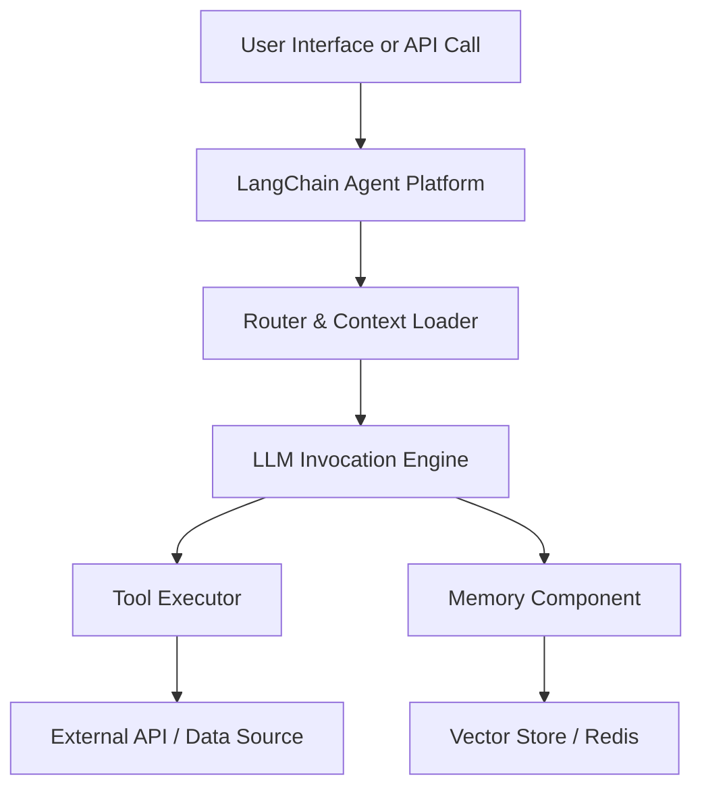

# LangChain Agent Platform – Administration Guide

**Version:** 1.0 | **Audience:** Platform Administrators | **Updated:** May 26, 2025  
**Status:** Stable | **Support Contact:** ops@langchain-enterprise.com

---

## Table of contents

1. [Platform Overview](#1-platform-overview)  
2. [Installation and Initial Setup](#2-installation-and-initial-setup)  
3. [User Management and Access Control](#3-user-management-and-access-control)  
4. [Agent Configuration and Deployment](#4-agent-configuration-and-deployment)  
5. [Security and Compliance](#5-security-and-compliance)  
6. [Monitoring and Performance Management](#6-monitoring-and-performance-management)  
7. [Troubleshooting Common Issues](#7-troubleshooting-common-issues)  
8. [Backup and Recovery](#8-backup-and-recovery)  
9. [Best Practices and Templates](#9-best-practices-and-templates)  
10. [Architecture Overview](#10-architecture-overview)  
11. [Next Steps and Resources](#11-next-steps-and-resources)

---

## 1. Platform Overview

The LangChain Agent Platform enables organizations to build and deploy intelligent agents powered by LLMs for enterprise automation, data synthesis, and task orchestration.

**Core Capabilities:**
- Agent execution engine with memory and tool integrations  
- Connector framework for external APIs, RAG, and databases  
- Enterprise-grade observability, security, and scalability controls  

---

## 2. Installation and Initial Setup

### 2.1 Installation Prerequisites

✅ **Required:**
- Python 3.10+
- Docker and Docker Compose
- PostgreSQL 14+
- Redis (optional but recommended)

💡 **Tip:** Use virtual environments to isolate dependencies.

---

### 2.2 Installation Process

```bash
git clone https://github.com/langchain/agent-platform.git
cd agent-platform
docker-compose up --build
```

🎯 **Success:** Admin dashboard available at `http://localhost:8080`

---

### 2.3 Initial Administrator Setup

1. Create admin user:
```bash
python scripts/create_admin.py
```
2. Log in to dashboard
3. Configure environment variables via `.env` file

---

## 3. User Management and Access Control

| Role         | Permissions                                     |
|--------------|--------------------------------------------------|
| Admin        | Full access, agent control, audit logs           |
| Developer    | Modify prompts, deploy agents                    |
| Viewer       | Read-only access to logs and dashboards          |

🔐 **SSO Integration:** Supports SAML 2.0 and OIDC providers.

---

## 4. Agent Configuration and Deployment

### 4.1 Agent Templates

LangChain includes starter templates for:
- Retrieval-Augmented Generation (RAG)
- Web scraping + summarization
- Multi-step task delegation

---

### 4.2 Configuring Agents

Agents are configured via YAML or UI form.

**Example (YAML):**
```yaml
name: financial_summary_agent
tools:
  - type: web-scraper
  - type: openai-completion
memory: vectorstore
timeout: 120
```

---

### 4.3 Deployment Options

| Option         | Description                        |
|----------------|------------------------------------|
| Local Docker   | Best for dev and testing           |
| Kubernetes     | Scalable production deployment     |
| Serverless     | Stateless functions via cloud APIs |

---

## 5. Security and Compliance

- API key rotation support  
- Role-based access control (RBAC)  
- Audit logging for prompt executions  
- Secrets management via Vault or AWS Secrets Manager  
- SOC 2 and HIPAA readiness frameworks

🚨 **Warning:** Disable agent-level shell access in production.

---

## 6. Monitoring and Performance Management

🛠️ **Monitoring Tools:**
- Prometheus + Grafana dashboards
- LangChain Agent Logs (structured)
- Alerts via Slack, Email, PagerDuty

💡 Use the `/metrics` endpoint to expose performance data.

### Log Export Example

```bash
curl -H "Authorization: Bearer $TOKEN" \
  https://api.langchain-enterprise.com/v1/logs/export?format=json > agent_logs.json
```

🎯 **Success:** File `agent_logs.json` contains audit logs and timestamps for review.

---

## 7. Troubleshooting Common Issues

| Symptom                         | Probable Cause                         | Resolution                                  |
|----------------------------------|----------------------------------------|---------------------------------------------|
| Agent timeout                   | Toolchain latency or memory overload  | Increase timeout or optimize prompt         |
| "Unauthorized" API error        | Token expired or RBAC misconfigured    | Regenerate key or review role permissions   |
| Blank responses from LLM        | Token quota exceeded or empty context | Revalidate prompt logic and inputs          |

---

## 8. Backup and Recovery

✅ **Recommended Procedures:**
- Export and store `.env` and `agent-config.yaml` files weekly
- Use `pg_dump` to back up PostgreSQL DB with agent states
- Snapshot Docker volumes if using local deployment
- Enable automated backups if hosted on AWS/Azure/GCP

**Recovery Steps:**
1. Pull latest code and restore environment variables  
2. Import saved database:  
```bash
pg_restore -d langchain_prod /backups/langchain_backup.dump
```
3. Restart containers and verify via dashboard

🎯 **Verify:** Run health check endpoint `/health` and confirm agent registry loads correctly.

---

## 9. Best Practices and Templates

- Limit agent memory scope to session context only  
- Use temperature 0.2–0.5 for factual workflows  
- Explicitly define output format (JSON, Markdown)  
- Track latency across agents and tools individually  
- Rotate API keys monthly and log usage

🎯 **Template Starter Pack:** Available at `/examples/templates/*.yaml`

---

## 10. Architecture Overview



---

## 11. Next Steps and Resources

- [LangChain Docs](https://docs.langchain.com)  
- [Open Source GitHub Repo](https://github.com/langchain/agent-platform)  
- [Admin Training Portal](https://training.langchain-enterprise.com)  
- [Contact Support](mailto:ops@langchain-enterprise.com)

---

*Last updated: May 26, 2025 | Document ID: LCAP-ADMIN-001*
