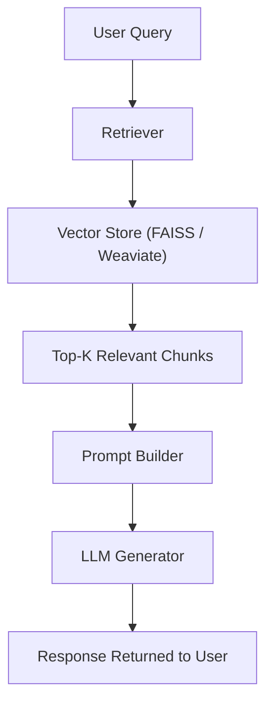

# Retrieval-Augmented Generation (RAG) – Implementation Guide

**Version:** 1.0 | **Audience:** AI Engineers & ML Ops | **Updated:** May 26, 2025  
**Status:** Stable | **Support Contact:** ai-support@example.com

---

## Table of contents

1. [Overview](#1-overview)  
2. [When to Use RAG](#2-when-to-use-rag)  
3. [Architecture Overview](#3-architecture-overview)  
4. [Data Ingestion & Indexing](#4-data-ingestion--indexing)  
5. [RAG Pipeline Components](#5-rag-pipeline-components)  
6. [Implementation Steps](#6-implementation-steps)  
7. [Evaluation & Testing](#7-evaluation--testing)  
8. [Deployment Considerations](#8-deployment-considerations)  
9. [Security & Data Hygiene](#9-security--data-hygiene)  
10. [Best Practices](#10-best-practices)  
11. [Resources](#11-resources)

---

## 1. Overview

Retrieval-Augmented Generation (RAG) enhances LLM responses by integrating external knowledge sources. Rather than relying solely on model parameters, RAG retrieves relevant documents from a vector store and injects them into the prompt at runtime.

---

## 2. When to Use RAG

RAG is ideal for:
- Dynamic data queries (e.g., support docs, policies, product info)
- Reducing hallucinations with grounded context
- Low-latency, high-accuracy question answering

💡 **Not suitable** when the required knowledge is static and well-covered by fine-tuning.

---

## 3. Architecture Overview



---

## 4. Data Ingestion & Indexing

### 4.1 Source Formats

✅ Supported:
- PDF
- HTML
- Markdown
- CSV
- JSON
- TXT

---

### 4.2 Chunking & Embedding

- Use 300–500 token chunks for optimal context balance  
- Apply semantic splitting (e.g., sentence-aware)  
- Common embedding models:
  - OpenAI `text-embedding-3-small`
  - Cohere `embed-english-v3`
  - HuggingFace `all-MiniLM-L6-v2`

---

### 4.3 Indexing Strategy

| Store        | Pros                         | Use Cases             |
|--------------|------------------------------|------------------------|
| FAISS        | Fast, lightweight             | Local experiments     |
| Weaviate     | Scalable, hybrid search       | SaaS, cloud-native    |
| Pinecone     | High availability, API-ready  | Production workloads  |

**Example with metadata filter:**
```json
{
  "query": "Retrieve latest financial policy",
  "filter": {
    "department": "finance",
    "year": "2024"
  }
}
```

---

## 5. RAG Pipeline Components

| Component     | Description                                  |
|---------------|----------------------------------------------|
| Retriever     | Queries vector index to return relevant docs |
| Reranker      | (Optional) Ranks and filters retrieved docs  |
| Prompt Builder| Assembles prompt using retrieved chunks      |
| Generator     | Invokes LLM with retrieval-enhanced prompt   |

---

## 6. Implementation Steps

### 6.1 Embed and Index Your Data

```python
from langchain.embeddings import OpenAIEmbeddings
from langchain.vectorstores import FAISS

documents = load_documents("docs/")
chunks = split_documents(documents, chunk_size=400)

embeddings = OpenAIEmbeddings()
index = FAISS.from_documents(chunks, embeddings)
```

🎯 **Success:** Embeddings stored in vector index for fast retrieval.

---

### 6.2 Configure the Retriever + Prompt Chain

```python
from langchain.chains import RetrievalQA
from langchain.llms import OpenAI

retriever = index.as_retriever()
rag_chain = RetrievalQA.from_chain_type(
    llm=OpenAI(),
    retriever=retriever,
    return_source_documents=True
)
```

---

### 6.3 Run the RAG Query

```python
response = rag_chain.run("What are the security controls in place?")
print(response)
```

🎯 **You should see:** Context-grounded answer from your indexed data.

---

### 6.4 Prompt Construction Example

Here’s how a fully assembled prompt might look before LLM execution:

```
Answer the question using only the context below. If you don’t know, say you don’t know.

Context:
---
[Chunk 1: "Our security framework includes RBAC, audit logging..."]
[Chunk 2: "Agents must authenticate via SSO and API key validation..."]
---

Question: What are the security controls in place?
```

---

## 7. Evaluation & Testing

| Method               | Purpose                                 |
|----------------------|-----------------------------------------|
| Manual review        | Check factuality and format             |
| Precision@K          | Quality of top-k retrieval              |
| BLEU / ROUGE         | Text similarity to ground truth         |
| Hallucination checks | Validate that output uses retrieved info|

💡 Use prompt tracing and logging to debug edge cases.

---

## 8. Deployment Considerations

- Serve retriever and index as a microservice  
- Cache frequent queries to reduce cost  
- Use LLM latency monitoring with alerting  
- Keep index updated with scheduled retraining  
- Store retrieval inputs/outputs for QA

---

## 9. Security & Data Hygiene

✅ **Data Redaction & Cleansing:**
- Remove PII, credentials, or sensitive config values before indexing  
- Strip headers/footers in PDF/HTML scraping jobs  
- Use regex or entity detection for compliance enforcement

🔐 **Access Controls:**
- Protect your vector store and logs with API gateway and authentication  
- Encrypt documents at rest and during embedding pipeline

---

## 10. Best Practices

- Validate chunk coverage during ingestion  
- Use instructions in prompt header (e.g., "Use only the provided context")  
- Add citation markers if displaying source  
- Limit retrieval scope using metadata filters  
- Include user query verbatim in final prompt

---

## 11. Resources

- [LangChain RAG Templates](https://docs.langchain.com/docs/use-cases/question-answering)
- [OpenAI Embeddings](https://platform.openai.com/docs/guides/embeddings)
- [FAISS Documentation](https://github.com/facebookresearch/faiss)
- [RAG Paper (Facebook)](https://arxiv.org/abs/2005.11401)

---

*Last updated: May 26, 2025 | Document ID: RAG-GUIDE-001*
