# RAG Implementation Guide

*Connect AI chatbots to your internal documents and data sources for context-aware responses tailored to your business needs.*

| **Metadata**     | **Value**                          |
|------------------|------------------------------------|
| **Version**      | 1.2                                |
| **Author**       | Corey Rollins                      |
| **Last Updated** | May 21, 2025                       |
| **Status**       | Draft                              |
| **Source**       | _To be added when published_       |

---

## Table of Contents

1. [Introduction](#1-introduction)  
2. [Document Preprocessing](#2-document-preprocessing)  
3. [Vector Store Setup](#3-vector-store-setup)  
4. [Retrieval Pipeline](#4-retrieval-pipeline)  
5. [LLM Integration](#5-llm-integration)  
6. [Example Output](#6-example-output)  
7. [Monitoring and Evaluation](#7-monitoring-and-evaluation)  
8. [Next Steps](#8-next-steps)  

---

## 1. Introduction

Retrieval-Augmented Generation (RAG) enhances language model outputs with organization-specific knowledge by connecting chatbots to private data sources. This guide outlines the essential components and steps to implement a secure, scalable, and maintainable RAG architecture in your environment.

💡 **Tip**: Start small with one high-impact use case, then iterate. 

```mermaid

graph TD
    A[User Query] --> B[Query Embedding]
    B --> C[Vector Search – Top-K]
    C --> D[Document Chunks with Metadata]
    D --> E[Prompt Construction]
    E --> F[LLM Generation]
    F --> G[Answer with Sources]

```



---

## 2. Document Preprocessing

___

### 2.1 Source Types

- PDFs
- HTML or Markdown documentation
- Confluence pages
- CSV and Excel files
- SQL databases

___

### 2.2 Chunking Strategy

- Use semantic or sentence-based chunking
- Target 300–500 token chunks
- Add overlap (~50 tokens) for context continuity

💡 **Tip**: Include metadata such as source, section heading, and document date in each chunk.

___

### 2.3 Sample Chunk

```json
{
  "content": "Employees must complete security training within 30 days of hire.",
  "metadata": {
    "source": "employee-handbook.pdf",
    "section": "Security Training Policy",
    "last_updated": "2024-11-01"
  }
}
```

---

## 3. Vector Store Setup

___

### 3.1 Supported Vector Stores

| Vector Store | Description | Link |
|--------------|-------------|------|
| **FAISS**    | Lightweight, in-memory, fast for prototyping | [FAISS](https://github.com/facebookresearch/faiss) |
| **Pinecone** | Scalable, managed, with filtering support | [Pinecone Docs](https://docs.pinecone.io) |
| **Weaviate** | Open-source, built-in metadata filtering | [Weaviate Docs](https://weaviate.io/developers/weaviate) |
| **Qdrant**   | Rust-based, performance-focused with filtering | [Qdrant Docs](https://qdrant.tech/documentation/) |

___

### 3.2 Embedding Models

- `text-embedding-ada-002` (OpenAI) – [Docs](https://platform.openai.com/docs/guides/embeddings)
- `all-MiniLM-L6-v2` (Sentence Transformers) – [Docs](https://www.sbert.net/docs/pretrained_models.html)

⚠️ **Warning**: Mixing embedding models may degrade retrieval quality.

---

## 4. Retrieval Pipeline

___

### 4.1 Query Flow


___

### 4.2 Prompt Construction

- Include retrieved chunks with source tags
- Limit context window (e.g., 3–5 chunks)
- Add role instructions: _“You are an internal knowledge assistant...”_

💡 **Tip**: Add fallback prompts when no relevant documents are found.

---

## 5. LLM Integration

___

### 5.1 Compatible Models

- **OpenAI** (ChatGPT, GPT-4)
- **Anthropic** Claude
- **Cohere** Command R
- **Open-source**: Mistral, LLaMA 2 via LangChain

___

### 5.2 Response Guidelines

- Use streaming for responsiveness
- Annotate responses with document sources
- Strip sensitive or non-permitted content before display

💡 **Tip**: Implement post-processing to flag hallucinations or unsupported claims.

---

## 6. Example Output

___

### 6.1 Sample Exchange

**User Query:**  
> *“What is the deadline for completing employee security training?”*

**RAG-Generated Response:**  
> Employees must complete security training within 30 days of their hire date. This policy ensures all new hires understand the organization’s information security expectations and protocols.  
>  
> *[Source: employee-handbook.pdf, Section: Security Training Policy, Last Updated: 2024-11-01]*

___

### 6.2 Output Best Practices

| Element | Example | Notes |
|--------|---------|-------|
| ✅ **Factual Clarity** | "Complete within 30 days..." | Direct answer, no filler |
| ✅ **Source Citation** | [Source: …] | Reinforces trust and transparency |
| ✅ **Metadata Use** | Section, date, filename | Derived from chunk metadata |
| ✅ **Natural Tone** | Policy explanation | Matches assistant role behavior |

💡 **Tip**: Adapt display format to your UI—e.g., tooltip, collapsible footnote, or inline citation.

---

## 7. Monitoring and Evaluation

___

### 7.1 Metrics to Track

- Query latency
- Document retrieval accuracy (hit/miss ratio)
- User feedback scores
- Escalation or fallback frequency

___

### 7.2 Quality Review Checklist

| Criteria | Description |
|----------|-------------|
| **Factual Accuracy** | Is the response supported by retrieved documents? |
| **Relevance** | Was the most contextually appropriate data retrieved? |
| **Traceability** | Are document sources clearly cited in the answer? |
| **Tone** | Does the answer follow brand guidelines and role setup? |

💡 **Tip**: Use a 1–5 rating scale internally to identify low-performing queries.

---

## 8. Next Steps

- Identify and prioritize high-impact internal use cases
- Select embedding and vector store tech stack
- Set up preprocessing and RAG pipeline in staging
- Roll out in controlled production with monitoring
- Schedule regular audits for performance and security

💡 **Tip**: Review your LLM provider’s data usage policy before launch.

[Back to top](#rag-implementation-guide)
